# Community Event Hub

> **Run a tech-community conference without the spreadsheet chaos.** One open-source web app where every participant signs in with a PIN, lands on a hub built for their role, and self-services everything they owe — book a hotel night, accept a speaker slot, pick a polo size, capture a booth lead, RSVP to the dinner. Organizers get live dashboards, gentle reminders and one back office to run it all. Fork it, configure it in JSON, deploy it on Azure.

> **Free for any community to use.** Built by Microsoft MVP **Morten Knudsen** ([aka.ms/morten](https://aka.ms/morten)).
> Public mirror: <https://github.com/KnudsenMorten/community-event-hub>.

| Public landing page | …and on a phone |
|---|---|
| [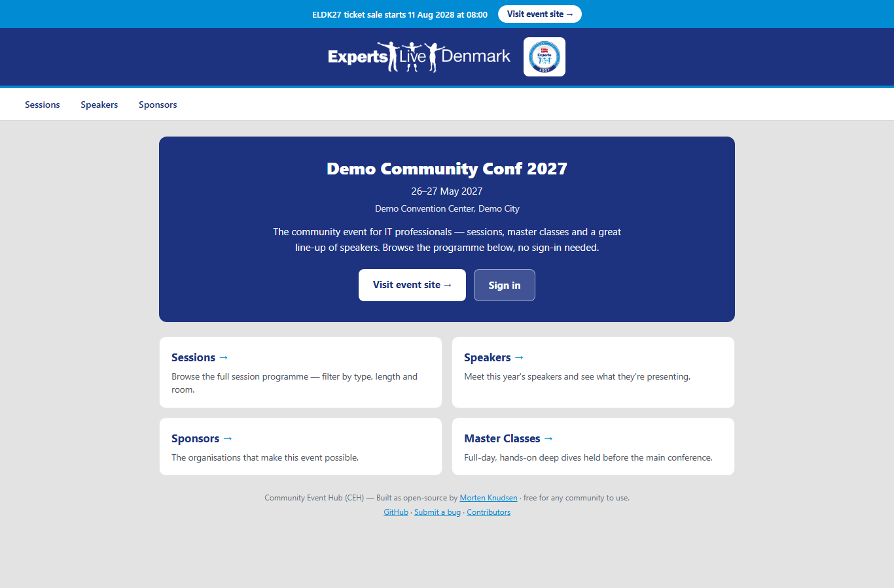](docs/img/public-landing.png) | [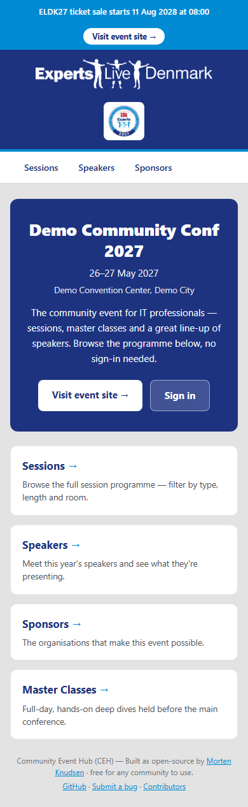](docs/img/public-landing-mobile.png) |

*The public front door — event details, programme and a sign-in, no login required. The whole hub is mobile-first, so it looks and works the same on the phone in an attendee's hand at the venue.*

---

## What it is

Community Event Hub (CEH) is the **behind-the-scenes operational layer** for a community conference. It is **not** a public event site or a ticketing system — it sits *alongside* those (see [How it fits with Zoho Backstage](#how-it-fits-with-zoho-backstage)) and owns the work: crew sign-in, self-service forms, tasks & reminders, sponsor deliverables, volunteer planning, exports and the organizer back office.

It is built to be **evergreen and multi-community**. The codebase is generic (`CommunityHub`); everything about an edition — community name, dates, venue, hostname, deadlines, sponsors, content — lives in an `Events` row plus per-edition JSON. A new edition or a whole new community is **a new row + config, not a code change**. The project is open-sourced from the **Experts Live Denmark** instance that runs the conference; a sanitized public template is published openly while the real config, logos and production settings stay private.

## Who it's for

The hub gives every persona its own tailored, mobile-first surface — and organizers a single place to run everything:

| Persona | What they get |
|---|---|
| **Organizer** | Command center + cross-role overview, live dashboard, fast search/sort/paged grids, participant management (edit / delete-safely / bulk / act-as / secure links), pre-selection & onboarding queues, the action queue for late changes, a task-allocation queue, an Email Center + broadcast, sessions & Sessionize, sponsor admin + leads, volunteer structure & buckets, multi-hotel, swag/travel/lunch/dinner overviews, exports & printable run-sheets, social-graphics + LinkedIn scheduling, and the AI Community Helper to ask about speakers, sessions and key times. |
| **Speaker / Masterclass speaker** | A speaker hub with a milestone tracker and countdowns, "My sessions", an editable public bio (tabbed) seeded from Sessionize but owned by them, a public-profile preview, preferred-email routing, calendar-subscribe for deadlines, attendee questions, share graphics, a public master-class logistics page, and the AI Community Helper to ask about speakers, sessions and key times. |
| **Volunteer** | "My schedule" (all shifts, time-ordered, with per-shift instructions and calendar subscribe), self-service shifts (confirm / decline / swap), "My tasks" grouped by area, a help channel to their supervisor, a supervisor dashboard if they run a category, and the AI Community Helper to ask about speakers, sessions and key times. |
| **Sponsor** | A single sponsor portal (`/Sponsor`) with company profile, booth tier, logistics quick-links, an "Our Booth" page, the deliverables checklist, a leads read-view and order/invoice status; booth lead-capture and a secured Leads API; tasks generated from what they bought; and the AI Community Helper to ask about speakers, sessions and key times. |
| **Attendee** | A "My Event" home with a countdown, master-class status, a personal agenda (ask-a-question and rate-the-session links), self check-in on event days, the self-service hotel/swag/lunch forms, and the AI Community Helper to ask about speakers, sessions and key times. |
| **Anyone (no login)** | A public front door (`/`), the programme (`/Sessions`, `/Speakers`), the sponsors page (`/Sponsors`), master-class logistics, per-session ask + rate pages, and the call-for-speakers survey. |

> The detailed public feature catalog is **[`docs/FEATURES.md`](docs/FEATURES.md)**; the architecture, build, deploy and runbook are in **[`docs/DESIGN.md`](docs/DESIGN.md)**.

---

## Table of contents

- [What it is](#what-it-is)
- [Who it's for](#who-its-for)
- [See it in action](#see-it-in-action)
- [Why it exists](#why-it-exists)
- [Feature areas](#feature-areas)
  - [1. Platform — built for every edition](#1-platform--built-for-every-edition)
  - [2. Sign-in & embedding](#2-sign-in--embedding)
  - [3. Crew profiles & roles](#3-crew-profiles--roles)
    - [Your profile, your hub](#your-profile-your-hub)
    - [Managing people, safely](#managing-people-safely)
    - [Volunteer work structure](#volunteer-work-structure--run-a-big-pool-without-a-bottleneck)
    - [Volunteer "My schedule" + self-service shifts](#volunteer-my-schedule--self-service-shifts)
    - [Buckets & resource allocation](#buckets--resource-allocation--plan-staffing-then-commit)
    - [Onboarding lifecycle](#onboarding-lifecycle--from-sign-up-to-set-up)
    - [Multi-hotel management](#multi-hotel-management)
  - [4. Self-service forms](#4-self-service-forms)
  - [5. Tasks & reminders](#5-tasks--reminders)
  - [6. Sessions & surveys](#6-sessions--surveys)
  - [7. Sponsors](#7-sponsors)
  - [8. Sponsor leads](#8-sponsor-leads)
  - [9. Attendees & masterclass reconciliation](#9-attendees--masterclass-reconciliation)
  - [10. Email & notifications](#10-email--notifications)
  - [11. Organizer hub](#11-organizer-hub)
  - [12. Hosting & reliability](#12-hosting--reliability)
  - [13. Accessibility](#13-accessibility)
  - [14. Bilingual UI — English & Danish](#14-bilingual-ui--english--danish)
  - [15. Social graphics & post scheduling](#15-social-graphics--post-scheduling)
  - [16. AI Community Helper](#16-ai-community-helper)
- [How it fits with Zoho Backstage](#how-it-fits-with-zoho-backstage)
- [Getting started](#getting-started)
- [Configuration model](#configuration-model)
- [Embedding](#embedding)
- [Repository layout](#repository-layout)
- [Documentation](#documentation)
- [License](#license)
- [Status](#status)

---

## See it in action

Every screenshot below is captured **headlessly** against a locally-run instance seeded with **synthetic demo data** (a fictional "Demo Community Conf" with placeholder people and sponsors).

| Organizer command center | Speaker hub (mobile) |
|---|---|
| [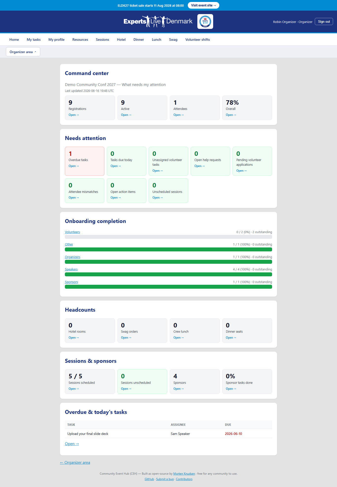](docs/img/organizer-command-center.png) | [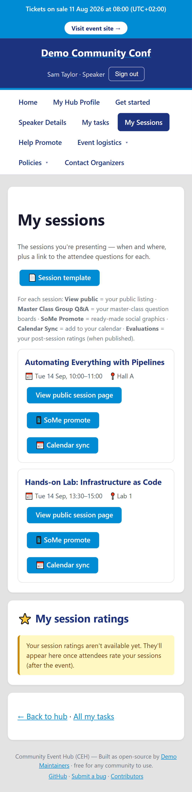](docs/img/speaker-hub-mobile.png) |
| *"Is the event on track, what do I do next?" — one screen triages the whole event.* | *Mobile-first throughout: a speaker's milestone tracker and sessions at ~390px.* |

| Volunteer "My schedule" | Sponsor self-service |
|---|---|
| [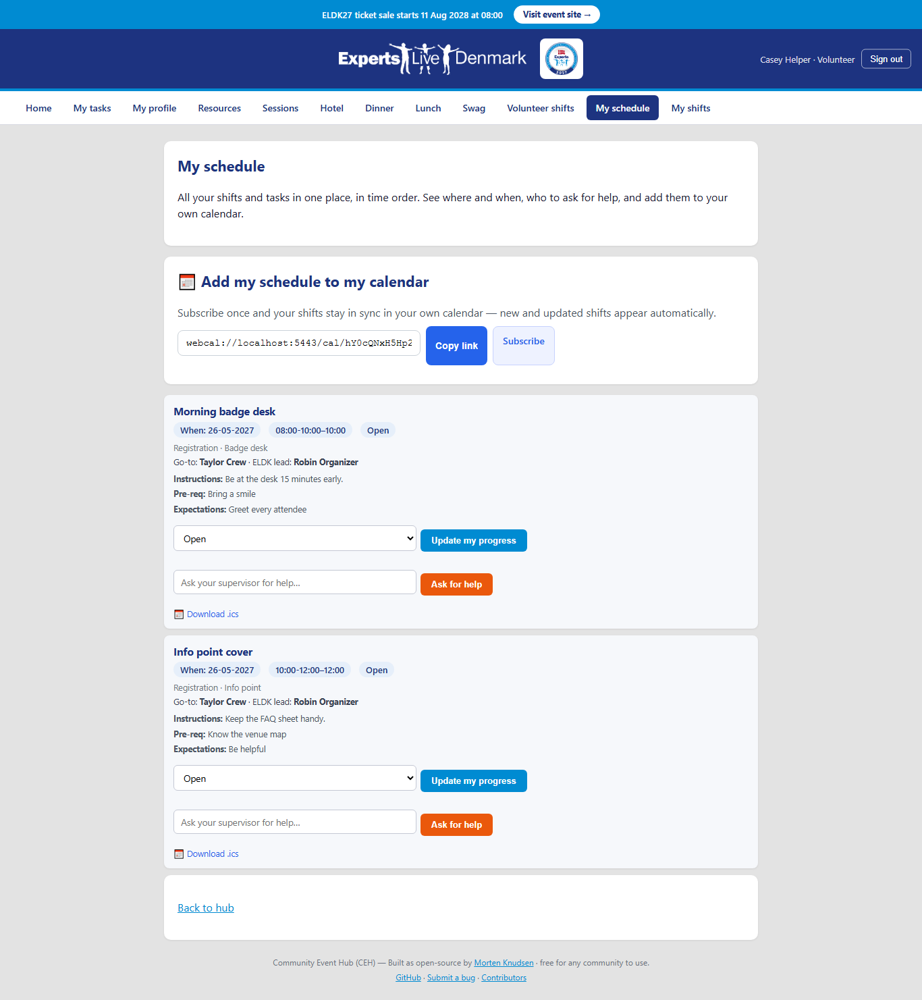](docs/img/volunteer-schedule.png) | [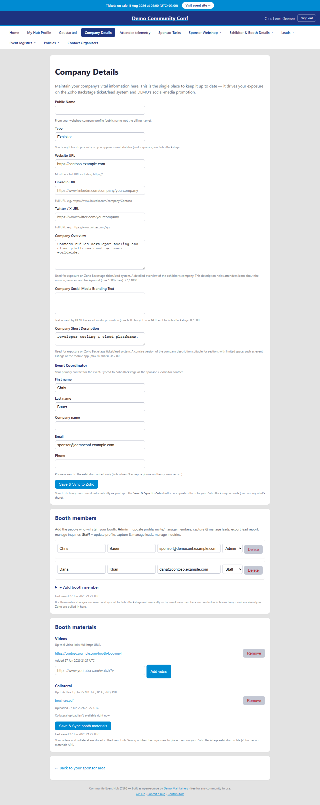](docs/img/sponsor-portal.png) |
| *Every shift, time-ordered, with who to ask and one-tap calendar subscribe.* | *The in-hub Sponsor area: company details, booth, tasks, leads and order status (screenshot refresh pending).* |

| Volunteer schedule (mobile) | Attendee "My Event" (mobile) |
|---|---|
| [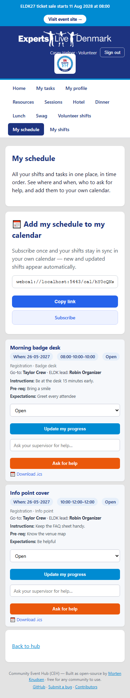](docs/img/volunteer-schedule-mobile.png) | [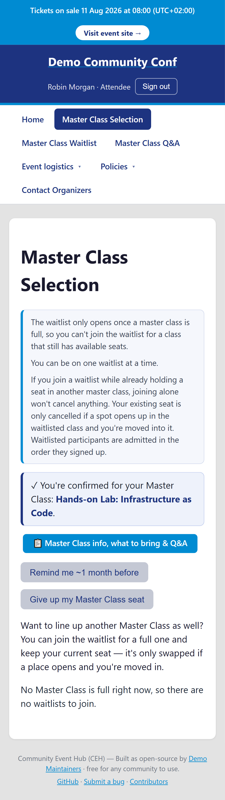](docs/img/attendee-my-event-mobile.png) |
| *Built for someone standing at the venue: a volunteer checks their next shift on their phone.* | *Every attendee's home — countdown, Master Class status and a personal agenda — in the palm of their hand.* |

> Every persona surface is designed phone-first (~360px) and tested headlessly at that width, so the experience above is the same on a laptop at the organizer desk and a phone on the show floor.

> ℹ️ The role menus were redesigned in the 2026 edition (see the menu maps below). Fresh screenshots of each redesigned menu are being captured; the maps below are the source of truth in the meantime.

> 📸 **Screenshot refresh in progress.** Several newly-built views deserve their own capture and are pending a separate capture step (no image files are added here yet): the **in-wizard inline stepper** ("Step X of N" with Prev/Next), the **AI Community Helper chat panel**, the sponsor **"Our Booth"** page, a **unified task page** showing the "Task checklist" completion %, and the **`/Organizer/OrganizerAllocation`** task-allocation queue. Two existing shots are **now stale** and will be re-captured: `docs/img/speaker-hub.png` (readiness moved into My Tasks) and the attendee `docs/img/attendee-my-event*.png` shots (the Master Class section is now the in-hub 3-section page).

## Role menus (2026 redesign)

Each role sees only what's theirs — a focused, mobile-first menu. `▸` marks a fold-out section; `↗` opens an external site (Zoho exhibitor dashboard / webshop) in a new tab.

**Attendee** — deliberately minimal:
`Home` · `Master Class` (the in-hub 3-section chooser — pick / switch / waitlist, all on one page) · `My plan` · `Community Helper`

**Speaker:**
`Home` · `My tasks` (now also where "Am I ready?" readiness lives — no separate `/Speaker/Readiness` leaf) · `My profile` · `Sessions` · `My Sessions` · `Master Class Q&A` (master-class speakers only) · `Bio` · `Calendar` · `Event logistics ▸` (Hotel · Appreciation Dinner · Lunch · Speaker Gift · Travel reimbursement) · `Contact Organizers` · `Community Helper`

**Sponsor:**
`Home` · `My profile` · `Sponsor Webshop ▸` (Buy extra services ↗ · Sponsor orders · Linked contacts) · `Exhibitor & Booth Details ▸` (Exhibitor Profile ↗ · Booth Members ↗ · Exhibitor Materials ↗ · Promotional Banner ↗) · `Sponsor Tasks` (now also where the deliverables % lives) · `Leads ▸` (Leads ↗ · Inquiries ↗ · Capture leads · My leads export) · `Event logistics ▸` (a single fold-out leading with `Booth run-of-show` · `Our Booth` · Hotel · Appreciation Dinner · Lunch) · `Contact Organizers` · `Community Helper`

**Volunteer:**
`Home` · `My tasks` · `My profile` · `My schedule` (shifts + tasks, with confirm / decline / request-swap) · `My availability` (per-day full / half / blocked) · `Supervisor` (supervisors only) · `Event logistics ▸` (Hotel · Appreciation Dinner · Lunch · Volunteer Gift · Important dates) · `Community Helper`
> Volunteers also sign up via an anonymous shift-survey link (no account needed) that captures their availability.

**Organizer** — a lean hub menu; each hub opens a button-grid of its admin pages:
`Home` · `Command center` · `Dashboard` · `Find person` · `People` · `Sessions & speakers` · `Comms` · `Social media` · `Sponsors` · `Volunteers` · `Logistics` · `Setup` · `Audit log` · `Community Helper`

---

## Why it exists

**Goals**

- Build an **open-source community event platform** other communities can re-use — to help scale the Microsoft (and adjacent) community by automating manual work.
- Give **speakers / volunteers / sponsors / attendees** one self-service hub to submit data and complete tasks, and to see and manage their own submissions.
- **Centralize tasks** — one overview, not five.
- **Better change management** — hotel changes, speaker changes, etc. flow through the hub instead of email threads.
- **More automation, fewer manual touches** per participant.
- **Sync data to subsystems** — Backstage / webshop / company directory, read where it makes sense.
- **Automate deliverables to partners** — hotel rooming list, catering overviews, swag / polo orders.

**Problems it solves** (vs. how a conference is usually run today)

- Move out of spreadsheets into a database — automation instead of manual merges.
- Avoid static forms — they generate endless follow-up and Excel reconciliation.
- Simplify the system landscape — drop tools like Microsoft Planner with tenant integration for sponsors.
- Collect info only from the selected people, away from Sessionize / generic forms.
- More self-service so organizers don't update on people's behalf (avoids human mistakes).
- Minimize email — only send for overdue tasks.

<details>
<summary>Architecture at a glance (diagrams)</summary>


</details>

---

## Feature areas

The sections below mirror the chapters of the public feature catalog. Each is a summary — see **[`docs/FEATURES.md`](docs/FEATURES.md)** for the full per-audience detail and **[`docs/DESIGN.md`](docs/DESIGN.md)** for how it works.

### 1. Platform — built for every edition

One hub, every year, every community. The codebase, repo, Azure resources and namespaces are all generic `CommunityHub` — the year appears only in the web address and the event's display name. Launching a new edition (or onboarding a new community) is a new `Events` row plus per-edition JSON, never a rebuild or a fork. Everything about an edition — event details, sponsors, content, hotel, integrations, speaker deadlines — is configuration you edit, not code you change. A sanitized public template is published openly while your real config, logos and production settings stay private.

→ [`docs/FEATURES.md` §1](docs/FEATURES.md#1-platform--built-for-every-edition) · architecture in [`docs/DESIGN.md` §1–2](docs/DESIGN.md#1-system-overview)

### 2. Sign-in & embedding

- **One-time PIN by email — no new account.** Crew sign in with just their email; the hub sends a 6-digit PIN that expires in 15 minutes and works once. Safeguards built in: rate limiting (5/hour per email), lockout after repeated wrong tries, constant-time verification, and neutral messaging that never reveals whether an email is registered. PINs are never logged in plaintext.
- **"Stay signed in" your way.** At login you choose a session length — a day, a week (default), a month, or until you sign out — and the session refreshes itself as you keep using the hub.
- **Magic-link login.** Invitation emails can carry a tap-to-sign-in link (valid 7 days) so crew land straight in their hub without typing a PIN.
- **Pre-filled login links.** `/Login?email=<address>` opens the sign-in page with the email pre-filled (pure convenience — it never bypasses the PIN), and works in every environment because each link uses that environment's own base URL.
- **Ready for single sign-on.** Identity is isolated behind an `IIdentityProvider` seam so a verified SSO provider can be added later without disrupting the PIN experience.
- **Embeds safely in your event portal.** The hub runs inside an existing conference platform (e.g. a Zoho Backstage embed) with CSP `frame-ancestors` and `SameSite=None; Secure` cookies; security never depends on trusting the embed.

→ [`docs/FEATURES.md` §2](docs/FEATURES.md#2-sign-in--embedding--frictionless-no-new-passwords) · design in [`docs/DESIGN.md` §4](docs/DESIGN.md#4-auth-identity--embedding)

### 3. Crew profiles & roles

Everyone who works your event — from the lead organizer to a first-time volunteer — gets **one profile and one hub built around their role**, so they only ever see what is theirs to do.

#### Your profile, your hub

Each person has one profile per edition — name, contact details, role, accreditation (MVP / Expert / RD / MS Employee), awards, clothing sizes, and status flags. **What it does for you:** every signed-in person gets a **"My profile"** page they own (they can only ever change their own details — never anyone else's), so personal info stays current without an organizer typing it for them. A single shared **Resources** page (venue, floor plan, event site, exhibitor guide, organizer contact) gives everyone one always-current place for the practical info, maintained by organizers as edition settings — no developer needed. Every role gets a hub built around what that person actually needs to do — Organizer, Speaker, Masterclass Speaker, Volunteer, Sponsor, Speaker-Sponsor, Video, Photography, VIP, Attendee — and new crew get a friendly one-time welcome page the first time they arrive.

#### Managing people, safely

Organizers can filter crew by role/status and activate or deactivate anyone in a click — deactivated people can no longer sign in. Every grid row has a full **Edit** action (name, email, persona/role, active state, sponsor-company link) and a **Delete** behind a confirmation. **Why it matters:** nothing important is ever silently lost — people with linked data (sessions, tasks, claims, history) are **deactivated** rather than permanently removed, while a never-engaged row is fully cleaned up; bulk deactivate is available and every removal is audited. Profiles can be tagged as **test/dummy data** so the whole synthetic cast can be wiped at go-live in one step without touching a single real registration.

#### Volunteer work structure — run a big pool without a bottleneck

For events with dozens of volunteers, the organizing team can't be everyone's single point of contact. Organizers build a three-level work tree — **Categories → Subcategories → Tasks** — and appoint a trusted volunteer as the **supervisor** of a category, giving them management rights for just that area (alongside an organizer **lead** for oversight). **What you get:** supervisors run their own area's dashboard (add work, assign volunteers, move tasks along); volunteers see a **"My tasks"** view grouped by category; and a built-in **help channel** lets a stuck volunteer ask their supervisor for help in one tap — the supervisor is emailed (lead CC'd) so they don't have to be watching a screen. Mobile-first for use at the venue.

#### Volunteer "My schedule" + self-service shifts

Every volunteer gets one mobile-first page answering "what am I doing, and when?" — all their shifts time-ordered (dated first, undated last), showing where/when and **who to ask** (supervisor + lead), with per-shift instructions and one-tap **calendar subscribe** (or a single-shift `.ics`). They also stay in control of their own shifts: **confirm** they can take one, **decline** it (with an optional reason — a coordinator is automatically signalled to reassign), or **request a swap** — all surfaced on the organizer action queue, with one-tap undo. They can only ever act on shifts they are actually assigned to. *(No self event-check-in — that stays in Zoho Backstage.)*


*A volunteer's whole day in one place: shifts time-ordered, who to ask, and one-tap calendar subscribe — and it works just the same on a phone at the venue (see the mobile shot above).*

#### Buckets & resource allocation — plan staffing, then commit

A planning surface turns a long task list into a staffed plan, with a draft-it-then-commit workflow so nothing is assigned by accident. **Import** the volunteer plan (CSV) to build buckets and tasks, see **red/green coverage** (needed vs assigned) at a glance, get **AI-assisted** suggestions for any missing pre-requisite or expectation, map people into a **draft** and watch coverage simulate live — then **Commit** to make assignments real (or **Discard** the draft). Two organizers can plan at once without stepping on each other.

Beyond drafting buckets, a **task-allocation pipeline** turns availability into staffed work and routes it cleanly. An **availability auto-assign engine** matches open work to the people who said they're free, and the result lands in **role-routed queues** — a volunteer queue, an organizer queue, and a *tracked-only* queue (work owned by a Responsible Team that no one is emailed about). The whole staging area is a **SILENT queue**: editing, re-routing and re-assigning inside it sends **no email**, so organizers can shuffle a plan freely. Only when an organizer **commits** does the hub emit **batched, per-person notifications** — one tidy summary per assignee, not a storm of edits. Supporting it: **auto-generated task descriptions** from the title (so a one-line task still reads clearly), **all-organizer edit** of any task, and an **Excel export / import round-trip** with a stable per-task **GUID upsert** so a plan can be worked in a spreadsheet and re-imported without ever duplicating a row. The organizer view is `/Organizer/OrganizerAllocation`.

#### Onboarding lifecycle — from sign-up to set-up

A clear path from "someone is interested" to "they're ready to go", with organizers in control of who comes on board. Prospective volunteers, speakers and media land in a **pre-selection queue** (inactive → preselected → active; only an active person can sign in); organizers validate and activate one or many at once, and clear duplicates/spam. Each activated person then runs a short, **persona-tailored onboarding wizard** that covers only the steps that apply to them, tracked on an **onboarding dashboard** by stage and persona — and an organizer can re-open a single step to trigger a friendly reminder if something changes.

#### Speaker self-service, consolidated

Speakers manage everything about themselves on one **Speaker Details** page — first/last name, bio + socials, photo, Microsoft accreditation (multi-select, mapped to their Zoho speaker **Skills**), country, and an optional preferred contact email — with a single **Save & sync to Zoho**. The Sessionize import seeds these and pulls each speaker's profile picture into SharePoint, and new speakers default to a locked release ring so nothing is published or emailed until an organizer promotes them. Anyone can sign in with their primary **or an alternate email**. A **Help Promote** page hands speakers ready-made social graphics + a one-tap **publish to LinkedIn** (through the hub's reviewed posting path — safely queued and posting nothing until a LinkedIn connection is enabled), with an opt-in email the moment their graphics are released. Session details (time + location) come from the live agenda, and speakers are emailed automatically if their session moves.

#### Multi-hotel management

When the rooms don't all fit in one hotel, organizers define each hotel (name, address, reception contact), assign each person to a hotel in one click, and see everyone **grouped by hotel** with per-hotel headcounts and confirmed counts. Record a per-person reservation number once a hotel returns it, and those details — assigned hotel, its address and the confirmation number — flow straight into each person's hotel calendar invite, so everyone sees exactly where they're staying.

→ [`docs/FEATURES.md` §3](docs/FEATURES.md#3-crew-profiles--roles--the-right-hub-for-each-person)

### 4. Self-service forms

Short, mobile-friendly forms wired so completing them does the right follow-up automatically:

- **Appreciation dinner** — RSVP with a calendar invite, and capture dietary needs.
- **Hotel** — book a room and get a hotel calendar invite; feeds the rooming list and room-night forecast.
- **Lunch** — sign up for pre-day and main-day lunch.
- **Speaker info & editable bio** — speakers manage their own details and edit their **public bio** in tabbed sections (Bio · Tagline · Links & Social · Photo · Sessions); their edits are kept and the nightly Sessionize sync won't overwrite them (see §6).
- **Preferred email for calendar & messages** — a speaker can set a preferred address; when set, **all** calendar invites and emails (from the hub *and* Zoho Backstage) go there, while their Sessionize email stays their sign-in and match key.
- **Swag** — choose polo, jacket and award preferences.
- **Travel** — a clear **two-step** flow (**Step 1: Upload Receipt**, then **Step 2: Request Travel Reimbursement**, with Step 2 blocked until a receipt is uploaded) that creates the matching payout task and emails the claim + receipts to the finance inbox for automatic bookkeeping.
- **Volunteer sign-up** — a single guided, multi-step wizard (about-you → availability → agreement, with the Code of Conduct and Privacy Policy linked) that sets up the right tasks per volunteer.
- **Get-started wizard for every role** — speakers, sponsors, organizers, volunteers, event partners and media each get a guided flow that shows **only the steps they're entitled to** (a self-funded speaker doesn't see hotel/travel/swag; a supported one does), marks a step **done automatically from saved data**, and keeps the "step X of Y" count honest. The same entitlement gate closes any form a person isn't entitled to. **"Get started" is now a true inline stepper, not a link list** — each step's real form renders **in place** with **Prev / Next** and **save-and-advance**, so a person fills in a step and moves straight to the next without ever leaving the wizard (and "Save & next" advances in sequence rather than looping on a not-yet-done step). The speaker flow opens with an **optional "Calendar email" step** so a speaker can set the address their calendar invites and reminders go to before anything else.
- **"Last saved" + auto-save** — every save shows when it was last saved, and Company Details auto-saves plain fields (with a quiet *Saving… / Saved* status) so nothing is lost to a forgotten Save.
- **Structured dietary & allergy capture** — the dinner and speaker forms use a structured picker (diet choice + common-allergen tick-boxes, free text only for anything not listed), so the caterer gets real head-counts instead of a pile of notes; day-catering and the dinner are tracked separately.
- **Every form confirms it saved** — submitting any self-service form shows the same clear "saved" banner, announced to screen readers and dismissable, so no submit is silent.
- **In-place guidance when something's missing** — forms flag exactly which field needs attention right next to it and re-check on the server, so nothing slips through.
- **Late-change alerts** — edits to hotel/dinner/shift details *after* the change deadline notify organizers; edits before the deadline stay quiet.

→ [`docs/FEATURES.md` §4](docs/FEATURES.md#4-self-service-forms--crew-fill-in-their-own-details)

### 5. Tasks & reminders

Every person sees only their own tasks, ticks them off, and the list fills itself from the forms they complete and the role they hold. **One consistent "what do I still owe" checklist** — pending, done, and a clear **overdue** badge with days late — now renders through **one unified task page** shared across the hub home, the Tasks page and the attendee My-Event page (and includes a sponsor contact's company-scoped tasks), so the checklist never says "all done" while work is still outstanding; pending items deep-link straight to the form that completes them. The page leads with a single **"Task checklist" completion %** so everyone sees at a glance how much they still owe, and role-specific signals fold into the same list — a speaker's **"Am I ready?" readiness** and a sponsor's **deliverables progress** are surfaced in **My Tasks** rather than living on a separate page.

Each speaker automatically gets a dated task for every key milestone (for the current edition: submit title + abstract for masterclass speakers, verify bio + photo in the hub, upload a draft preview deck, upload the final deck — each on its own deadline, configurable per edition). A **speaker hub** turns those milestones into one mobile-first tracker: a progress bar, per-milestone cards with a live countdown ("12 days to go" / "due today" / "overdue 3 days"), one-tap Mark done / Reopen, and a clear "next up" — plus a **"My sessions"** card (title, day/time, room or "to be scheduled", co-speakers, a jump to attendee questions, and the public session link once announced) and a **preview of their public profile** exactly as attendees will see it once they're selected for the line-up.

A gentle, reliable reminder engine sends on a per-type cadence — speaker milestones counting down (plus an overdue nudge), a weekly pending-tasks digest, weekly sponsor and form chasers, a short series for general tasks — and it never double-sends, quietly catching up if a day is missed. Everything (on/off, cadence, wording, recipients incl. CC/BCC/escalation) is tuned through settings, not code. The guiding principle is to nudge only when something is actually overdue.

**Sync to your own calendar.** Every speaker, volunteer and organizer can subscribe their hub deadlines and shifts to the calendar they already use (Outlook / Google / Apple) with a short, friendly subscribe link (private per person, resettable), or download a single item as `.ics` — new and moved deadlines flow through automatically, with a pop-up a week and a day before each due date. When an organizer **activates** a person, their activation email even carries a calendar invite for the event itself. A single edition-wide switch (on by default) turns calendar sync on or off.

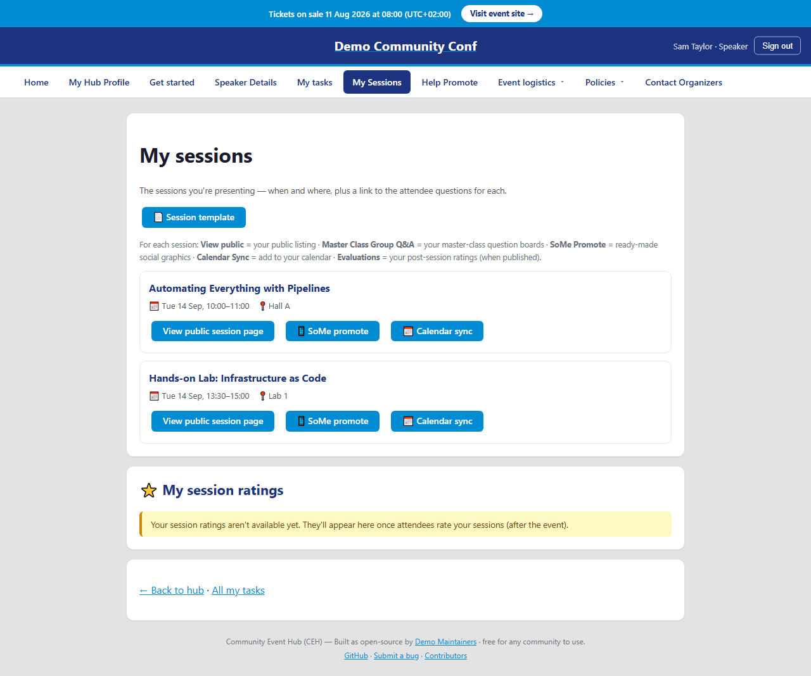
*The speaker hub turns deadlines into a progress tracker with live countdowns, "My sessions" and a public-profile preview (screenshot refresh pending — "Am I ready?" readiness now lives in My Tasks).*

→ [`docs/FEATURES.md` §5](docs/FEATURES.md#5-tasks--reminders--nothing-slips-no-inbox-spam) · jobs in [`docs/DESIGN.md` §5](docs/DESIGN.md#5-jobs-scheduled-timers)

### 6. Sessions & surveys

- **Pull speakers from the Sessionize API.** Connect a Sessionize API endpoint and the hub pulls the **accepted**-speaker list automatically (nightly, or on demand from an organizer button), creating/updating speakers (matched on email, never overwriting roles) and reporting skipped rows. *Setup:* in Sessionize open the event → **API/Embed** → new API endpoint → name it → **JSON** → include all built-in fields → enable the **speaker emails** advanced field (required, or every speaker is skipped — email is the match key) → configure the **accepted-speakers** view → **save** → copy the endpoint id (`https://sessionize.com/api/v2/<your-event-id>/view/All`). The endpoint id is ordinary operator configuration (not a secret): set it in your per-edition config (`integrations.<edition>.json` or a gitignored custom config). Keep the real id out of the public mirror, but it is plain config — not a Key Vault secret.
- **Switch the endpoint safely.** An organizer endpoint-settings page lets you set or change the Sessionize endpoint id (and view) in the hub without a redeploy. Changing it (the typical case: switching from call-for-speakers to the accepted line-up) asks how to treat speakers already imported — **Replace** (the normal production full re-seed) or **Merge** (for testing only; a delta that never flushes a speaker's own edits) — and never starts an import on its own.
- **Sessions come across too, linked to their speakers.** The same pull imports your **sessions** (linking each to its speaker(s), with co-speakers and multiple-sessions handled), upserting by Sessionize id so nothing is duplicated. **Add your own sessions** (e.g. a sponsor session) directly in the hub — clearly marked and safe across re-imports. Each session carries a **type** (Master Class / Tech Session / Sponsor Session) and a **length**, and the list filters by both.
- **Preview before you import; delete safely.** A **dry-run preview** shows exactly how many speakers would be created / updated / left unchanged and which curated bios a full import would overwrite, before the real import (a separate, confirmed click). Organizers can **delete a bad or duplicate session** behind a confirmation — a session that has collected attendee questions, evaluations or master-class bookings is protected.
- **Or import speakers from a spreadsheet.** Prefer files? Upload a Sessionize export; the hub reads columns in any order, with the same create/update rules, skip reporting, and automatic one-time welcome (speakers only; the API pull is the path that also brings sessions).
- **Speakers own their bio — Sessionize just seeds it.** Each speaker's public profile (bio, tagline, LinkedIn / X / blog, photo) is seeded from Sessionize but belongs to the speaker once they touch it; the nightly **delta** sync only fills empty/untouched fields and never flushes their edits, while a one-click **"Full import"** is the deliberate complete re-seed.
- **Push approved speaker bios to your public Backstage site — safely.** When the line-up is set, the hub can mirror each approved speaker's bio to your Zoho Backstage speaker page. No one goes public by accident: a speaker is only made visible when explicitly approved (a per-speaker switch that starts off), until then their bio is written only as a hidden draft, and there is no automatic/scheduled push. *(◻ live activation pending — built and tested, off by default.)*
- **Tell a speaker when their session moves.** A speaker's session shows its **time and location from the live agenda**, the public-session link points at the platform's session details, and a background engine watches the agenda for **time/location changes** and **emails the affected speaker** when their slot moves. It's organizer-controllable and release-gated, and seeds quietly the first time so no one is emailed for a change that didn't really happen.

#### A public programme anyone can browse (no login)

- **A public front door at `/`** — event name, dates and venue, a Visit-event / Sign-in call to action, and cards into the public Sessions, Speakers, Sponsors and Master Classes pages. Signed-in crew still go straight to their hub.
- **`/Sessions` + `/Sessions/{id}`** — the live edition's sessions with speaker(s), type, length, room and time; filter by type/length/room and search by title, speaker or room. Each session has its own shareable detail page (abstract, cross-linked speakers, links to master-class info and "ask the speaker", and a one-click **"Add to my calendar"** `.ics`).
- **`/Speakers` + `/Speakers/{id}`** — this year's published speakers (photo, tagline, their sessions); only speakers the organizers chose to publish appear, with a friendly "coming soon" until then.

| Public speaker lineup | Public session detail |
|---|---|
| [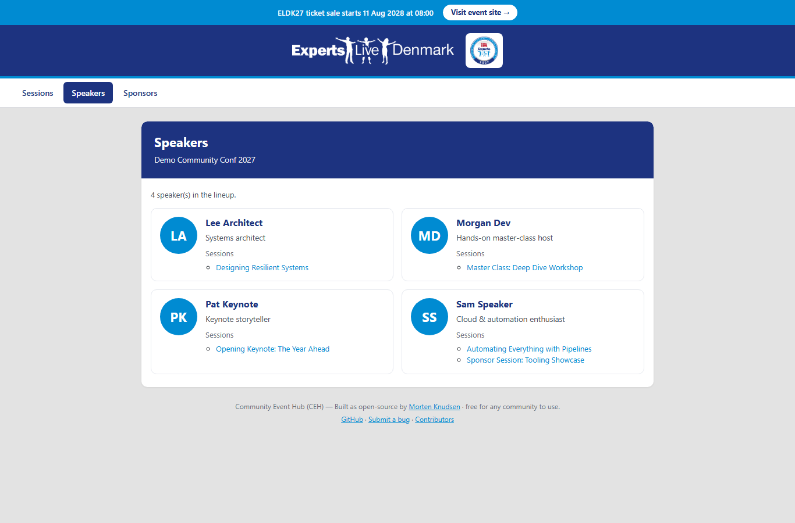](docs/img/public-speakers.png) | [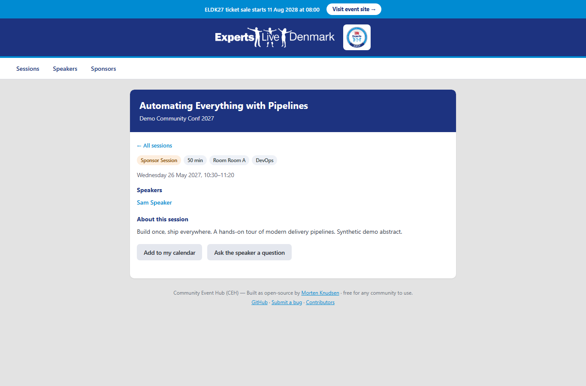](docs/img/public-session-detail.png) |
| *Only published speakers appear; each links to their sessions and back.* | *Every talk has a shareable page with "Add to my calendar" and "ask the speaker".* |

#### At and around the room

- **A QR code for every room.** The hub generates a per-room QR, stores the image on your **SharePoint**, and attaches its link to every session in the room so each speaker gets a **"Download QR"** button for their slides. *(Honestly reports "not wired" until SharePoint is set up, rather than inventing a link.)*
- **Collect session feedback.** Two evaluation paths reach the speaker's preferred inbox: a physical **HappyOrNot** smiley box (results one-click emailed to the speaker(s) after the talk), and a **public, no-login QR rating page** (`/sessions/<token>/evaluate`) — tap a 1–5 smiley plus an optional comment, fully anonymous, with light anti-abuse. Organizers get a **results dashboard** with per-session and per-room averages, counts and comments.
- **Let attendees ask questions before the event.** Every session has a **public, no-login link** (`/sessions/<token>/ask`, addressed by an unguessable per-session token). Questions stay inside the hub — never posted publicly — and reach only organizers and the session's speakers (ask anonymously if you like); speakers see and answer their own sessions' questions, visible to co-speakers too.
- **Public master-class logistics page + Zoho Booking sync.** Every master class gets its own clean, no-login page where speakers/organizers publish setup instructions ("bring your laptop charged", what to install). Pull the people who **booked a master class** straight into the hub from **Zoho Booking** (one-way; Booking stays source-of-truth); re-running never duplicates, and newly-booked people land in the validation queue.

- **Public, no-login surveys.** A 3-step survey at its own web address (pick a track → rank topics → set your level), with a live results dashboard anyone can view, spam protection built in, and no sign-in required.
- **Call-for-speakers demand survey.** Weighted topic rankings, per-track breakdowns and a level distribution on a shareable results page that helps shape the agenda. Surveys are mobile-first with per-step imagery and per-track deep links, and are defined entirely in JSON under `src/CommunityHub/App_Data/Surveys/<slug>.json` — adding one is a config change, not a migration.

→ [`docs/FEATURES.md` §6](docs/FEATURES.md#6-sessions--surveys--from-call-for-speakers-to-the-schedule) · import design in [`docs/DESIGN.md` §6](docs/DESIGN.md#6-integrations)

### 7. Sponsors

A sponsor is a **company, not a single contact** — every contact at a company sees that company's shared tasks. Company and contact details (including who signs and who coordinates) come from your central company directory, which the hub reads as source-of-truth and never duplicates; sponsor-facing text always shows the company's chosen public name (with a fallback chain). Booth tasks are generated automatically from what each sponsor bought — shared booth basics plus per-tier extras (Platinum / Diamond / Gold) — de-duplicated across orders so a company never sees an item twice. A baseline checklist (logo, onboarding, description, attendee-bag insert, app-game) is set up for every sponsor; deadlines are anchored to the event date or first order, all configurable. Task wording is hand-curated for clarity; instructions render long URLs as clean buttons; each task can have its own upload folder with change alerts. Organizers can add/link/remove coordinators, set the default signer and coordinator, and create or edit tasks targeted at all exhibitors, all sponsors, or a specific tier. Work the platform handles behind the scenes is never shown to sponsors as a to-do.

- **A public sponsors page at `/Sponsors`.** A clean, no-login page lists your sponsor companies **grouped by tier** (Platinum, Diamond, Gold, Feature, other supporters), each with logo (a tidy initials badge as fallback), public company name and optional website link, with a friendly empty state before sponsors are announced.
- **A single sponsor portal at `/Sponsor`.** Signed-in sponsors get a self-service home that pulls together everything about their sponsorship: company profile and logo, booth tier, booth & logistics quick-links (floor plan, exhibitor guide), their **deliverables checklist** (now surfaced through Sponsor Tasks, the same pending/completed view used across the hub), a read view of their **leads**, and **order & invoice status** drawn from the records the hub holds (it says so plainly where invoicing isn't configured rather than inventing one). Each sponsor sees only their own company's data.
- **An "Our Booth" page with live venue images.** A sponsor's **Event logistics** fold-out leads with a **"Booth run-of-show"** and an **"Our Booth"** page that shows the venue and booth-area photos **live from the organizers' SharePoint** — served through the hub's own image proxy, so pictures stay current the moment an organizer drops a new one, with **no SharePoint link ever exposed** to the sponsor. (Until SharePoint is configured the page simply shows nothing rather than a broken link.)
- **Accounting that keeps itself in step (🟡 optional, off until configured).** New sponsors flow into your accounting system as customers with the right contact roles, webshop orders become accounting orders (all idempotent), a new sponsor's **tax-id is validated up front**, and foreign-currency orders get a **currency check** with today's rate when a rate source is configured. Until accounting/webshop credentials are set, it shows exactly what it *would* do and never touches a live system.
- **Booth sponsors become exhibitors, kept in step.** A sponsor whose package includes a booth is **created as an exhibitor** in your booth platform automatically, with the right booth category and slot, and updated in place when the slot is assigned later. A sponsor can add booth members and **really remove** them; the engine **self-heals** stale links, **fills in blank** website / LinkedIn / X / description fields across the webshop, the hub and the booth platform (never overwriting a set value), and protects the contact email from a known platform lock-out. It **never deletes a sponsor/exhibitor record** (their leads and identity are tied to it), and when something fails it sends an **operator alert carrying the actual error** — delivered regardless of release-ring gating. *(Booth-platform credentials and one pinned category id are operator config; until set it runs in a safe no-write mode.)*

| Public sponsors page | Sponsor self-service |
|---|---|
| [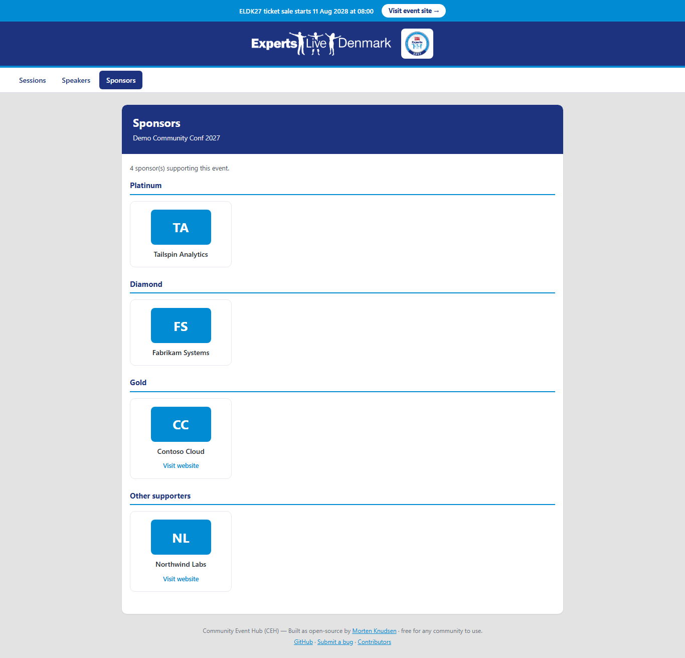](docs/img/public-sponsors.png) | [](docs/img/sponsor-portal.png) |
| *Sponsors grouped by tier, with an initials badge when no logo is uploaded.* | *The in-hub Sponsor area — company details, booth, tasks, leads and orders (screenshot refresh pending).* |

→ [`docs/FEATURES.md` §7](docs/FEATURES.md#7-sponsors--managed-as-companies-with-the-right-tasks) · integrations in [`docs/DESIGN.md` §6](docs/DESIGN.md#6-integrations)

### 8. Sponsor leads

A full lead pipeline for booth leads. **Capture leads at the booth, right in the hub** — booth staff type in the people they meet (name, email or phone, company, job title, interest) from any phone with no app install or scanner setup; each lead is screened for junk on the way in and shows in a "recently captured" list, requiring at least an email or phone so every lead is followable-up. This works alongside the Zoho Backstage scanner — use either or both. Each sponsor also gets a secured **Leads API** (JSON or CSV) with ready-made script samples and a browser-friendly "Your Leads API" page, with its own revocable access key/token (shown once, stored only as a secure hash). Leads live in a real pipeline with a live admin grid — Reply, mark Processed, set Interest, flag Ignore/Junk — and nothing is ever hard-deleted (soft status preserves rows so the screen keeps learning from operator overrides). Sponsors can opt into a daily digest or near-real-time alerts of new leads, junk skipped, recipients defaulting to all the company's contacts. Each lead gets a 0–100 heuristic quality score and label; only unmistakable test entries are auto-junked, everything else stays advisory.

→ [`docs/FEATURES.md` §8](docs/FEATURES.md#8-sponsor-leads--capture-screen-and-route-booth-leads) · pipeline + Zoho CRM pull (gated off by default) in [`docs/DESIGN.md` §6](docs/DESIGN.md#6-integrations)

### 9. Attendees & masterclass reconciliation

The hub compares two-day tickets against masterclass bookings and surfaces the mismatches — no booking, no ticket, or duplicate bookings — with branded chaser emails to sort them out. Attendees are synced in for visibility with deep links back to the booking system; the hub never re-does seat reservations, capacity or waitlists. "Same person, two emails" cases are resolved by a human or the attendee via a chaser, never auto-merged. Organizers get a clean, read-only attendee browser with summary tiles, search, filters and a CSV export that handles accented names; corrections happen at the source system.

- **A "My Event" dashboard for attendees.** Every attendee gets one mobile-first home with a live countdown (or "Happening now" during the event), their Master Class status (reserved / not booked / double-booked, with a deep-link to manage the booking), and the practical info — dates plus the venue as a one-tap map link.
- **A rebuilt in-hub Master Class page (`/MyMasterClass`).** One clean **three-section** page — your current pick, the master classes you can switch to, and a waitlist — so an attendee chooses, **switches**, or joins a waitlist without leaving the hub. Switching is an **atomic move** guarded by a **hard overbooking check**: a seat is only ever given up once the new one is secured, and a class that's full is never oversold (you're offered its waitlist instead). Every option shows **live booked / capacity / waitlist counts**, your **position** if you're waitlisted, and an inline flash that confirms exactly what happened.
- **A personal agenda on "My Event".** A **My sessions** card (the session they reserved), the **full agenda** with their own session highlighted, and quick links to their hotel, swag and lunch forms plus the public agenda — each session links to its details, to **ask the speaker a question**, and to **rate the session** afterwards. Read-only; booking still happens at the source.
- **Self check-in — "I'm here".** On the event days a ticket-holding attendee can tap one button to check themselves in (recorded and shown back to them) — self-service, idempotent, open only during the event window, and never re-implementing turnstiles or badge scanning.

| Attendee "My Event" | …on a phone |
|---|---|
| [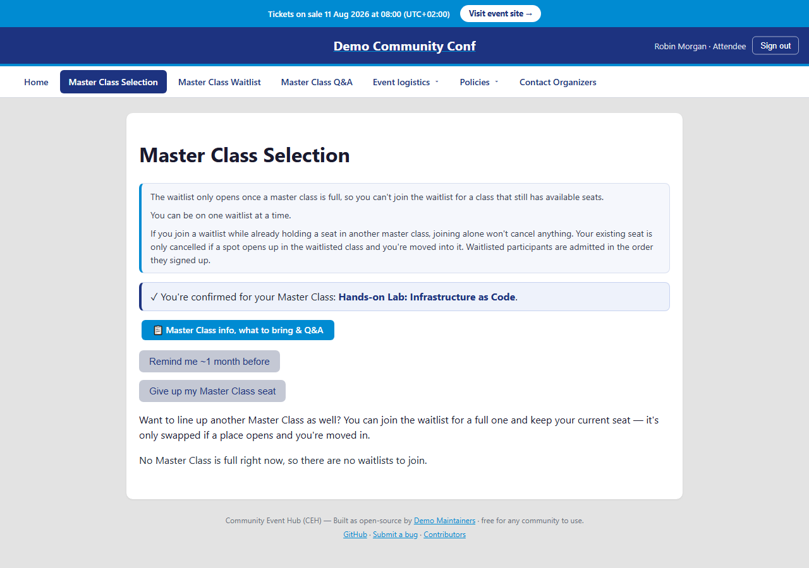](docs/img/attendee-my-event.png) | [](docs/img/attendee-my-event-mobile.png) |

*The attendee hub: a live countdown, ticket and Master Class status, a personal agenda and self check-in — with a deep-link out to manage the booking. Built phone-first for the person walking up to the venue (screenshot refresh pending — the Master Class section is now the in-hub 3-section `/MyMasterClass` page).*

→ [`docs/FEATURES.md` §9](docs/FEATURES.md#9-attendees--masterclass-reconciliation--one-clear-picture) · reconciler in [`docs/DESIGN.md` §6](docs/DESIGN.md#6-integrations)

### 10. Email & notifications

All mail is sent through a professional relay from your event sender address, rendered by one branded template engine (a shared branded shell + per-type content + `{{token}}` substitution) built to render correctly across clients including Outlook — and **every** email is on-brand, including sign-in invitations, manual task nudges and travel-payout confirmations. Organizers get an **Email Center** to preview any template safely, send a one-click test to themselves, and watch a delivery pulse.

- **A one-tap welcome email for every role.** A warm, mobile-first welcome with a single **"Open my Event Hub — signs you in automatically"** button (a genuine secure auto-login link) and a per-role line about what their hub is for. It explains how the Hub sits alongside the public Zoho Backstage site, and ships as both designed HTML and plain text.
- **Per-persona onboarding emails that send themselves.** Each crew group (volunteer / speaker / media / sponsor / organizer) has its own short set of getting-started emails; the moment an organizer **activates** someone they receive their group's set automatically — and never twice, even if re-activated.
- **Broadcast to exactly the people you mean.** Send one personalized message ("Hi {FirstName}") to a precisely chosen audience: filter by **role group**, by **status** (active / inactive / both), with a one-tick **"exclude test users"** safeguard (on by default) so a real broadcast never reaches the synthetic test cast. **Start from a reusable template** (blank / announcement / reminder / welcome) then edit freely; you see the **recipient count and the actual filtered list** before sending. Sending is resilient (a bad address never stops the batch) and resume-safe.
- **A complete email log.** Every email the hub sends — welcome, sign-in codes, reminders, broadcasts, onboarding and manual re-sends — is recorded; organizers get a log view (all emails and per-person, filterable by name/email) with subject, category, the address it went to, any CC, and whether it succeeded. Nothing is sent off the books.
- **Re-send to one person + a secondary email (optional CC).** From the Email Center, pick a person and a template and send it again. Anyone can add an **extra address** that gets copied on every email to them — purely additive, on top of their primary (or, for speakers, preferred) address.

→ [`docs/FEATURES.md` §10](docs/FEATURES.md#10-email--notifications--on-brand-controllable-safe) · email system in [`docs/DESIGN.md` §7](docs/DESIGN.md#7-email-system)

### 11. Organizer hub

Run the whole event from one place, through a menu that splits cleanly into a tidy **"My event"** bar (Home, profile, tasks, resources, just the forms that apply) and a single **"Organizer area"** dropdown that gathers every management tool — grouped into collapsible sections (People, Sessions, Comms, Sponsors, Volunteers, Logistics) with the three most-used tools (Organizer home, Command center, Dashboard) pinned at the top. A regular attendee, speaker, volunteer or sponsor never sees the management tools.

- **A command-center landing — "is the event on track, what do I do next?"** One screen triages the whole event: registrations (and how many active), attendee numbers, onboarding completion % overall and per group, hotel / swag / lunch / dinner headcounts, sessions scheduled vs needing a slot, and sponsor status — topped by a prioritized **"what needs my attention"** call-out (overdue tasks, due today, unassigned shifts, open help requests, people waiting to be approved, reconciliation mismatches, unscheduled sessions). Every number is a button into the matching, pre-filtered list, and an "all clear" message instead of an invented red badge. Read-only.
- **A cross-role event overview.** One read-only page answering "where does the whole event stand?" — participation by role, task completion per role and category, speaker milestone progress, volunteer coverage (assigned vs open), sponsor task/lead totals and attendee check-in numbers, with "needs attention" tiles.
- **Find a person fast — search, filter and sort everyone.** A dedicated **"Find a person"** box searches every participant by **name or email** with a one-tap jump to that person. The full **Participants** grid carries the same power: free-text search on name + email, filter by **status** (active / inactive / everyone), by **persona/role** and by **sponsor company**, and **sort** by name, email, persona or status. The same fast, **server-side** search / sort / pagination is on the Participants, Speakers, Attendees, Sessions, Sponsor-leads and Sponsors grids so long lists stay fast.
- **Bulk participant operations, safely.** Tick several people and deactivate, reactivate or change role in one action — behind a confirmation that states how many rows were selected — safe to re-run (already-in-state rows skipped) and reporting exactly how many changed.
- **Act as a participant, or hand off via a secure link.** From the grid an organizer can **"Switch to user"** to navigate the whole app exactly as that person sees it and act on their behalf — a banner names who is being helped, "Return to organizer" exits, and every switch/return/on-behalf change is written to an **acting-as audit log**. A lighter **"Modify on behalf"** quick-edit changes a couple of logistics fields without leaving the organizer seat. For a VP/speaker whose admin is handled by an assistant, an organizer can issue a **secure link** scoped to just that one person — time-bound, revocable, and audited.
- **Exports & printable run-sheets — on-site operations on paper.** An **"Exports & run-sheets"** page gives both **downloadable CSVs** and **print-friendly run-sheets** for the lists you carry to the floor: the **attendee list**, the **lunch headcount**, **room & session sheets** (running order per room with each session's room-QR link and speakers), the **volunteer rota**, and **badge data** (name, role, company). Read-only; not an event check-in tool (that lives in your ticketing system).

A **live dashboard** shows form completion, participants by role, tasks and overdues, sponsor completion, attendee mismatches and volunteer coverage, plus live pipeline cards for leads and event prep. An **action queue** surfaces late changes (a hotel/dinner edit close to the lock date) as items grouped by type with live open counts, resolvable with a note and exportable to CSV. Practical **data grids** for participants and hotel bookings (inline active and check-in/out toggles, filters) and tasks (inline edit), each with CSV export. Plus the management areas:

- **Speakers** — import from the Sessionize API or an Excel export, set participation, activate/deactivate, dashboard, send overdue reminders, add/update/delete dated tasks.
- **Hotel** — export the rooming list (hotel-grade `.xlsx`), import confirmation IDs, send updated calendar invites, dashboard.
- **Travel reimbursement** — overview of claims, register payout, send confirmation.
- **Swag** — multi-sheet vendor spreadsheet for polo/award/jacket orders, dashboard.
- **Group photos** — register a company + contact, schedule a slot, send calendar invites that *update* rather than duplicate (stable ICS UID).
- **App game** — register a sponsor's gift and send the branded gift reminder to every active sponsor contact.
- **Lunch & dinner overviews** — pre-/main-day lunch numbers and the appreciation-dinner list with allergies; booth overview.
- **Sponsor admin area** — manage the sponsor task catalog, run the leads pipeline (issue/rotate/revoke keys, set notification preferences, action leads), and watch a sponsor status dashboard sorted overdue-first.

| Command center | Live dashboard |
|---|---|
| [](docs/img/organizer-command-center.png) | [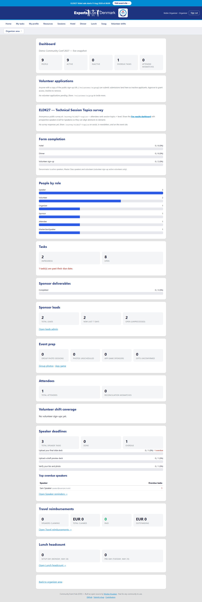](docs/img/organizer-dashboard.png) |
| *Prioritized "what needs my attention" with every number a link into the matching list.* | *Form completion, participants by role, tasks, sponsor and volunteer coverage at a glance.* |

→ [`docs/FEATURES.md` §11](docs/FEATURES.md#11-organizer-hub--run-the-whole-event-from-one-place) · feature surface in [`docs/DESIGN.md` §8](docs/DESIGN.md#8-feature-surface-hubs--organizer-areas)

### 12. Hosting & reliability

The full environment (database, web app, scheduled jobs, storage, secret vault, logging and monitoring) is **defined as code** (Bicep): Azure SQL, App Service, Azure Functions, Storage, Key Vault, Log Analytics + Application Insights — separate dev + prod instances per event (e.g. `rg-communityhub-dev`, `rg-communityhub-prod`). Background jobs handle reminders, order pulls, attendee reconciliation, portal sync, sponsor-lead delivery and upload-change watching on their own schedules, each individually switchable. **Scripted, safe deploys** build a versioned artifact, deploy and health-check, with one-command rollback; **production releases are zero-downtime** (deploy to a staging slot, warm up, then swap — dev stays on B1, prod runs S1 with a slot). The app absorbs Azure SQL cold-starts gracefully (EF retry) so it runs happily on cost-efficient, auto-pausing infrastructure (~€25/month per instance; +~€50/month for the prod S1 slot). Schema is versioned via EF migrations and **kept in sync across dev and prod every release**. Publishing to the public template runs through a controlled, allow-listed (denylist) process with a dry-run pre-flight; protected branches, required reviews and secret scanning keep the codebase safe; each environment binds its own verified custom domain with a managed certificate. **Dev mirrors prod's data** so dev is a faithful rehearsal — the only deliberate difference is that all development email is redirected to a single test address; synthetic test accounts are tagged (`IsTestUser`) so they never skew real counts.

#### Safe-by-default outbound email (allowlist model)

Outbound email is guarded so a half-configured or pre-launch environment can never spam real people:

- **Dev redirect.** In development, `Email:RedirectAllTo` sends *every* outbound mail to one test inbox, with the subject prefixed `[TEST -> original@addr]` — so the whole flow is exercised without reaching real participants.
- **Prod allowlist.** In production, `Email:OnlySendTo` is an **allowlist** — only addresses on the list actually receive mail; everyone else is filtered out. This is the model that lets you bring an edition live gradually. When a send reaches **nobody** because everyone was filtered out, the organizer is told so honestly rather than shown a false "done".

→ [`docs/FEATURES.md` §12](docs/FEATURES.md#12-hosting--reliability--production-grade-by-design) · infra/deploy/runbook in [`docs/DESIGN.md` §11–15](docs/DESIGN.md#11-infrastructure-bicep--environments)

### 13. Accessibility

The participant-facing pages target **WCAG 2.1 AA** (markup, ARIA and CSS only — no data-model change): correct page language for screen readers, a **skip-to-main-content** link, a visible keyboard focus ring everywhere, a real navigation landmark with "you are here", grouped form choices as proper fieldsets, and an accessible survey wizard. An **axe-core** test suite scans the login, survey and per-role hub pages so regressions are caught.

**Consistent, honest feedback after every action.** A shared set of UX building blocks gives the whole hub the same dependable behaviour: a tidy **"✓ Saved" / error banner** (success fades, errors stay until dealt with, both announced to screen readers, always dismissable); **to-the-point form errors** shown next to the field that needs fixing; and a clear **"are you sure?"** confirmation before big or irreversible actions, stating exactly how many people will be affected. Success/failure is reported truthfully after every send and QR provisioning — a real send confirms "sent at &lt;time&gt; — N recipient(s)"; a send that reached **nobody** (everyone filtered out, or already sent) is shown as a distinct, clearly-not-a-success notice explaining why. Colour- and icon-coded (green success, blue "nothing happened", red error), announced to screen readers, in English and Danish.

→ [`docs/FEATURES.md` §13](docs/FEATURES.md#13-accessibility--usable-by-keyboard-and-screen-reader-2026-06-15)

### 14. Bilingual UI — English & Danish

Every participant-facing page can be shown in **English (default) or Danish**, with a small **English / Dansk** switcher in the top bar of every page (including the anonymous sign-in page and inside the embedded view). The choice is remembered in a cookie and the page honours the browser's preferred language by default; the declared `lang` switches with it so a screen reader pronounces copy correctly. The whole participant surface is translated — first-run onboarding, every self-service form, sponsor pages, attendee detail, the survey wizard and results, organizer navigation and hub status cards. Strings live in one shared resource file per language, so adding a language or translating more pages is a resource-file edit, not a code rewrite.

→ [`docs/FEATURES.md` §14](docs/FEATURES.md#14-bilingual-ui--english-and-danish-2026-06-15)

### 15. Social graphics & post scheduling

The hub produces **ready-to-share social graphics** for speakers and sponsors (a polished PNG composed from a template background plus photo/logo and name, cross-platform with no special server setup), keeps every graphic and speaker picture in **one shared file store (SharePoint)**, and lets speakers share their own — all with an **organizer approval step** so nothing is visible to a speaker until released. Organizers can swap in their own artwork behind the same link. On a **"My share graphics"** page speakers download the PNG or open a ready-to-edit LinkedIn/X draft (including an "I'm speaking at …" button) — the hub never posts on anyone's behalf.

A **LinkedIn company-page post scheduler** lets organizers queue posts (Speaker / Sponsor / Ad-hoc) with a scheduled time, auto-written text (your manual edit always wins), and the right **approved** graphic attached automatically — a still-unapproved graphic is never attached (the post publishes text-only with a clear note until it's released). Preview exactly what will publish, toggle a post active/inactive without deleting it, with compliant tagging (sponsor posts tag the signer, coordinator and company; speaker posts tag organizers only) plus a 5-minute speaker heads-up email and publish notifications. Nothing is ever double-posted.

The same shared file store also powers a **reusable, server-proxied live-image** component: any page can show pictures straight from a SharePoint folder (e.g. the venue and booth photos behind the sponsor "Our Booth" page) through the hub's own image proxy — the file stays in SharePoint, the link is never exposed to the visitor, and dropping a new photo on SharePoint updates the page with no deploy.

*External connections (the SharePoint tenant/site and LinkedIn page + token) are set up by the operator with their own credentials; until configured, the hub still generates graphics and builds drafts — it simply runs in a safe, no-post mode.*

→ [`docs/FEATURES.md` §15](docs/FEATURES.md#15-social-media-graphics--shared-file-store-2026-06-15)

### 16. AI Community Helper

Every signed-in person — attendee, speaker, volunteer, sponsor **and** organizer — gets a built-in **AI Community Helper**: a chat panel that answers "who's speaking on X?", "when's the lunch break?", "which sessions cover Y?" in plain language. It is **grounded**, not guessing: it only ever answers from the event's own facts — the **published** speakers, their skills, the sessions and the schedule (key times like lunch on each day) — plus a short, operator-maintained **"Contact the organizers"** reference. It also reads from an **operator-curated SharePoint reference folder** (Markdown, text, Word, PDF or Excel), so organizers can teach the helper something new — a venue FAQ, a travel note, a sponsor briefing — simply by **dropping or replacing a file on SharePoint**; the helper reflects it within minutes, with **no deploy**.

Privacy is enforced at the source: an **unpublished speaker is a hard gate** — they never surface in an answer until organizers publish them — and every retrieval is **authorized at fetch time**, so the helper can only ever ground on what the asker is allowed to see. The chat panel scrolls long replies so a detailed answer never overflows.

→ [`docs/FEATURES.md` §22](docs/FEATURES.md#22-ai-community-helper--ask-anything-grounded-and-privacy-gated-2026-06-27) · design in [`docs/DESIGN.md`](docs/DESIGN.md)

---

## How it fits with Zoho Backstage

Community Event Hub is the **behind-the-scenes self-service companion** to your public event site — it does **not** replace Zoho Backstage. The two stay in their lanes:

- **Backstage owns the public-facing event** — the public site, the published schedule, ticketing, capacity/waitlists and the booth lead scanner. The Hub never re-implements seat reservations or turnstiles.
- **The Hub owns the operational layer** — crew sign-in, self-service forms, tasks & reminders, sponsor deliverables, volunteer planning, exports and the organizer back office.
- **Data flows where it makes sense, not in circles.** The Hub **embeds** safely inside a Backstage portal as a seamless panel; it **pulls** accepted speakers and sessions from the **Sessionize** API and master-class bookings from **Zoho Booking** (those systems stay source-of-truth); it can **push** approved speaker bios out to Backstage speaker pages (off until you explicitly approve a line-up); and a speaker's **preferred email** is honoured by both the Hub *and* Backstage. Attendees are synced in for visibility with deep links back, but bookings are always managed at the source.


*The Hub embeds seamlessly inside the public event portal — sign-in works inside the iframe.*

---

## Getting started

Want to run your own edition? You will need an Azure subscription, the `az` and `dotnet` 8 tooling, an SMTP relay for transactional email, and a DNS zone you can add a CNAME to.

Prerequisites:

- Azure subscription you can deploy to (one resource group per environment is fine)
- `az` CLI (>= 2.50), `bicep` (bundled with az), `dotnet` 8 SDK, `gh` CLI optional
- A Brevo (or any SMTP-relay) account for transactional email
- A DNS zone you can add a CNAME to

```bash
# 1. clone (then set baseName + your own subscription)
gh repo clone KnudsenMorten/community-event-hub
cd community-event-hub
#   - edit infra/main.dev.parameters.json / main.prod.parameters.json (baseName, region, sizes)
#   - export AZURE_SUBSCRIPTION_ID=<your subscription id>   # deploy.sh pins this so a deploy
#                                                           #   can't land in the wrong sub

# 2. deploy infra (App Service Plan, SQL Server + DB, Key Vault, Functions
#    plan, Storage, Log Analytics, App Insights). No SQL password needed:
#    the SQL server is Azure-AD-only and the apps authenticate via managed identity.
./scripts/deploy.sh dev --whatif   # preview first
./scripts/deploy.sh dev            # or `prod`

# 3. set secret values straight into Key Vault (Brevo SMTP, WooCommerce, Company Manager, Zoho, ...)
./scripts/set-secrets.sh dev

# 4. apply EF migrations against the env's SQL (Azure-AD auth; add your client IP to the
#    SQL firewall temporarily if needed, then remove it)
dotnet ef database update --project src/CommunityHub.Core --startup-project src/CommunityHub

# 5. seed your Event row + a few test participants (edit values first; use your own addresses)
./tools/seed-dev.ps1

# 6. publish + deploy the app code (web + jobs)
./tools/deploy-app.ps1 -Env dev            # build -> timestamped artifact -> deploy -> health check
./tools/deploy-app.ps1 -Env dev -App jobs  # the Functions app, same scripted way

# 7. bind your custom domain (after the CNAME verifies)
az webapp config hostname add --resource-group rg-<baseName>-dev \
  --webapp-name <webAppName> --hostname hub.your-event.example
```

`tools/rollback-app.ps1` redeploys any kept artifact (or, on prod, an instant slot swap-back). Full step-by-step — DNS, certs, post-deploy settings, and the operate playbook — is in **[`docs/DESIGN.md` §12 (deploy)](docs/DESIGN.md#12-deploy-rollback--zero-downtime)** and **[§15 (runbook)](docs/DESIGN.md#15-operational-runbook)**.

---

## Configuration model

Two layers decide "which event are we serving":

**The active `Events` row** (`IsActive = 1`) — login, dashboard, and reminder jobs all resolve "current event" via that flag. Roll over to a new edition by inserting a new row, marking it active, and (optionally) deactivating the previous. Per-event fields: `Code` (e.g. `ELDK27`), `CommunityName`, `DisplayName`, `StartDate` / `EndDate` / `PreDayDate`, `VenueName` / `HubHostname` / `IsActive` / `LockDate`.

**Per-edition JSON** under `config/*.<edition>.json` — event, hotel, integrations, sponsor, content and speaker-deadline files (each validated on load against its `_schema` key; secrets are Key Vault references by name only). See the full table in **[`docs/DESIGN.md` §17](docs/DESIGN.md#17-configuration--key-vault-reference)**.

App-wide settings live in App Service configuration and resolve to Key Vault references for secrets:

- `Sql:ConnectionStringTemplate` + `Sql:AdminUser` (+ `Sql:AdminPassword` → KV)
- `Email:SmtpHost` / `SmtpPort` / `FromAddress` (+ `SmtpUsername` / `SmtpKey` → KV)
- `Email:RedirectAllTo` — **dev-only test mode**; when set, every outbound mail is redirected here and the subject is prefixed `[TEST -> original@addr]`. Leave EMPTY in prod (prod uses an `Email:OnlySendTo` allowlist instead).
- `Embedding:BackstageOrigin` — CSP `frame-ancestors` (the Backstage origin list; empty blocks the iframe).

---

## Embedding

The hub is designed to embed inside an existing event-management tool (the upstream instance embeds it inside Zoho Backstage). To embed:

1. Set `Embedding:BackstageOrigin` to the embedding origin(s) (e.g. `https://backstage.example.com`).
2. The app strips `X-Frame-Options` and emits a CSP `frame-ancestors <origin>` header on every response.
3. PIN login + magic-link tokens work inside an iframe (cookies are `SameSite=None; Secure` behind HTTPS).

Embed snippet template lives at `tools/backstage-embed-snippet.html`. More in **[`docs/DESIGN.md` §4](docs/DESIGN.md#4-auth-identity--embedding)**.

---

## Repository layout

```
src/
  CommunityHub/             ASP.NET Core 8 Razor Pages web app (+ Leads API, /health)
  CommunityHub.Core/        Domain + Data + Email + Reminders + Integrations (shared)
  CommunityHub.Jobs/        Azure Functions worker — reminders, pulls, reconciliation, watchers

infra/
  main.bicep                Infra (App Service, SQL, KV, Functions, Storage, Log Analytics, App Insights)
  modules/                  One Bicep per Azure resource type
  main.{dev|prod}.parameters.json    Per-environment parameters (provide your own in a fork)
  DEV_TO_PROD_PARITY.md     Live dev->prod parity checklist

scripts/
  deploy.sh                 Idempotent `az deployment group create` of infra/main.bicep
  set-secrets.sh            Write KV secret values from prompts
  seed-<edition>.sql        Your own edition seed SQL (Event row + participants; keep it private)

docs/
  FEATURES.md               Public feature catalog (delivered features)
  DESIGN.md                 Architecture + data model + integrations + build + deploy + runbook

templates/
  emails/                   Branded email templates (layout + per-type content); packaged into
                            BOTH publish bundles by the csproj files — rendered at runtime, so
                            first-class code, not an example

config-examples/
  templates/emails/         Historical copies kept for the community fork docs

tools/
  seed-dev.ps1              Seed an Event row + test participants (one per role)
  deploy-app.ps1            Build + zip (forward-slash entries) + deploy web/jobs; slot-swap on prod
  rollback-app.ps1          Instant slot swap-back / artifact redeploy (web + jobs)
  enable-slot-deploys.ps1   One-time S1 + staging-slot + slot-MSI Key Vault grant (for prod)
  plant-test-pins.ps1       DEV-only: plant known-PIN LoginPin rows for the Playwright suites
  CommunityHub.OneShot/     Console CLI to run one job once locally
```

This repo is a sanitized template — it ships generic placeholders, not event-specific data. Keep your own production data (the `Events` row, real logos, prod parameter files, edition seed SQL and per-edition `config/*.json`) in a private copy; never commit it here.

---

## Documentation

| Doc | What it covers |
|---|---|
| **[`docs/FEATURES.md`](docs/FEATURES.md)** | Public feature catalog — the delivered feature set, by audience (the 16 areas above). |
| **[`docs/DESIGN.md`](docs/DESIGN.md)** | Architecture, data model, integrations, jobs, email, build, infra, deploy, and the operational runbook. |

Newly built capabilities are folded directly into the relevant feature area above (and into [`docs/FEATURES.md`](docs/FEATURES.md)). The public mirror is updated milestone-by-milestone — for per-release detail see the commit history (`git log --oneline`); every public commit message carries the private-repo source sha for traceability.

---

## License

MIT — see [`LICENSE`](LICENSE). Use it for your community event, fork it, redistribute, no warranty.

---

## Status

Active development for the next edition. The public mirror is updated milestone-by-milestone — see commit messages tagged with the private-repo source sha for traceability. Issues / PRs welcome.
