# Community Event Hub

> Open-source platform for running tech community conferences without the spreadsheet chaos, forms, and follow-up emails. Speakers, volunteers, sponsors, and attendees get self-service hubs; organizers get dashboards, reminders, and one place to run hotels, travel, swag, and tasks. Fork it, customize via JSON, and deploy on Azure.

> **Free for any community to use.** Built by Microsoft MVP **Morten Knudsen** ([aka.ms/morten](https://aka.ms/morten)).
> Public mirror: <https://github.com/KnudsenMorten/community-event-hub>.

A self-service participant portal for community-run tech events. One web app that every participant of an edition logs in to with a PIN, sees a personalized landing page for their role, and self-services everything they need to do before the event — book a hotel night, RSVP to the appreciation dinner, pick a polo size, accept a speaker slot, fill in travel reimbursement, upload a sponsor logo, etc.

Built to be **evergreen and multi-community**: the codebase is generic (`CommunityHub`), the per-event data — community name, dates, venue, hostname, deadlines — lives in the `Events` table. A new edition or a different community is a new row, not a code change. Open-sourced from the **Experts Live Denmark** instance that runs the conference.

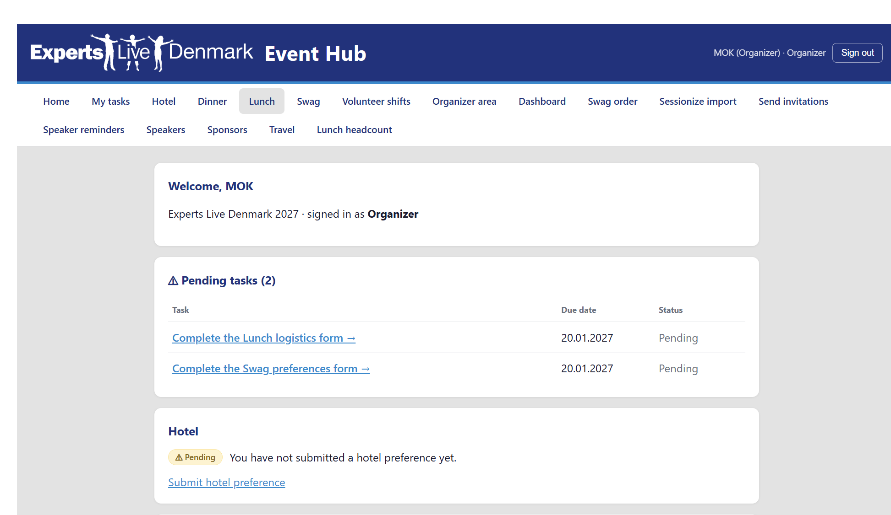

---

## Table of contents

- [Goals](#goals)
- [Problems to solve](#problems-to-solve)
- [Architecture](#architecture)
  - [Open-source public solution](#open-source-public-solution)
  - [Design](#design)
  - [Deployment](#deployment)
  - [Security — login](#security--login)
  - [Integration](#integration)
  - [Cost](#cost)
- [End-user hubs (interfaces)](#end-user-hubs-interfaces)
  - [Welcome (one-time only)](#welcome-one-time-only)
  - [Speaker Hub](#speaker-hub)
  - [Volunteers Hub](#volunteers-hub)
  - [Sponsors Hub](#sponsors-hub)
  - [Attendees Hub](#attendees-hub)
- [Organizers Hub (event management)](#organizers-hub-event-management)
  - [Speakers management](#speakers-management)
  - [Sponsors management](#sponsors-management)
  - [Volunteer management](#volunteer-management)
  - [Organizer tasks management](#organizer-tasks-management)
  - [Hotel management](#hotel-management)
  - [Travel reimbursement management](#travel-reimbursement-management)
  - [Swag management](#swag-management)
  - [Bella group event management](#bella-group-event-management)
  - [Group photos management](#group-photos-management)
  - [App game sponsor participation management](#app-game-sponsor-participation-management)
- [Automation (scripts)](#automation-scripts)
  - [Sponsor automation](#sponsor-automation)
  - [Attendee automation](#attendee-automation)
  - [Sponsor sync — to-do](#sponsor-sync--to-do)
- [Deploy your own instance](#deploy-your-own-instance)
- [Configuration model](#configuration-model)
- [Resilience notes](#resilience-notes)
- [Embedding](#embedding)
- [Repository layout](#repository-layout)
- [Full design spec](#full-design-spec)
- [License](#license)
- [Status](#status)

---

## Goals

- Build an **open-source community event platform** that other communities can re-use — to help scale the Microsoft (and adjacent) community by automating many manual tasks. Public repo: <https://github.com/KnudsenMorten/community-event-hub>.
- Provide a central hub for **speakers / volunteers / sponsors** to collect data and tasks — and let them see and manage their own submissions (self-service).
- **Centralize tasks** — one overview, not five.
- **Better change management** — hotel changes, speaker changes, etc. flow through the hub instead of email threads.
- **More automation** — fewer manual touches per participant.
- **Sync data to subsystems** — Zoho Backstage / ERP / Webshop, two-way where it makes sense.
- **Automate deliverables to partners** — hotel rooming list, Bella catering, swag / polo orders.
- **Automate invoicing** — faster money in the bank.

---

## Problems to solve

(vs. how organizing a conference usually works today)

- Move out of spreadsheets into a database — automation vs. manual.
- Avoid static forms — they generate endless follow-up and manual merges in Excel.
- Simplify the system landscape — drop Microsoft Planner with tenant integration for sponsors.
- Avoid manual follow-up by validating data at creation time (e.g. company tax ID).
- Separate collection of info away from Sessionize / generic forms — only collect from the selected people.
- Provide more self-service so we don't have to update on people's behalf (avoids human mistake).
- Minimize emails — only send for overdue tasks.

---

## Architecture

### Open-source public solution

- Lives on GitHub as [`KnudsenMorten/community-event-hub`](https://github.com/KnudsenMorten/community-event-hub).
- Each community (e.g. ELDK) clones / forks the public repo and customizes per event.

### Design

- Repo is 100% managed through GitHub CI/CD actions + Visual Studio Code with Claude AI integration.
- Per-event customization via JSON file (community name, hostname, deadlines, role rules).

### Deployment

- Automatic deployment to Azure of all components (dev + prod).
- Components: **Azure SQL, Azure App Service, Azure Functions, Application Insights**.
- Separate dev + prod instances per event (e.g. `rg-eldk27hub-dev`, `rg-eldk27hub-prod`).
- DNS:
  - dev: `dev.eldk27.eventhub.expertslive.dk`
  - prod: `eldk27.eventhub.expertslive.dk`
- **App-code deploys are scripted** (`tools/deploy-app.ps1 -Env dev|prod`):
  build &rarr; timestamped artifact (last 10 kept) &rarr; deploy &rarr; health
  check. `tools/rollback-app.ps1` redeploys any kept artifact.
- **Zero-downtime prod deploys (live since v1.2.4):** the prod plan runs
  **S1** with a `staging` deployment slot (`tools/enable-slot-deploys.ps1`
  did the one-time upgrade: S1 + slot + slot-identity Key Vault grant), so
  `deploy-app.ps1 -Env prod` automatically does deploy-to-slot &rarr;
  warm-up &rarr; **swap**; production users never see the restart, and
  rollback is an instant swap-back. Dev intentionally stays on **B1**
  (direct deploy, short restart is fine there). Gotcha baked into the
  tooling: zips must carry forward-slash entry names &mdash; PS 5.1
  `Compress-Archive` writes backslashes, which the Linux Kudu rejects with
  a blind HTTP 400.

### Testing

- **Playwright mobile suites** under `tests/playwright/` run against real
  DEV + PROD deployments on three device profiles (iPhone 13 / Pixel 5 /
  iPhone SE 375&nbsp;px — the viewport that historically caught layout
  clips):
  - `survey-mobile.spec.ts` — public survey wizard end-to-end (no login).
  - `admin-mobile.spec.ts` — organizer admin pages behind a **real PIN
    login**: `tools/plant-test-pins.ps1` plants short-lived known-PIN rows
    in the DEV database (PBKDF2-hashed, future-dated so they outrank
    form-requested PINs, self-expiring, single-use), then the suite signs
    in and exercises the Attendees browser + Email Center, including an
    actual test-send through Brevo. DEV-only; skips itself unless
    `ADMIN_PIN` is set.
- DEV redirects ALL outbound email to the operator inbox
  (`Email__RedirectAllTo`); PROD supports a temporary `Email__OnlySendTo`
  allowlist for smoke-testing new functionality against production data
  without mailing real participants.

### Security — login

- PIN-by-email (no passwords; PIN is single-use and short-lived).
- **NEW in v1.1.x: user-picked session length**. Login form now has a "Stay signed in for" dropdown — 1 day / 1 week (default) / 1 month / Until I sign out — so people don't have to redo PIN every visit. Cookie is `IsPersistent + ExpiresUtc` set to match the choice; sliding refresh keeps active sessions alive past the picked window.

- Login via email + PIN code (PIN valid for 15 minutes).
- URL support with PIN auto-login (valid 7 days).
- **NEW in v1.2.x: deterministic per-sponsor API tokens** — the sponsor leads
  API accepts a token derived as SHA256(EventId + SponsorCompanyId +
  TokenVersion + GlobalSecret), so tokens can be re-issued deterministically
  and revoked by bumping the per-sponsor TokenVersion. Standard
  `Authorization: Bearer` is accepted alongside `X-Sponsor-Api-Key` / `?key=`.

### Integration

- iframe-embedded inside Zoho Backstage.

### Cost

- Estimated platform cost per instance: **~€25 / month** on the B1 tier.
- The prod instance was upgraded to **S1** for zero-downtime slot-swap
  deploys (B1 has no slots), which adds roughly **€50 / month** to the prod
  instance; dev stays on B1. App memory peaks around 270&nbsp;MB against
  S1's 1.75&nbsp;GB, so there is no pressure to go higher than S1.

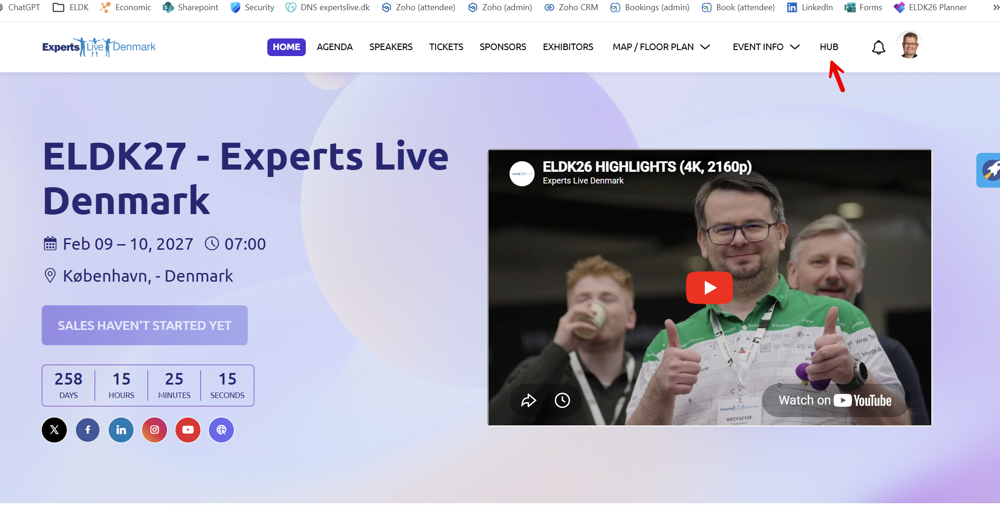
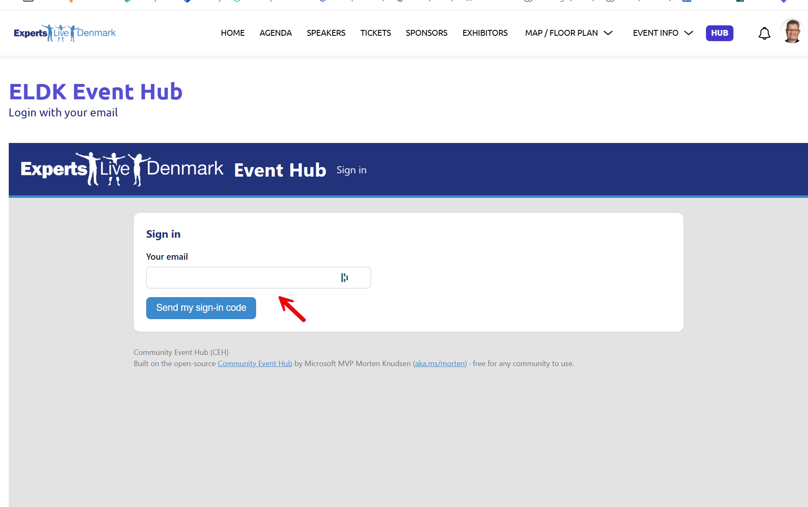

---

## End-user hubs (interfaces)

### Welcome (one-time only)

A first-time **Welcome** page is shown once per participant per edition.

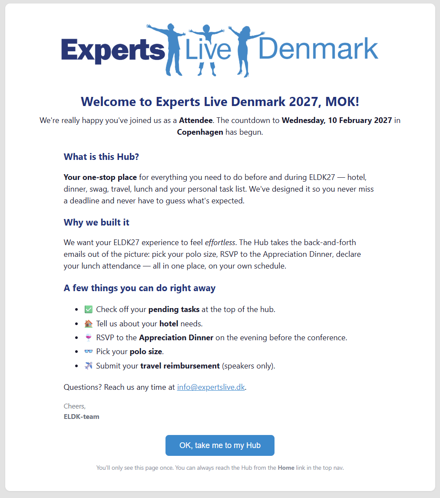

### Speaker Hub

- Tasks for speakers + overdue-only reminders — join Signal channel, deliver preview / final presentation, submit info, join Zoho Backstage.
- Collect + maintain info:
  - **Hotel** (incl. calendar invite)
  - **Appreciation dinner** (incl. calendar invite)
  - **Swag** incl. polo
  - **Travel reimbursement claim**
  - **Lunch participation** (pre-day)
  - **Speaker info** — accreditation, country, first-time speaker

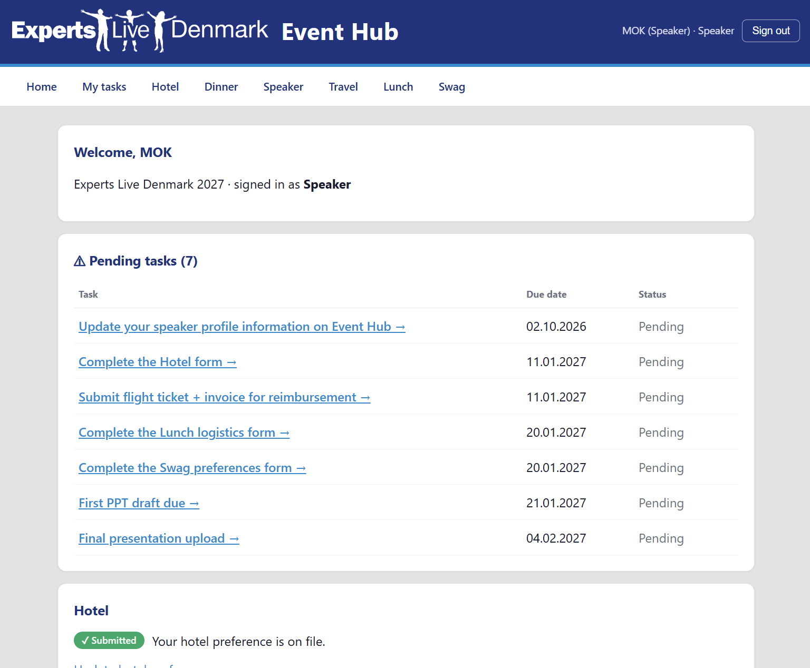
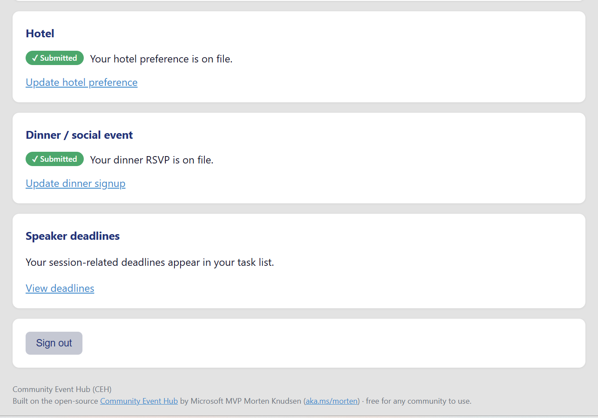
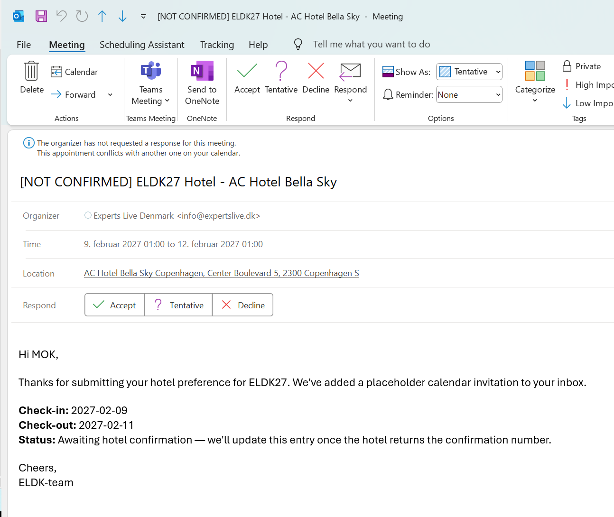

### Volunteers Hub

- Volunteer interest sign-up (unconfirmed participant) — collect availability.
- **Confirmed-volunteers only** view: congrats mail on selection, then:
  - **Hotel** (incl. calendar invite)
  - **Appreciation dinner** (incl. calendar invite)
  - **Swag** incl. polo
  - **Lunch participation** (setup day, pre-day)
  - **Tasks assigned** with sync-to-calendar option (button)

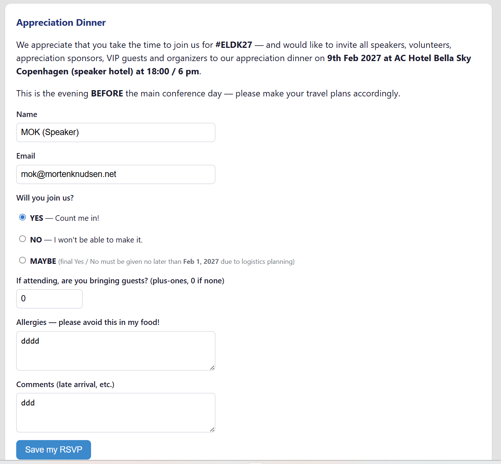
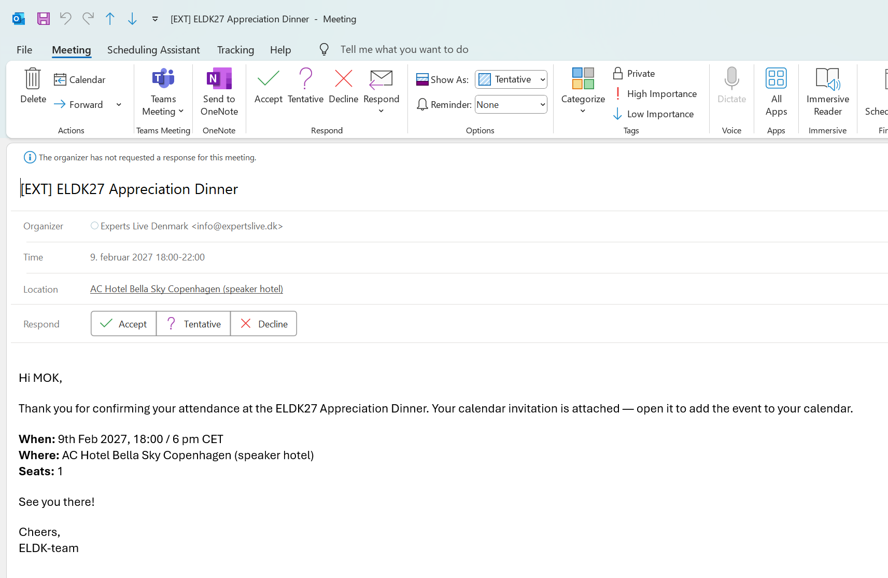
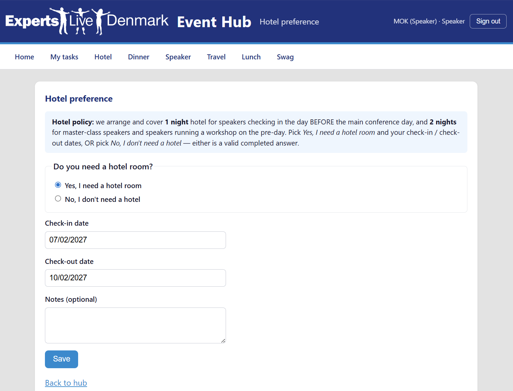

### Sponsors Hub

- Tasks + overdue-only reminders.
- Register company info — automatic upload to Zoho Backstage (exhibitors only).
- **NEW in v1.1.x: Sponsor leads API**. Each sponsor company gets a personal API key issued by the organizer team. The sponsor sees the key metadata + their company id + a JSON endpoint + a CSV endpoint + 3 PowerShell samples + a browser-direct download URL on the new **Your Leads API** page. The raw key is shown ONCE at issue time (SHA256-hashed in the DB) so a regenerate is the only way back if the sponsor loses it.
- **NEW in v1.1.x: per-sponsor lead status + AI screen**. Statuses are Open / Processed / Interest / Ignore / Junk — nothing is hard-deleted, so the AI screen model can learn from operator overrides over time.
- **NEW in v1.1.x: delta notifications**. Sponsors can opt-in to a daily digest (or real-time) of new leads since the last notification, with an optional skip-junk filter.

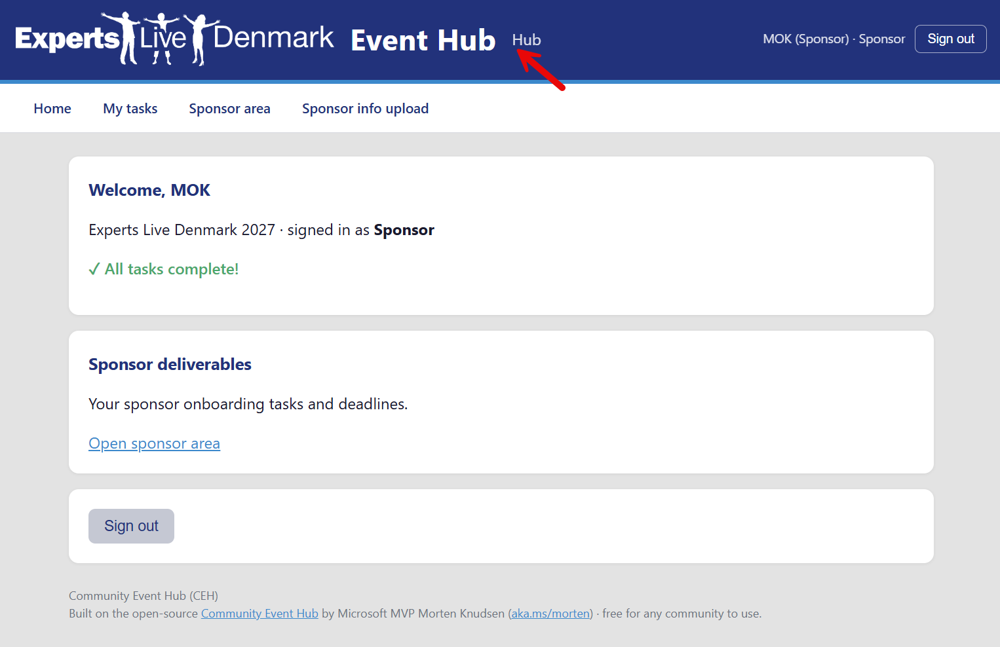

### Attendees Hub

- Pre-day attendees only:
  - See confirmed master class.
  - Remove master class booking(s).
  - Check if a booking was made with a different email.

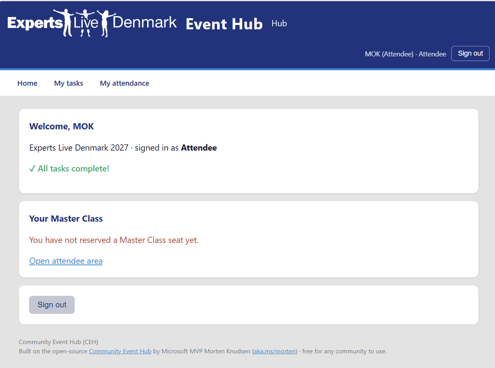

### Surveys (public)

Anonymous, no-login mini-surveys for the wider community — driven entirely
from JSON config files under `src/CommunityHub/App_Data/Surveys/<slug>.json`,
so adding or editing a survey is a config change, not a code change or
DB migration. Each survey ships two public URLs:

- `/survey/{slug}` — 3-step wizard (pick a track → rank three topics → pick a level per topic). One submit, no account, ~2 minutes for the respondent.
- `/survey/{slug}/results` — live aggregated dashboard for the same survey. Designed to be shared with prospective speakers (Call for Speakers) so they can align abstracts to attendee demand.

First instance is **`/survey/eldk27-topics`** — the ELDK27 Technical
Session Topics survey. Seven tracks (Security / Intune / Identity / Azure /
Microsoft 365 / AI low-code / AI development), each with ~8 session topics
grouped by category, and Introduction/Advanced/Expert examples written per
track. Responses are persisted to `SurveyResponses` + `SurveyResponsePicks`;
the survey content lives in JSON. Organizer dashboard surfaces a
**ELDK27 Technical Session Topics** card with response count, top track,
and a link to the public results dashboard.

Survey UX details: each track section on the results page has a stable
anchor, and the thank-you page links straight to each track's results.
The 1st/2nd/3rd ranking buttons render as a dark-blue badge with a white
ring when picked, so the selection stays clearly visible on the blue
topic rows (fixed after operator feedback — the picked state previously
matched the row color and disappeared).

---

## Organizers Hub (event management)

> **NEW in v1.2.4: Attendees browser + Email Center.**
>
> 1. **Attendees** (*Organizers → Attendees*) — the full reconciled
>    attendee set (Zoho Backstage tickets + Zoho Bookings Master Class
>    seats, synced nightly), with summary tiles (total / 2-day tickets /
>    booked / mismatches), free-text search, ticket + booking + mismatch
>    filters, and a **CSV export of the current filter** (UTF-8 BOM so
>    Excel handles Danish names). Read-only by design: attendees are owned
>    by the reconcile job; fixes happen at the Zoho source.
> 2. **Email Center** (*Organizers → Email center*) — renders every
>    branded email template through the SAME provider + layout the
>    reminder engine uses, with realistic sample tokens and a sandboxed
>    live preview, so a broken or missing template fails *visibly here*
>    instead of silently in a 06:00 Function run. One click sends a test
>    copy to the signed-in organizer. Below it: a **7-day delivery pulse**
>    (sent count per reminder type) and the **delivery ledger** (the
>    reminder engine's idempotency table — one row per email actually
>    delivered) filterable by type and recipient.
>
> Both pages are organizer-gated, mobile-tested (Playwright PIN-login
> suite at 375 px), and covered by `tests/playwright/admin-mobile.spec.ts`.

> **NEW in v1.2.5: Broadcast email** (*Organizers → Broadcast*) — compose
> one plain-text message and the hub sends it individually (branded
> layout, personal "Hi {firstName}") to every **active** participant in
> the selected role groups, optionally plus the reconciled attendees.
> Preview shows the exact recipient count before sending; every delivery
> is recorded in the `SentReminder` ledger keyed per subject, so a retry
> or double-click only reaches people who have not received that subject
> yet (resume-safe, never double-mails). Per-recipient failures are
> counted, logged and never abort the run. Deploy tooling also gained
> `tools/deploy-app.ps1 -App jobs` so the Functions app ships the same
> scripted way as the web app.

> **NEW in v1.2.6: the sponsor leads pipeline is fully DB-backed.** What
> v1.1.x introduced as UI + scaffolding is now real end to end:
>
> - **Durable stores** — `SponsorLead`, `SponsorLeadNotificationPref`,
>   `SponsorApiKey` and `SponsorTokenVersion` EF tables (migration
>   `SponsorLeadsPipeline`). Issued API keys and deterministic-token
>   version bumps (= revocations) survive restarts and slot swaps; the
>   previous in-memory scaffolds are retired.
> - **Live leads grid + actions** — the Leads admin page shows real rows
>   with per-lead Reply (sends branded mail + records the audit on the
>   row), Mark Processed / Interest / Ignore / Junk. Nothing hard-deletes;
>   Ignore/Junk rows are preserved (and hidden from sponsor feeds) so
>   operator overrides keep training the screen. Pipeline counters and
>   last-sync timestamp are live.
> - **Sponsor feed serves real data** — `leads.json` / `leads.csv` return
>   the sponsor's leads (junk/ignored excluded), stamped with the live
>   event + community names.
> - **Delta digests** — `SponsorLeadsJob` (hourly at :15) sends each
>   opted-in sponsor the leads captured since their `LastDeltaSentAt`
>   cursor: Daily cadence at 06:15 UTC, RealTime on every hourly run;
>   skip-junk honored; cursor advances only after a successful send so a
>   failed delivery retries the same window. Recipients default to all
>   sponsor contacts when the pref list is blank.
> - **Zoho CRM pull** — nightly at 05:15 UTC + the admin "Sync now"
>   button, idempotent by Zoho record id (content columns re-sync, hub
>   workflow columns never overwritten). Config-gated by
>   `Zoho__CrmEnabled` (default off) until the refresh token carries the
>   `ZohoCRM.modules.READ` scope and CRM records carry the sponsor
>   company id field (`Zoho__CrmSponsorCompanyIdField`).
> - **AI screen, heuristic baseline** — every synced lead gets a 0-100
>   score + label (looks-legit / incomplete / unreachable / test-entry);
>   only unmistakable test entries are auto-junked, everything else is
>   advisory. Operator status overrides are the training data for a
>   future model-based screen.

> **NEW in v1.2.8: hotel rooming list + dashboard pipeline cards.**
>
> - **Rooming list export** (*Organizers → Data grid → "Rooming list
>   (Excel, for the hotel)"*) — a hotel-grade `.xlsx` of every
>   participant flagged NeedsRoom: name, email, phone, check-in /
>   check-out, room type, share-with and hotel confirmation columns,
>   ready to mail to the hotel as-is. Closes the "Send Excel rooming
>   list to the hotel" item below.
> - **Organizer dashboard cards** — two new at-a-glance cards: *Sponsor
>   leads* (total / new last 7 days / open) and *Event prep* (photo
>   sessions + unscheduled, app-game sponsors, gifts unconfirmed), all
>   counted live from the DB on every load.
> - **Sponsor status dashboard leads columns are live** — leads total /
>   last-7-days / last Zoho sync per company now read from the
>   `SponsorLead` store (they were placeholder zeroes).
> - **Mobile sweep test** — the Playwright admin suite now logs in and
>   visits **every** organizer page at 375 px asserting no horizontal
>   overflow; the first run caught (and this release fixes) overflow on
>   Participants, Sponsor status dashboard and Sponsor tasks.

> **NEW in v1.1.x: Sponsor Admin sub-area.** A single Organizer-gated
> hub (under *Organizers → Sponsor Admin*) carrying three pages:
>
> 1. **Sponsor tasks** — manage the canonical task catalog every sponsor
>    company has to complete (create, delete, shift deadlines).
> 2. **Sponsor leads** — view the per-sponsor pipeline status, issue /
>    rotate / revoke per-sponsor API keys (raw key shown once, only the
>    SHA256 hash is stored), surface 3 PowerShell + 1 browser-direct
>    download samples, manage per-sponsor notification preferences
>    (digest cadence + recipients + skip-junk flag), and act on
>    individual leads via Reply / Mark Processed / Interest / Ignore /
>    Junk buttons. Nothing is hard-deleted; soft-status preserves rows
>    so the AI screen can learn from operator overrides.
> 3. **Sponsor status dashboard** — per-company row of task done /
>    overdue counters + leads volume + last Zoho sync timestamp, sorted
>    by overdue first.
>
> **NEW: Contributors page** at `/Contributors` (link in the global
> footer). Credits the Experts Live Denmark organizer team
> (Morten Knudsen / Martin Byskov / Morten Leth Hedegaard / Kent
> Agerlund) plus external contributors starting with Laura Gulbe
> (Software Central).


### Speakers management

- Import speakers from Sessionize Excel → into Hub.
- Import from Sessionize Excel → into Zoho Backstage.
- Set speaker participation (pre-day / main-day) — import OR grid multi-select.
- Activate / deactivate speakers.
- Dashboard — overview of pending tasks.
- Send reminders covering overdue tasks.
- Add / update / delete tasks for speakers, incl. deadlines.

### Sponsors management

- Dashboard — overview of pending tasks.
- Add (and link) extra event coordinator with automatic sync to ERP / Webshop / Hub.
- Delete event coordinator (automatic across ERP / Webshop / Hub).
- Set default signer / event coordinator.
- Add / update / delete tasks for sponsors with deadlines — targeting `exhibitors-all`, `sponsors-all`, or `exhibitor-{gold,diamond,platinum}`.

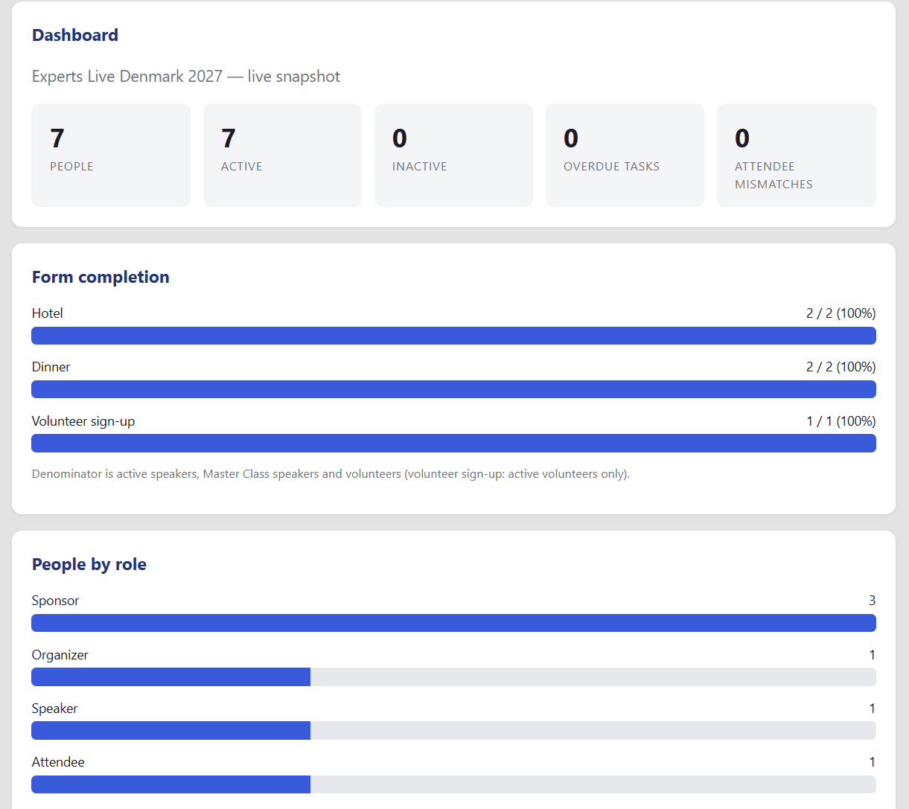

### Volunteer management

- Import tasks from Excel and assign to volunteers.
- Activate / deactivate volunteers.
- Dashboard — pending / missing submissions.

### Organizer tasks management

- Import / assign tasks to the ELDK leads.

### Hotel management

- Send Excel rooming list to the hotel — *(live since v1.2.8: download
  at **Organizers → Data grid → Rooming list**)*.
- Import Excel with confirmation IDs.
- Send email with updated calendar invite carrying the hotel confirmation.
- Dashboard — pending / missing submissions.

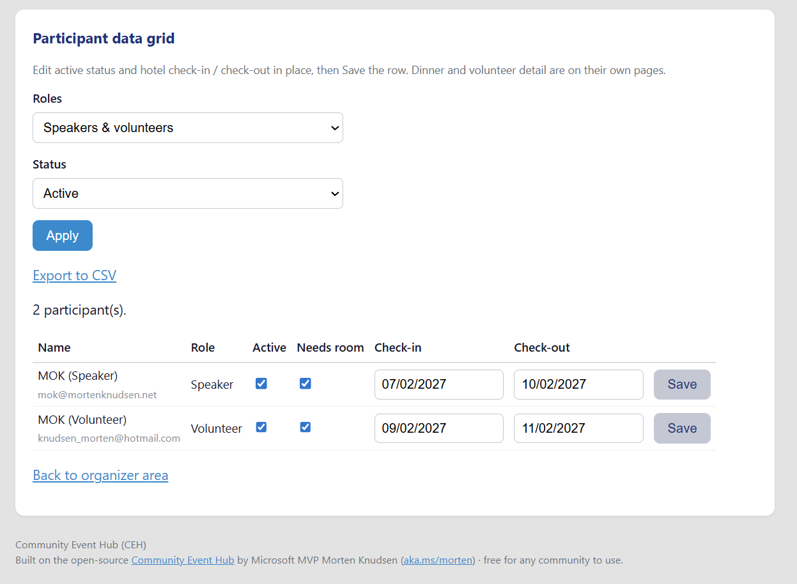

### Travel reimbursement management

- Overview of claims.
- Register payout + send confirmation email to speaker.

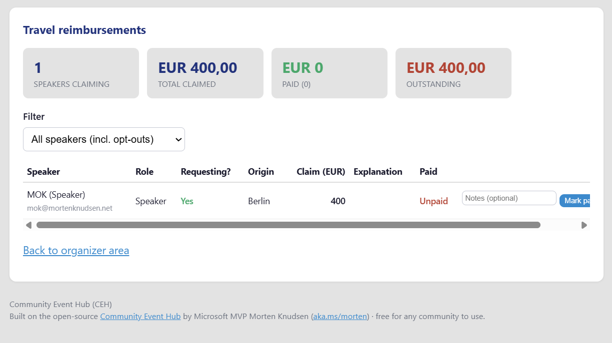

### Swag management

- Excel overview for ordering: polo, awards, jackets, etc.
- Dashboard — pending / missing submissions.

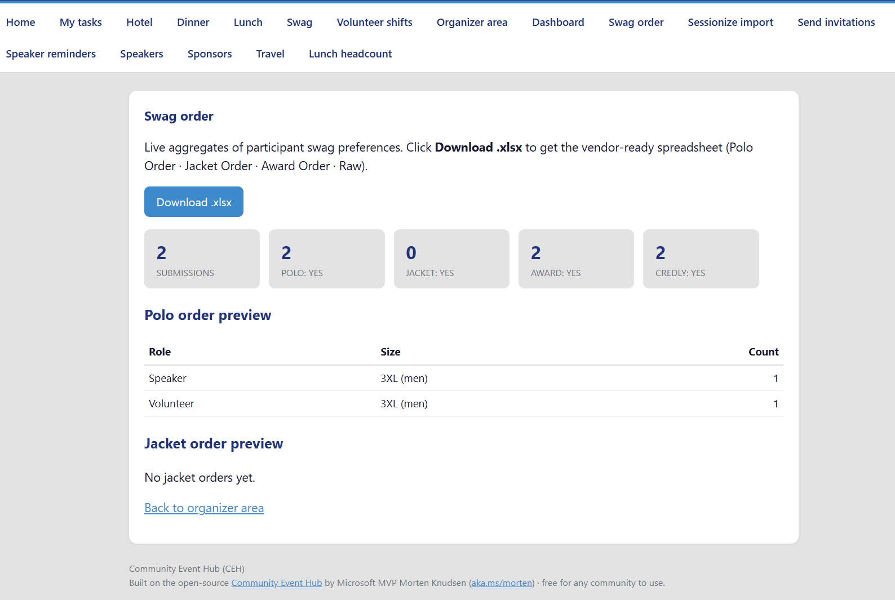

### Bella group event management

- Lunch overview pre-day / main-day.
- Appreciation dinner overview incl. allergies.
- Tasks.
- Book furniture — via API (planned).
- Exhibitor booth overview.

### Group photos management

*(Live since v1.2.7 at **Organizers → Group photos**.)*

- Register company with contact details.
- Schedule the photo slot (Danish wall-clock; stored as UTC).
- Create / update calendar invite + send to the lead incl. internal
  participants — the ICS UID is stable per registration, so re-sending
  after a slot move **updates** the recipients' existing calendar entry
  instead of duplicating it.

### App game sponsor participation management

*(Live since v1.2.7 at **Organizers → App game**.)*

- Register participating sponsor (gift) — one row per sponsor company,
  gift description + confirmed flag + notes.
- Send reminder to sponsor to bring gift to event — branded template
  (`app-game-gift-reminder.html`) mailed to every active contact of the
  sponsor company; last-sent timestamp tracked on the row.

---

## Automation (scripts)

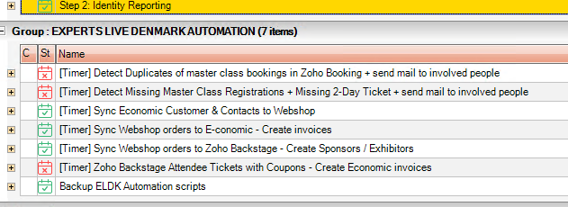

### Sponsor automation

- Automatic create / update of sponsors + exhibitors in **Zoho Backstage** from sponsor webshop orders.
- Automatic create sponsors in **e-conomic ERP** + sync to sponsor webshop.
- Automatic API integration to validate company tax ID when a new sponsor is created.
- Ability to create / update customers + contacts via webhook / API.
- Automatic create contacts + roles in ERP (e-conomic) + sync to sponsor webshop.
- Automatic set default signer / event coordinator in sponsor webshop.
- Automatic create ERP (e-conomic) orders from sponsor webshop.
- Automatic currency check on order creation (today's FX).

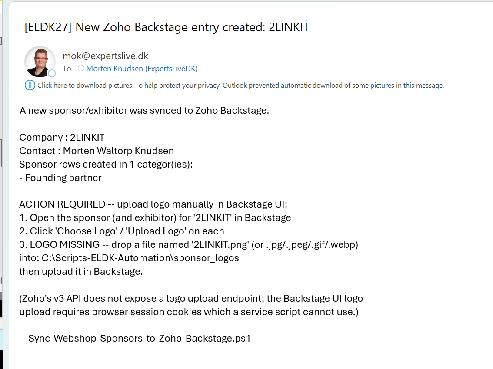

### Attendee automation

- Send info if no master class has been chosen.
- Send info if more than one master class has been booked — with ability to remove booking(s).

### Sponsor sync — to-do

- Orders only — create sponsor companies in the hub via script.
- Orders only — create contacts in the hub via script and link to sponsor company.
- Tasks are assigned to the sponsor **company** (not the individual contact). All contacts of a sponsor company see all tasks for that company.

---

## Deploy your own instance

Prerequisites:

- Azure subscription you can deploy to (one resource group per environment is fine)
- `az` CLI (>= 2.50), `bicep` (bundled with az), `dotnet` 8 SDK, `gh` CLI optional
- A Brevo (or any SMTP-relay) account for transactional email
- A DNS zone you can add a CNAME to

```bash
# 1. clone
gh repo clone KnudsenMorten/community-event-hub
cd community-event-hub

# 2. deploy infra (creates the App Service Plan, SQL Server + Basic DB,
#    Key Vault, Function Plan, Storage, Log Analytics, App Insights)
export ELDKHUB_SQL_ADMIN_PASSWORD='<strong password you keep>'
./scripts/deploy.sh dev      # or `prod`

# 3. set secrets in Key Vault (Brevo SMTP, WooCommerce, etc.)
./scripts/set-secrets.sh dev

# 4. apply EF migrations (creates the Events + Participants + ... tables)
export Sql__ConnectionStringTemplate="Server=tcp:<your-sql-server>.database.windows.net,1433;Initial Catalog=<your-db>;Encrypt=True;TrustServerCertificate=False;"
export Sql__AdminUser="communityhubadmin"
export Sql__AdminPassword="$ELDKHUB_SQL_ADMIN_PASSWORD"
dotnet ef database update --project src/CommunityHub.Core --startup-project src/CommunityHub

# 5. seed your Event row + a couple of test participants
./tools/seed-dev.ps1   # PowerShell; edit the values for your community/dates first

# 6. publish + deploy the app code
dotnet publish src/CommunityHub/CommunityHub.csproj -c Release -o publish
Compress-Archive publish/* publish.zip
az webapp deploy --resource-group rg-communityhub-dev --name communityhub-web-dev --src-path publish.zip --type zip

# 7. bind your custom domain
az webapp config hostname add --webapp-name communityhub-web-dev \
  --resource-group rg-communityhub-dev --hostname hub.yourevent.example
```

Full step-by-step including DNS, certs, and the operate playbook: see [`docs/RUNBOOK.md`](docs/RUNBOOK.md).

---

## Configuration model

There's one knob that determines "which event are we serving right now": the `Events` row whose `IsActive = 1`. The login, dashboard, and reminder jobs all resolve "current event" via that flag. You roll over to a new edition by inserting a new row, marking it active, and (optionally) deactivating the previous.

Per-event things in the `Events` row:

- `Code` (e.g. `ELDK27`) – short identifier, unique
- `CommunityName` (e.g. `Experts Live Denmark`) – shown in UI + emails
- `DisplayName` (e.g. `Experts Live Denmark 2027`) – page titles
- `StartDate` / `EndDate` / `PreDayDate` – drive deadlines + role gates
- `VenueName` / `HubHostname` / `IsActive` / `LockDate`

App-wide things in App Service settings (which then resolve to Key Vault refs):

- `Sql:ConnectionStringTemplate` + `Sql:AdminUser` (+ `Sql:AdminPassword` → KV)
- `Email:SmtpHost` / `SmtpPort` / `FromAddress` (+ `SmtpUsername` / `SmtpKey` → KV)
- `Email:RedirectAllTo` — **dev-only test mode**; when set, every outbound mail's recipient is replaced with this address and the subject is prefixed `[TEST -> original@addr]` so the organizer can verify content without participants receiving anything during dev/test. Leave EMPTY in prod.
- `Embedding:BackstageOrigin` – CSP `frame-ancestors` (set `*` if embedding inside any iframe)
- `Sessionize:ApiUrl` (optional, only if you want auto-import)

---

## Resilience notes

The app uses EF Core's `EnableRetryOnFailure(maxRetryCount=6, maxRetryDelay=30s)` on both DbContexts so:

- Azure SQL Serverless **cold-start** (`SqlException 40613 "Database is not currently available"`) is silently absorbed — the user's first request after a 60+ min idle just takes 30-60s instead of failing.
- **Transient transport hiccups** (TCP reset, brief throttling) are retried with exponential back-off.
- Storage (data files + log) is always-on regardless of compute state, so paused-DB scenarios are zero data loss — any in-flight COMMIT either succeeds after the retry or never started.

Result: you can run on the cheapest Azure SQL tier and pause compute aggressively without users seeing errors.

---

## Embedding

The hub is designed to embed inside an existing sponsor / attendee management tool (the upstream ELDK instance embeds it inside Zoho Backstage). To embed:

1. Set `Embedding:BackstageOrigin` App Setting to the embedding origin (e.g. `https://backstage.example.com`), or `*` to allow any.
2. The app strips `X-Frame-Options` and emits a CSP `frame-ancestors <origin>` header on every response.
3. PIN login + magic-link tokens work inside an iframe (cookies are SameSite=None Secure when behind HTTPS).

Embed snippet template lives at `tools/backstage-embed-snippet.html`.

---

## Repository layout

```
src/
  CommunityHub/             ASP.NET Core 8 Razor Pages web app
  CommunityHub.Core/        Domain + Data + Email + Integrations (shared)
  CommunityHub.Jobs/        Worker for reminders + Sessionize import jobs

infra/
  main.bicep                Stage-1 infra (App Service, SQL, KV, Function, Storage, Log Analytics)
  modules/                  One Bicep per Azure resource type
  main.{dev|prod}.parameters.json    Per-environment parameters (community fork: provide your own)

scripts/
  deploy.sh                 Idempotent `az deployment group create` of infra/main.bicep
  set-secrets.sh            Write KV secrets from environment variables

docs/
  CONCEPT.md                Source-of-truth design doc (goals, hubs, organizer admin, automation)
  RUNBOOK.md                Step-by-step "first deploy" + "operate" recipe
  TEST_WALKTHROUGH.md       End-to-end smoke walkthrough

templates/
  emails/                   Branded email templates (layout + per-type content);
                            packaged into BOTH publish bundles (web + jobs) by
                            the csproj files — the apps render from this folder
                            at runtime, so it is first-class code, not an example

config-examples/
  templates/emails/         Historical copies kept for the community fork docs

tools/
  seed-dev.ps1              Seed an Event row + 5 test participants (one per role)
  deploy-app.ps1            Build + zip (forward-slash entries) + deploy web; slot-swap on prod
  rollback-app.ps1          Instant slot swap-back / artifact redeploy
  enable-slot-deploys.ps1   One-time S1 + staging-slot + slot-MSI Key Vault grant (done for prod)
  plant-test-pins.ps1       DEV-only: plant known-PIN LoginPin rows for the Playwright admin suite
```

The PRIVATE upstream repo (`eldk-community-event-hub`) holds the ELDK27 production data (event row JSON, real logo files, prod parameter files). The PUBLIC repo (this one) is a sanitized template — no event-specific data.

---

## Full design spec

See **[docs/CONCEPT.md](docs/CONCEPT.md)** for the source-of-truth design document. The README mirrors its chapter structure; CONCEPT is the canonical version with full prose.

Other docs:
- [`docs/RUNBOOK.md`](docs/RUNBOOK.md) — first-deploy + operate playbook
- [`docs/TEST_WALKTHROUGH.md`](docs/TEST_WALKTHROUGH.md) — end-to-end smoke walkthrough
- [`docs/DESIGN_NOTES_emails_sponsor_sessionize.md`](docs/DESIGN_NOTES_emails_sponsor_sessionize.md) — email + sponsor + Sessionize import design notes

---

## License

MIT — see `LICENSE`. Use it for your community event, fork it, redistribute, no warranty.

---

## Status

Active development for the ELDK27 edition (Feb 2027). The public mirror is updated milestone-by-milestone — see commit messages tagged with the private-repo source sha for traceability. Issues / PRs welcome.
