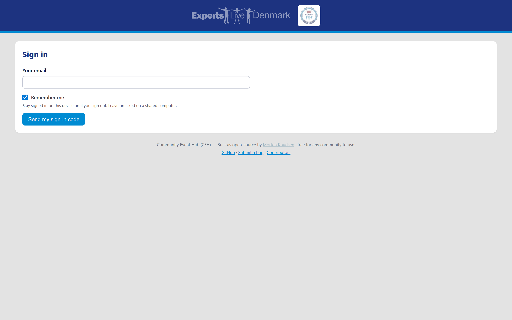
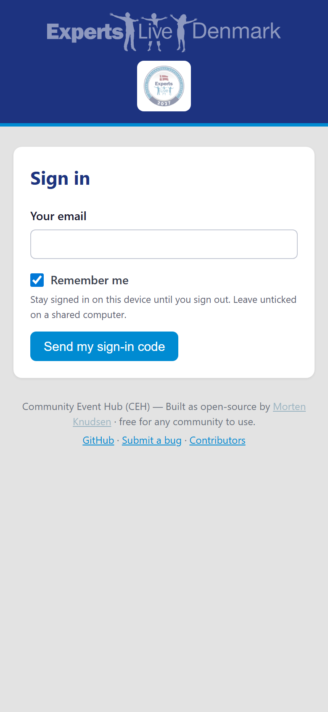
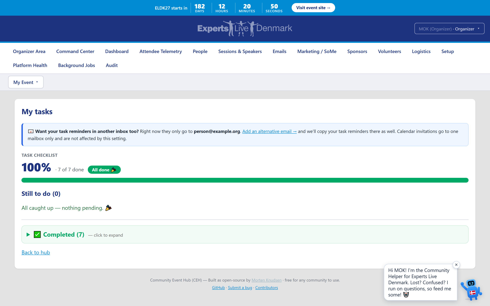
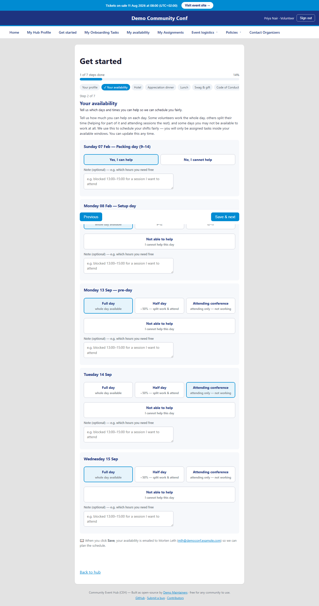
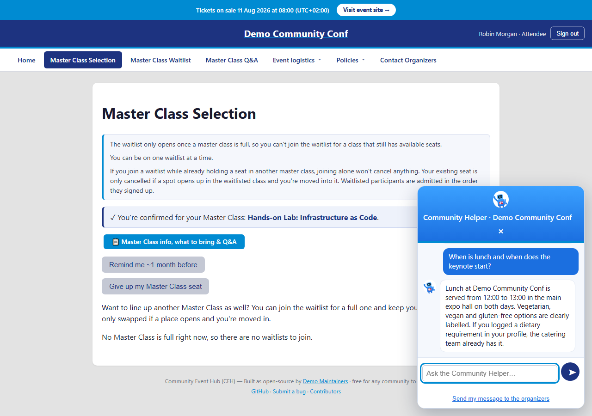
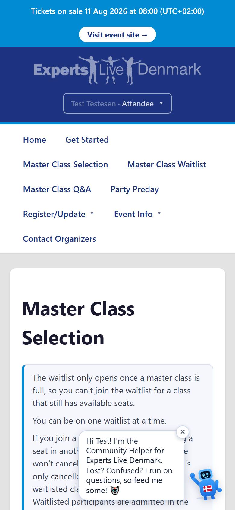
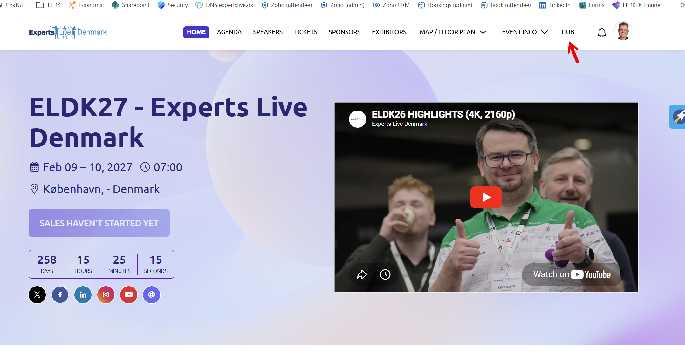
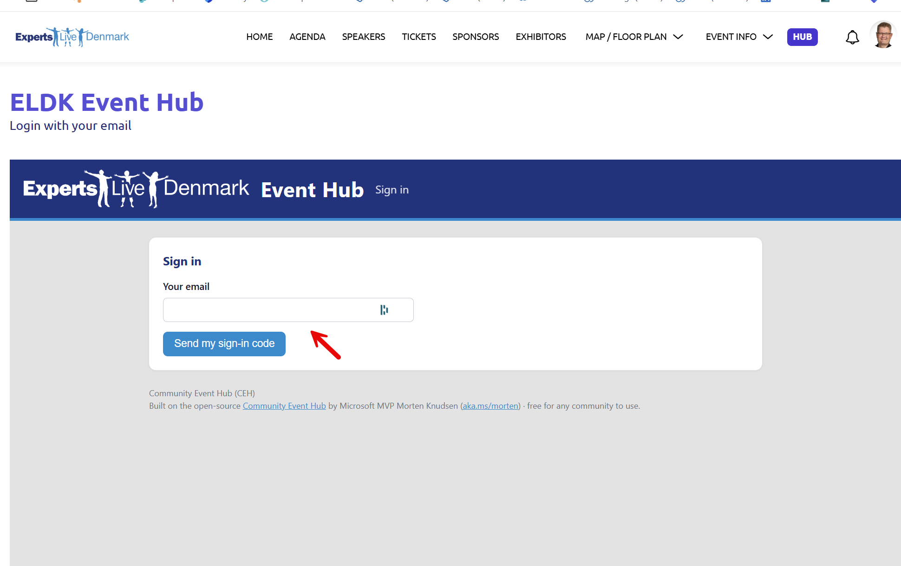

# Community Event Hub

> **Run a tech-community conference without the spreadsheet chaos.** One open-source web app where every speaker, volunteer, sponsor, partner and attendee signs in with an e-mailed PIN, lands on a hub built for their role, and self-services everything they owe — book a hotel night, RSVP to the dinner, pick a master class, upload their slides or booth artwork. Organizers get a command center, gentle automatic reminders, a social-media campaign planner and one back office to run it all. Configure it for your event and deploy it on Azure.

> **Free for any community to use.** Built by Microsoft MVP **Morten Knudsen** ([aka.ms/morten](https://aka.ms/morten)).
> Public repository: <https://github.com/KnudsenMorten/community-event-hub>.

| Sign-in page | …and on a phone |
|---|---|
| [](docs/img/public-login.png) | [](docs/img/public-login-mobile.png) |

*The way in: no password, just an e-mailed one-time code — or one tap from any e-mail the hub sends. The whole hub is mobile-first, so it works the same on the phone in an attendee's hand at the venue.*

---

## What it is

Community Event Hub (CEH) is the **behind-the-scenes operational layer** for a community conference. It is **not** your public event site or ticketing system — it sits *alongside* them (see [How it fits with your event platform](#how-it-fits-with-your-event-platform)) and owns the work: crew sign-in, onboarding, self-service forms, tasks and reminders, sponsor deliverables, volunteer planning, master-class seats, e-mail, social-media announcements, exports and the organizer back office.

It is built to be **evergreen**. The codebase is generic (`CommunityHub`); everything about an edition — community name, dates, venue, rooms, deadlines, sponsor rules, wording — lives in an `Events` database row plus per-edition configuration. A new edition is **a new row and new config, not a code change**. The project is open-sourced from the instance that runs a live community conference; this repository is the sanitized template, while that event's real configuration, content and settings stay private.

## Who it's for

| Persona | What they get |
|---|---|
| **Organizer** | A command center that ranks what needs attention today, a live dashboard, one status board for every role with filters and chase lists, fast searchable grids with bulk actions, "switch to user" to see the hub as someone else, pre-selection and onboarding queues, catering and hotel numbers you can order against, the Email Center and full e-mail log, per-feature switches and release rings, background-job health and cadence, exports and printable run-sheets, a searchable audit log, and the social-media campaign planner. |
| **Speaker** | A Get-Started wizard for everything the event needs from them, one task list with due dates, their sessions and public profile, promotion graphics ready to share, the posts the hub has planned about their session, logistics forms (hotel, dinner, lunch, gift, travel reimbursement where eligible), and session feedback delivered after the talk. |
| **Volunteer** | Sign-up and availability in their own words, a pre-selection path to becoming active, their assignments with who to ask, a help channel to their supervisor, and the same logistics forms where they apply. |
| **Sponsor** | Their company's tasks generated from what they bought, uploads that complete the task when the file arrives, company details, their webshop orders, booth information with live venue photos, the posts announcing them, and reminders that reach the whole coordinator team. |
| **Media & event partner** | Their own crew hub with a welcome, Get-Started steps, hotel, dinner and party sign-up, and aggregate "who's coming" insights. |
| **Attendee** | A welcome matched to their ticket, the in-hub master-class chooser (pick, switch, or join the waitlist), party sign-up and event information. |
| **Anyone (no login)** | The public programme — `/Sessions`, `/Speakers`, `/Agenda`, `/MasterClasses`, `/Sponsors`, `/Contributors` — plus a per-session QR rating page. |

Every signed-in person also gets the **AI Community Helper**, which answers questions about speakers, sessions and key times from the published programme only.

> The full delivered-feature catalog is **[`docs/FEATURES.md`](docs/FEATURES.md)**; architecture, build, deploy and runbook are in **[`docs/DESIGN.md`](docs/DESIGN.md)**.

---

## Table of contents

- [What it is](#what-it-is)
- [Who it's for](#who-its-for)
- [By the numbers](#by-the-numbers)
- [See it in action](#see-it-in-action)
- [Why it exists](#why-it-exists)
- [Key features by area](#key-features-by-area)
- [How it works](#how-it-works)
- [How it fits with your event platform](#how-it-fits-with-your-event-platform)
- [Getting started](#getting-started)
- [Configuration model](#configuration-model)
- [Embedding](#embedding)
- [Repository layout](#repository-layout)
- [Documentation](#documentation)
- [License](#license)
- [Status](#status)

---

## By the numbers

Measured on this repository on 2026-09-14.

| | |
|---|---|
| Delivered features in the catalog | **224** entries ([`docs/FEATURES.md`](docs/FEATURES.md)) |
| Application code (C#, excluding migrations) | **211,770** lines in 1,053 files |
| Razor views | **43,076** lines in 261 files (203 pages) |
| Scheduled background jobs | **43** timer-triggered functions, plus an order webhook |
| Database migrations | **259** EF Core migrations |
| Branded e-mail templates | **39** |
| Automated tests | **6,773** xUnit tests (145,008 lines of test code), plus Pester and Playwright suites |
| Infrastructure as code | **7** Bicep files (1,071 lines) |

---

## See it in action

Every screenshot is the real product, captured automatically by a headless test that signs in and photographs each page at desktop **and** phone width. The participants' **names, e-mail addresses, companies and photographs are synthetic** — the capture replaces them before the picture is taken; the signed-in account and the branding are the upstream conference's own.

| Organizer command center | Speaker hub (mobile) |
|---|---|
| [](docs/img/organizer-command-center.png) | [](docs/img/speaker-hub-mobile.png) |
| *"Is the event on track, what do I do next?" — one screen triages the whole event.* | *Mobile-first throughout: a speaker's sessions and next steps at ~390px.* |

| Volunteer assignments | Sponsor home |
|---|---|
| [](docs/img/volunteer-schedule.png) | [](docs/img/sponsor-portal.png) |
| *What a volunteer is doing, and when, with who to ask.* | *A sponsor's own area of the hub.* |

| Task checklist | Get-Started wizard |
|---|---|
| [](docs/img/unified-task-checklist.png) | [](docs/img/wizard-inline-stepper.png) |
| *One task list per person with a live completion percentage.* | *One step at a time, with the real form in place and save-and-next.* |

| AI Community Helper | Attendee home (mobile) |
|---|---|
| [](docs/img/ai-community-helper.png) | [](docs/img/attendee-my-event-mobile.png) |
| *A grounded, role-aware assistant that answers only from the published programme.* | *Built for someone walking up to the venue.* |

## Full screen gallery

Each entry links to its full-size desktop capture; append `-mobile` to any filename for the phone version.

<details>
<summary><strong>Public pages</strong> — what a visitor sees before signing in</summary>

| Screen | What it shows |
|---|---|
| [Sign in](docs/img/public-login.png) | Passwordless: an e-mailed one-time code, or one tap from any hub e-mail |
| [Sessions](docs/img/public-sessions.png) | The public catalogue with live filters for type, length, room, date, track and level |
| [Master classes](docs/img/public-masterclasses.png) | Full-day sessions, with capacity and booking state |
| [Session detail](docs/img/public-session-detail.png) | One session with its speakers |
| [Speakers](docs/img/public-speakers.png) | The published line-up (unpublished speakers are never shown) |
| [Sponsors](docs/img/public-sponsors.png) | Sponsors by tier, from the sponsor records themselves |
| [Agenda](docs/img/public-agenda.png) | The schedule, day by day |
| [Contributors](docs/img/public-contributors.png) | Everyone who helped build the event |
| [About](docs/img/public-about.png) | The in-hub product introduction |

</details>

<details>
<summary><strong>Role hubs</strong> — speaker, sponsor, volunteer, attendee</summary>

| Screen | What it shows |
|---|---|
| [Hub home](docs/img/hub-home.png) | Where every role lands: what you owe, when it is due |
| [Your tasks](docs/img/unified-task-checklist.png) | Every obligation with a deadline and a progress rollup |
| [Speaker hub](docs/img/speaker-hub.png) | A speaker's own sessions, times, rooms and outstanding items |
| [Speaker tasks](docs/img/speaker-tasks.png) | Bio, photo, slides, travel — each dated |
| [Speaker readiness](docs/img/speaker-readiness.png) | "Am I done?" answered, rather than guessed |
| [Speaker graphics](docs/img/speaker-graphics.png) | Ready-made promotion artwork to download and share |
| [Speaker announcements](docs/img/speaker-announcements.png) | The posts the hub has planned about their session |
| [Sponsor home](docs/img/sponsor-portal.png) | The sponsor's own area of the hub |
| [Sponsor booth](docs/img/sponsor-our-booth.png) | Stand information, venue photos and what is still owed |
| [Sponsor deliverables](docs/img/sponsor-deliverables.png) | Every contracted item, tracked with a deadline |
| [Sponsor announcements](docs/img/sponsor-announcements.png) | Their own posts, and what each is waiting for |
| [Volunteer sign-up](docs/img/volunteer-signup.png) | Availability in the volunteer's own words |
| [Volunteer assignments](docs/img/volunteer-schedule.png) | The work that availability turned into |
| [Attendee home](docs/img/attendee-my-event.png) | Master class and party booking |
| [Profile](docs/img/profile.png) | The details every role maintains themselves |

</details>

<details>
<summary><strong>Organizer</strong> — running the event</summary>

| Screen | What it shows |
|---|---|
| [Dashboard](docs/img/organizer-dashboard.png) | The state of the edition at a glance |
| [Command center](docs/img/organizer-command-center.png) | What needs a human today, ranked |
| [Participants](docs/img/organizer-participants.png) | Everyone, filterable by role, status, company and rollout ring |
| [Attendees](docs/img/organizer-attendees.png) | Ticket holders, reconciled against the ticketing system |
| [Sessions](docs/img/organizer-sessions.png) | The programme, with rooms, tracks and levels |
| [Action queue](docs/img/organizer-allocation-queue.png) | Late changes and work waiting for an organizer |
| [E-mail center](docs/img/organizer-email-center.png) | Preview exactly what will be sent, before it sends |
| [E-mail log](docs/img/organizer-email-log.png) | Every message, its state, and retries |
| [Background jobs](docs/img/organizer-jobs.png) | Cadence and health of every scheduled routine |
| [Graphics](docs/img/organizer-graphics.png) | Speaker, session and sponsor artwork generation |
| [Exports](docs/img/organizer-exports.png) | Excel and CSV for anything you need outside the hub |
| [Audit trail](docs/img/organizer-audit-trail.png) | Who changed what, and when |
| [Data freshness](docs/img/organizer-data-freshness.png) | Whether each integration is actually flowing |
| [Hotels](docs/img/organizer-hotels.png) | Allotments, room blocks and assignments |
| [Volunteers](docs/img/organizer-volunteers.png) | Structure, areas and coverage |
| [Evaluation results](docs/img/organizer-evaluation-results.png) | Session scores and written feedback |
| [Coupon invoicing](docs/img/organizer-coupon-invoicing.png) | Partner coupon pools and what has been billed |
| [Group photos](docs/img/organizer-group-photos.png) | Company photo registrations |

</details>

<details>
<summary><strong>Social-media campaign</strong> — planned by the hub, approved by a human</summary>

| Screen | What it shows |
|---|---|
| [Marketing hub](docs/img/some-hub.png) | The campaign's home |
| [Content studio](docs/img/some-content-studio.png) | Walk the queue, edit, approve — one post at a time |
| [Event posts](docs/img/some-event-posts.png) | Your own dated posts alongside the generated ones |
| [Campaign settings](docs/img/some-settings.png) | Cadence, auto-approval, exclusions and the announcement windows |
| [Post templates](docs/img/some-templates.png) | The wordings each post type draws from |

</details>

---

## Why it exists

**Goals**

- An **open-source community event platform** other communities can re-use, so running a conference takes fewer manual touches.
- One **self-service hub** where speakers, volunteers, sponsors and attendees submit what the event needs and see what they still owe.
- **Tasks in one place** — one overview, not five — and **change management** through the hub instead of e-mail threads.
- **Data flowing to and from the systems you already use** — call for speakers, ticketing, webshop, finance — and **deliverables for partners** (rooming lists, catering numbers, swag orders) produced automatically.

**Problems it solves**

- Spreadsheets and static forms that generate endless follow-up and manual reconciliation.
- Organizers updating details on people's behalf, and the mistakes that come with it.
- Too much e-mail: the hub nudges only when something is actually due.

<details>
<summary>Architecture at a glance (diagrams)</summary>




</details>

---

## Key features by area

A summary of what is delivered today. Each area has much more detail — and the date every piece shipped — in **[`docs/FEATURES.md`](docs/FEATURES.md)**.

### Platform & configuration

- A new edition or a new community is **a new `Events` row plus configuration**, never a rebuild.
- **Every capability has a switch** and is off until you turn it on for your edition; release rings let you open features and e-mail to your own test accounts first, then a few real people, then everyone.
- Rooms, session lengths and audience levels, webshop product rules and job cadences are **configuration you edit**, not code.
- Accounts **marked as test data** stay out of every total a supplier invoices you for — rooms, meals, head counts.
- A public template that **builds from a fresh clone** and ships a **neutral default content set** — every task's instructions, the welcome steps, information pages, surveys and edition settings — so a fresh install is usable from the first start.

### Sign-in & embedding

- **Passwordless**: a one-time PIN by e-mail that expires in 15 minutes, with lockout and rate limiting and messages that never reveal whether an address is registered.
- **One-tap sign-in links** in the hub's e-mails, revocable, and a "remember me" choice.
- Signed-out visitors go straight to sign-in; the public programme pages stay reachable on their own addresses.
- Hub access follows the person's ticket or role, and the hub **embeds safely** inside your event portal.

### People, roles & onboarding

- **One main role plus add-on "hats"** (a speaker who is also a sponsor contact), with entitlements counted once.
- A **Get-Started wizard for every role** that shows only the steps that apply, renders each real form in place, opens with a welcome, and names exactly what is missing.
- A **pre-selection queue** for volunteers and other applicants, with an availability grid, undo and reversible deactivation.
- **One status board** for every role with filters, chase lists and e-mail export; add a person by hand before any sync knows them.
- **Volunteer structure** with categories, supervisors, help requests and an allocation pipeline that stays silent until an organizer commits.
- **Speaker categories** (community, sponsor, guest) and media picture and video libraries.

### Self-service forms & logistics

- **Hotel** across several hotels, with room blocks, confirmation numbers and a rooming list.
- **Appreciation dinner** with structured diet and allergy capture, a kitchen allergy roll-up and a run-sheet.
- **Catering numbers you can order against** and lunch lists for both days.
- **Party RSVP**, swag choices, a two-step **travel reimbursement** offered only to people who can claim it, and a group-photo planner.
- Every form shows when it was last saved; edits close to the deadline become organizer action items.

### Tasks & reminders

- **One checklist per person** with a completion percentage and overdue badges.
- **Uploads inside the task** — a sponsor's logo or a speaker's slides complete the task when the file arrives.
- A reminder engine that never double-sends, with the **repeat interval set per message and per role**; calendar invites arrive by e-mail.
- Sponsor reminders reach the **whole coordinator team**; Get-Started reminders show what is done and what is open.

### Sessions, speakers & programme

- **Hourly Sessionize import** of accepted speakers and sessions, with a dry-run preview and safe endpoint switching.
- **Public `/Sessions`, `/Speakers`, `/Agenda`, `/MasterClasses` and `/Contributors`** pages with filters for track, level, length and time slot; only published speakers appear.
- **The hub owns the schedule**: edit any session, mark keynotes and all-tracks sessions, and get told when your public event site disagrees.
- **Session feedback by QR code**, turned into per-session reports delivered to the speakers.
- A master-class Q&A board and ready-to-share promotion material for speakers.

### Sponsors & exhibitors

- A sponsor is a **company**; its tasks are generated from what it bought and de-duplicated across orders.
- A public **`/Sponsors`** page by tier and a booth page with **live venue photos** served from your document library.
- Optional **exhibitor sync** to your event platform, **webshop and finance integration** with clear ownership of each field, and withdrawal of lapsed sponsors.
- **Coupon pools and volume packages** with invoicing and a usage page for the customer.
- A sponsor **Leads API** with a lead pipeline and quality scoring.

### Attendees & master-class seats

- The **master-class chooser** runs in the hub — pick, switch or join a waitlist — and a class is **never oversold**.
- Separate welcomes for **1-day and 2-day** ticket holders; reassigned and cancelled tickets are handled cleanly.
- An organizer attendee browser and aggregate **"who's coming"** insights that name nobody.

### E-mail & notifications

- **Branded templates** rendered for every e-mail client, with an in-hub editor and test sends.
- **Release rings, a kill switch and a welcome safety cap** keep a half-configured environment from mailing real people; a send that reached nobody says so.
- A **complete e-mail log** with re-send, and a Comms page showing who got what.
- Paced sending and repeat suppression so nobody receives the same message twice.

### Organizer back office

- **Command center, dashboard and cross-role overview**, with every number a link into the matching list.
- Fast server-side search, sort and paging, **bulk actions**, **switch to user** and scoped secure links — all audited.
- **Exports and printable run-sheets**, data-freshness monitoring per integration, and an **audit log** in local time.

### Social media & graphics

- **Graphics** for speakers, sessions and sponsors, kept in one shared document library.
- A **post editor with live variables** that publishes to your LinkedIn company page, **tagging speakers and sponsor contacts** where LinkedIn allows it and telling you who it could not tag.
- A **campaign planner**: per-category rounds and start dates, a holiday pause, a capacity view that tells you whether the campaign fits, and a "not ready" reason on every held-back post.
- Posts are **approved as they come due**, and your own artwork is never overwritten.

### AI Community Helper

- Answers plain-language questions from the **published** speakers, sessions and schedule only — an unpublished speaker is a hard gate.
- Learns from a **curated document folder** you maintain, with no deploy.

### Hosting, reliability & safety

- The whole environment is **infrastructure as code** (Bicep); production deploys can go through a **staging slot and swap** with instant rollback.
- **Test mode and an external-write master switch** keep a dev environment from changing shared systems; integrations run in a safe no-write mode until configured.
- Transient failures are retried rather than reported as permanent; a deliberate skip is not a failure.
- Participant pages target **WCAG 2.1 AA**, with automated accessibility checks.

---

## How it works

```
             Browser / event-portal iframe
                          │
                 ┌────────▼─────────┐        ┌───────────────────────┐
                 │  Web app (.NET)  │        │ Functions app (.NET)  │
                 │  Razor Pages     │        │ scheduled jobs +      │
                 │  hubs, organizer │        │ order webhook         │
                 │  area, Leads API │        │                       │
                 └───┬─────────┬────┘        └────┬─────────────┬────┘
                     │  CommunityHub.Core (shared domain, EF Core, e-mail, integrations)
                     ▼         ▼                  ▼             ▼
               Azure SQL   Key Vault         Storage      Application Insights
          (managed identity, no passwords)

   Optional integrations: Sessionize · Zoho Backstage · WooCommerce · finance/ERP ·
   SharePoint document library · LinkedIn company page · SMTP relay · AI provider
```

- **Two apps, one core.** The web app serves every hub and the organizer area; the Functions app runs the scheduled work (reminders, imports, reconciliation, social-media dispatch, report publishing). Both use `CommunityHub.Core`, so a rule is written once.
- **The database is the source of truth**, versioned with EF Core migrations that the web app applies at startup.
- **Configuration decides the event**: the active `Events` row plus per-edition files and app settings, with secrets in Key Vault.
- **Safe by default**: every feature switch starts off, e-mail is ring-gated, and external writes are blocked outside production until you allow them.

Details: [`docs/DESIGN.md`](docs/DESIGN.md) — system overview, data model, integrations, jobs, e-mail, infrastructure and deploy.

---

## How it fits with your event platform

Community Event Hub is the **behind-the-scenes companion** to your public event site and ticketing — it does not replace them. The upstream instance runs alongside Zoho Backstage; the integrations are optional.

- **Your event platform keeps** the public event site, ticket sales, check-in and the booth lead scanner.
- **The hub owns** crew sign-in and onboarding, forms, tasks and reminders, sponsor deliverables, volunteer planning, master-class seat allocation, e-mail and the organizer back office.
- **Data flows where it makes sense.** The hub pulls accepted speakers and sessions from Sessionize and tickets and orders from your platform, can push sessions, speakers and exhibitors out to it, and embeds inside its portal.

### One-way by design: the hub owns the schedule

Sessions have exactly **one owner, and it is the hub**. The call-for-speakers system keeps the *content* — title, abstract and the speaker line-up are copied in on every import — while the **schedule, room, track and tags belong to the hub** the moment a session exists there.

- If the call-for-speakers system disagrees, you get **one e-mail** telling you what differs. Nothing is changed; you decide.
- If the public event site disagrees, you get an **action e-mail** naming the field and the value to set, and it **keeps reminding you** until it matches.
- The event platform **never writes back into the hub**; that is fixed in code, with no setting.


*The hub embeds inside the public event portal — sign-in works inside the iframe.*

---

## Getting started

Everything below uses only what is in this repository plus the standard Azure and .NET command-line
tools. It deploys one environment; repeat with `prod` for a second one.

**You need**

- An Azure subscription where you are **Owner** (or Contributor + User Access Administrator) — the
  templates create role assignments for the apps' managed identities — and an **Entra (Azure AD)
  group** that will administer the SQL server, with you as a member.
- [.NET 10 SDK](https://dotnet.microsoft.com/download) (`global.json` pins 10.0.x), Azure CLI ≥ 2.60
  with Bicep (`az bicep install`), [go-sqlcmd](https://aka.ms/go-sqlcmd), and `bash`, `jq`, `curl`
  and `zip` (on Windows: WSL or Git Bash).
- An SMTP relay account for transactional e-mail (the code is built around Brevo, but any relay with
  a username + key works) and a verified sender address.
- A DNS zone you can add a CNAME and TXT record to (optional — the default `*.azurewebsites.net`
  hostname works without one).

Run every command from the repository root. The scripts are invoked with `bash` so they work in a
fresh clone without setting the executable bit.

### 1. Clone and build

```bash
git clone https://github.com/KnudsenMorten/community-event-hub.git
cd community-event-hub
dotnet build CommunityHub.sln -c Release
```

### 2. Parameters for your environment

```bash
cp infra/main.dev.parameters.example.json infra/main.dev.parameters.json
```

Edit it: `baseName` (lowercase letters and digits, **at most 12 characters** — it becomes part of every
resource name), `sqlAadAdminLogin` + `sqlAadAdminObjectId` (your Entra SQL admin group), and optionally
`customDomain` and `backstageEmbedOrigin`. Keep the filled-in file out of any public fork.

### 3. Deploy the infrastructure

```bash
az login
export AZURE_SUBSCRIPTION_ID=<your-subscription-id>   # required: the script refuses to guess
bash scripts/deploy.sh dev --whatif   # creates the empty resource group, then previews: deploys nothing
bash scripts/deploy.sh dev
```

This creates `rg-<baseName>-dev` with Log Analytics + Application Insights, Key Vault, an Entra-only
Azure SQL server + serverless database, storage, a Linux App Service plan + web app and a Functions app
— all with managed identities, no SQL password. The outputs print the web app hostname
(`webAppHostname`), `functionsAppName`, `keyVaultName` and `sqlServerFqdn`. Keep the names at hand:

```bash
RG=rg-<baseName>-dev
WEB_APP=$(az webapp list -g $RG --query "[?!contains(kind, 'functionapp')] | [0].name" -o tsv)
FN_APP=$(az functionapp list -g $RG --query "[0].name" -o tsv)
KV=$(az keyvault list -g $RG --query "[0].name" -o tsv)
```

### 4. Secrets and app settings

```bash
bash scripts/set-secrets.sh dev
```

It prompts for each secret and writes it straight to Key Vault; leave anything you do not use blank
(including `sql-admin-password`, which the Entra-only server does not use). The infrastructure already
sets `Sql__ConnectionStringTemplate`, `KeyVault__Uri`, `TestMode__Enabled`, the Application Insights
settings and `Hub__CustomDomain`. Add the e-mail settings to **both** apps — the scheduled jobs send
mail too:

```bash
SETTINGS=(
  Email__SmtpHost=smtp-relay.brevo.com Email__SmtpPort=587
  "Email__SmtpUsername=@Microsoft.KeyVault(VaultName=$KV;SecretName=brevo-smtp-username)"
  "Email__SmtpKey=@Microsoft.KeyVault(VaultName=$KV;SecretName=brevo-smtp-key)"
  Email__FromAddress=noreply@your-event.example "Email__FromDisplayName=Demo Community"
  Email__OrganizerInbox=organizers@your-event.example
  Email__SpeakerSessionAlsoTo=organizers@your-event.example
  Email__EventCode=DEMO27
  EmailTemplates__SupportEmail=support@your-event.example
  Feedback__OrganizerEmailTo=organizers@your-event.example
  Feedback__BugFeatureEmailTo=organizers@your-event.example
  "Feedback__SubjectPrefix=[DEMO27]"
)
az webapp config appsettings set      -g $RG -n $WEB_APP --output none --settings "${SETTINGS[@]}"
az functionapp config appsettings set -g $RG -n $FN_APP  --output none --settings "${SETTINGS[@]}"
```

| App setting | Why it matters |
|---|---|
| `Email__SmtpHost` / `Email__SmtpPort` / `Email__SmtpUsername` / `Email__SmtpKey` | **Required** — sign-in codes are e-mailed |
| `Email__FromAddress` / `Email__FromDisplayName` | **Required** — must be a sender your relay has verified |
| `Email__OrganizerInbox`, `Email__SpeakerSessionAlsoTo`, `EmailTemplates__SupportEmail`, `Feedback__OrganizerEmailTo`, `Feedback__BugFeatureEmailTo` | **Set them** — the defaults in code are the upstream community's own mailboxes |
| `Email__EventCode`, `Feedback__SubjectPrefix` | **Set them** — the defaults tag subjects with the upstream edition code |
| `Email__RedirectAllTo` | Optional, dev only — every mail goes to this one inbox |
| `Email__UnsubscribeSecret` | Optional — a long random string; without it, mass mails carry no unsubscribe link |
| `Embedding__BackstageOrigin` | Optional — set by the infrastructure from `backstageEmbedOrigin`; see [Embedding](#embedding) |

Every integration (Sessionize, Zoho, webshop, finance system, SharePoint, LinkedIn, AI) is optional and
stays off until you configure its section. If you enable one, also override its upstream defaults:
`ContentStudio__EventName`, `ContentStudio__TicketsUrl`, `ContentStudio__AgendaUrl` (social posts),
`Zoho__BackstagePublicBaseUrl` (Zoho Backstage) and `EconomicErp__InvoiceHeading` (e-conomic). See
[`config/README.md`](config/README.md) and [`docs/DESIGN.md` §17](docs/DESIGN.md#17-configuration--key-vault-reference).

### 5. Give the apps access to the database

The web app creates and upgrades the schema itself at startup (EF Core migrations), using its managed
identity, so both apps must be users in the database. Logged in with `az` as a member of your Entra SQL
admin group:

```bash
bash scripts/grant-db-access.sh dev
```

The script finds the SQL server, web app and Functions app in `rg-<baseName>-dev`, opens a temporary
firewall rule for your IP (removed when it finishes), and runs — idempotently — for each app:

```sql
IF NOT EXISTS (SELECT 1 FROM sys.database_principals WHERE name = N'<webAppName>')
    CREATE USER [<webAppName>] FROM EXTERNAL PROVIDER;
ALTER ROLE db_datareader ADD MEMBER [<webAppName>];
ALTER ROLE db_datawriter ADD MEMBER [<webAppName>];
ALTER ROLE db_ddladmin   ADD MEMBER [<webAppName>];
-- and the same for <functionsAppName>, without db_ddladmin
```

Prefer not to use the script? Run that SQL yourself in the Azure portal (the database → *Query editor*,
signed in with Entra) with your two app names.

### 6. Make the content yours

The repository ships a complete **neutral default set** in `config/` — edition settings, sponsor rules,
speaker deadlines, the instructions of every built-in task, the welcome step of each role, the
information pages (introduction, key dates, addresses, good to know, session guidelines, wayfinding, …)
and the integration field maps — plus the call-for-speakers and post-event survey definitions in
`src/CommunityHub/App_Data/Surveys/`. A fresh install works with them as they are; edit them for your
event:

- `config/event.eldk27.json` — your community, dates, venue, rooms and the `placeholders` used in task
  text and e-mails.
- `config/speaker-deadlines.eldk27.json` and `config/sponsor.eldk27.json` — your deadlines and sponsor rules.
- `config/content/eldk27/*.md`, `config/tasks/eldk27/**/*.md`, `config/welcome/eldk27/*.md` — the words
  people read.
- Delete `config/signal-groups.eldk27.json` if you do not use Signal groups.

`config/` is packaged into both apps at publish time, so do this **before** step 7.
[`config/README.md`](config/README.md) explains every file and which app setting points the app at a
different file name.

### 7. Publish and deploy the code

```bash
dotnet publish src/CommunityHub/CommunityHub.csproj -c Release -r linux-x64 --self-contained false -o publish-out/web
dotnet publish src/CommunityHub.Jobs/CommunityHub.Jobs.csproj -c Release -o publish-out/jobs
(cd publish-out/web  && zip -qr ../web.zip  .)
(cd publish-out/jobs && zip -qr ../jobs.zip .)

az webapp deploy --resource-group $RG --name $WEB_APP --src-path publish-out/web.zip --type zip
az functionapp deployment source config-zip --resource-group $RG --name $FN_APP --src publish-out/jobs.zip
curl -fsS https://$WEB_APP.azurewebsites.net/health
```

The first start applies all migrations, which can take a minute on a paused serverless database.
Build the zip with forward-slash entry names (`zip`, or `tar -a -cf` on Windows) — Windows PowerShell
5.1's `Compress-Archive` writes backslashes, which Linux App Service rejects.

### 8. Create your edition and first organizer

Edit the values marked `EDIT` at the top of [`scripts/first-organizer.sql`](scripts/first-organizer.sql)
(the edition code should match `edition.code` in `config/event.eldk27.json`; the e-mail address is the
one you will sign in with), then — after step 7 has started the app once, so the schema exists:

```bash
bash scripts/grant-db-access.sh dev --sql-file scripts/first-organizer.sql
```

It creates the active `Events` row and an active organizer (role 0, lifecycle state 2, release ring 0 so
your own account receives mail from day one), and is safe to re-run. Open
`https://<webAppName>.azurewebsites.net/Login`, enter that address, and sign in with the PIN it
mails you. Everything else — people, sessions, sponsors, feature switches and release rings — is managed
from the organizer area from here on.

### 9. Custom domain (optional)

Create a CNAME from your hostname to `<webAppName>.azurewebsites.net` and the `asuid.<hostname>` TXT
record Azure shows you, then:

```bash
az webapp config hostname add --resource-group $RG --webapp-name $WEB_APP --hostname hub.your-event.example
az webapp config ssl create  --resource-group $RG --name $WEB_APP --hostname hub.your-event.example
```

### Going further

- **Production with zero downtime.** Scale the prod plan to Standard, add a `staging` slot, give the
  slot's managed identity the same Key Vault access and database access
  (`bash scripts/grant-db-access.sh prod --staging-slot`), deploy to
  the slot (`--slot staging`), check `/health` there, then `az webapp deployment slot swap`. Swap back to
  roll back. Details in [`docs/DESIGN.md` §12](docs/DESIGN.md#12-deploy-rollback--zero-downtime).
- **Dev safety.** `testModeEnabled` in the dev parameters keeps integrations read-only, and setting
  `Email__RedirectAllTo` on the dev apps sends every mail to one inbox.
- **Run it locally.** See [`docs/DESIGN.md` §10](docs/DESIGN.md#10-build--local-dev) (use a SQL login
  locally; integrated authentication is not supported without one).
- **Tests.** `dotnet test CommunityHub.sln` runs offline and needs nothing external; the structural
  checks run against whatever is in `config/`, so they tell you when an edited file no longer parses.
  While `config/PUBLIC-TEMPLATE.md` exists, the 19 tests that pin the upstream conference's own values
  or its maintainers' internal documents are skipped, with that reason shown. The Playwright suites in
  `tests/playwright/` run against a live instance: set `CEH_BASE_URL` and the `*_EMAIL` / `*_PIN`
  (`ORGANIZER_EMAIL`, `ADMIN_PIN`, `SPEAKER_EMAIL`, `SPEAKER_PIN`, …) described in
  `tests/playwright/support/hub.ts` — **always set `CEH_BASE_URL`**, because the defaults point at the
  upstream project's own environments.

### Known limitations of the public edition

A few things are still wired to the conference this project came from **in code**. A fresh install
works, but these need a change under `src/` in your fork (or are shown as-is):

| Where | What | What to change |
|---|---|---|
| `TaskBodyStore`, `WelcomeCopyStore`, `ContentMarkdownRenderer` | The content folder name `eldk27` is fixed | Keep the folder names in `config/`, or change the constants |
| Default config paths (`EventConfigOptions`, `SponsorConfigOptions`, …) | Default file names end in `.eldk27.json` | Keep the names, or set `EventConfig__EventConfigPath`, `SponsorConfig__SponsorConfigPath`, `SpeakerDeadlines__ConfigPath`, `SignalGroups__ConfigPath` |
| `src/CommunityHub.Core/Navigation/NavBuilder.cs` | The sponsor menu's Zoho leads/inquiries links, the sponsor webshop link, the Code of Conduct and Privacy Policy links, and the survey-results link point at the upstream event's websites | Replace the URLs (the Zoho items stay hidden while the `sponsor-leads` feature is off, its default) |
| `src/CommunityHub/Pages/{Speaker,Sponsor}/Announcements.cshtml` | The page title reads "Social Media Announcements (managed by ELDK)" | Edit the title |
| `src/CommunityHub/wwwroot/img/logo*.png`, `src/CommunityHub.Core/Evaluation/Fonts/logo-eldk.png` | The upstream community's logos | Replace the image files |
| Options classes listed in step 4 | Code defaults name upstream mailboxes, URLs and the edition code | Override with the app settings in step 4 |

---

## Configuration model

Two layers decide which event is served:

- **The active `Events` row** (`IsActive = 1`) — sign-in, dashboards and scheduled jobs resolve "the
  current event" from it. Roll over to a new edition by inserting a new row, marking it active and
  deactivating the previous one.
- **Per-edition files under `config/`** — event identity, dates, venue, rooms, sponsor rules, speaker
  deadlines — plus task, welcome and information-page texts in Markdown. The repository ships a neutral
  default set; see [`config/README.md`](config/README.md).

App-wide settings are App Service / Functions **app settings**, with secrets as Key Vault references:
`Sql:ConnectionStringTemplate` (emitted by the Bicep; the apps authenticate with their managed identity),
the `Email` section, `Embedding:BackstageOrigin`, `TestMode:Enabled`, `Integrations:AllowExternalWrites`,
and one section per optional integration. Outbound e-mail is controlled by **release rings** plus
`Email:KillSwitch`; `Email:RedirectAllTo` is for dev only. The full reference is
[`docs/DESIGN.md` §17](docs/DESIGN.md#17-configuration--key-vault-reference).

---

## Embedding

The hub can run inside an existing event portal (the upstream instance embeds it in Zoho Backstage):

1. Set `Embedding:BackstageOrigin` (app setting `Embedding__BackstageOrigin`, or `backstageEmbedOrigin` in
   the parameters file) to the portal origin, e.g. `https://your-event-portal.example`.
2. The app then sends `Content-Security-Policy: frame-ancestors <origin>` on every response; an empty
   value blocks framing.
3. PIN sign-in and one-tap links work inside the iframe (cookies are `SameSite=None; Secure`).

```html
<iframe src="https://hub.your-event.example/" title="Community Event Hub"
        style="width:100%; min-height:1200px; border:0; display:block;" loading="lazy"
        referrerpolicy="strict-origin-when-cross-origin" allow="clipboard-write; clipboard-read"
        sandbox="allow-scripts allow-same-origin allow-forms allow-popups allow-popups-to-escape-sandbox">
</iframe>
```

More in [`docs/DESIGN.md` §4](docs/DESIGN.md#4-auth-identity--embedding).

---

## Repository layout

```
CommunityHub.sln
src/
  CommunityHub/             ASP.NET Core (.NET 10) Razor Pages web app — every hub, the organizer area, Leads API, /health
  CommunityHub.Core/        Domain, EF Core data + migrations, e-mail, reminders, integrations (shared by both apps)
  CommunityHub.Jobs/        Azure Functions (isolated worker) — scheduled jobs and the order webhook
tests/
  CommunityHub.Core.Tests/  xUnit — services, scenarios, config
  CommunityHub.Web.Tests/   xUnit — page models, routing, markup rules
  playwright/               Browser suites (need a running instance, CEH_BASE_URL and sign-in PINs)
infra/
  main.bicep, modules/      The whole Azure environment as code
  main.{dev,prod}.parameters.example.json   Copy to main.<env>.parameters.json and fill in
scripts/
  deploy.sh                 Create the resource group and deploy infra/main.bicep
  set-secrets.sh            Write secret values into Key Vault from prompts
  grant-db-access.sh        Make the apps' managed identities database users; optionally run a SQL file
  first-organizer.sql       Your edition row and first organizer account (edit, then run with the script)
config/                     Per-edition settings, task/welcome/info-page texts and field maps — ships a neutral default set
config-examples/            Historical copies of early e-mail templates (reference only)
templates/emails/           The branded e-mail templates the apps render (layout + one file per mail)
docs/
  FEATURES.md               Every delivered feature, by date
  DESIGN.md                 Architecture, data model, integrations, jobs, e-mail, infra, deploy, runbook
  img/                      Screenshots used by the docs
```

This repository is the sanitized public template. Once `config/`, the parameter files and your logos hold
your real event, keep them in a private copy.

---

## Documentation

| Doc | What it covers |
|---|---|
| **[`docs/FEATURES.md`](docs/FEATURES.md)** | The complete delivered feature catalog — an index of every entry with its ship date, then the detail. |
| **[`docs/DESIGN.md`](docs/DESIGN.md)** | Architecture, data model, integrations, scheduled jobs, e-mail, build, infrastructure, deploy and the operational runbook. |
| **[`config/README.md`](config/README.md)** | Every per-edition configuration and content file, what reads it, and how to point the app at your own. |
| [`docs/ROLE-FLOWS.md`](docs/ROLE-FLOWS.md), [`docs/UX-FLOWS-DETAILED.md`](docs/UX-FLOWS-DETAILED.md), [`docs/SECURITY-NOTES.md`](docs/SECURITY-NOTES.md) | Supporting design notes. |

The public mirror is updated milestone by milestone; every public commit names the private source commit
it came from.

---

## License

MIT — see [`LICENSE`](LICENSE). Use it for your community event, fork it, redistribute it; no warranty.

---

## Status

In active use for a live conference edition and under active development. Issues and pull requests are
welcome.
