# Community Event Hub — Feature Catalog

*Delivered feature set, as of 2026-06-27. Accuracy pass 2026-07-07 (§224/§234 review): claims that
described since-retired behavior are annotated inline as "(retired/corrected 2026-07-07: …)" — the
original text is kept as history, the note states what the hub does today.*

Community Event Hub (CEH) is the all-in-one workspace that runs a tech-community
conference end to end: one home for your organizers, speakers, volunteers,
sponsors and attendees. Everyone signs in to a single hub tailored to their role,
fills in the forms that apply to them, sees exactly the tasks they owe, and gets
gentle, well-timed reminders so nothing slips. Organizers get live dashboards,
exports and a one-stop email center; sponsors get their own lead pipeline; speakers
get their deadlines; attendees get a clean status view.

This catalog describes what the product does for each audience today. Features are
grouped by area — Platform, Sign-in, Crew, Self-service Forms, Tasks & Reminders,
Sessions & Surveys, Sponsors, Sponsor Leads, Attendees, Email, Organizer Hub, and
Hosting & Reliability.

---

## Feature index

The complete delivered set — **82 features**, in the order they shipped.
Everything listed is live in the product today; nothing here is planned or partial.

| # | Feature | Shipped |
| --- | --- | --- |
| 1 | [Platform — built for every edition](#1-platform--built-for-every-edition) |  |
| 2 | [Sign-in & embedding — frictionless, no new passwords](#2-sign-in--embedding--frictionless-no-new-passwords) |  |
| 3 | [Crew profiles & roles — the right hub for each person](#3-crew-profiles--roles--the-right-hub-for-each-person) |  |
| 4 | [Self-service forms — crew fill in their own details](#4-self-service-forms--crew-fill-in-their-own-details) |  |
| 5 | [Tasks & reminders — nothing slips, no inbox spam](#5-tasks--reminders--nothing-slips-no-inbox-spam) |  |
| 6 | [Sessions & surveys — from call-for-speakers to the schedule](#6-sessions--surveys--from-call-for-speakers-to-the-schedule) |  |
| 7 | [Sponsors — managed as companies, with the right tasks](#7-sponsors--managed-as-companies-with-the-right-tasks) |  |
| 8 | [Sponsor leads — capture, screen and route booth leads](#8-sponsor-leads--capture-screen-and-route-booth-leads) |  |
| 9 | [Attendees & masterclass reconciliation — one clear picture](#9-attendees--masterclass-reconciliation--one-clear-picture) |  |
| 10 | [Email & notifications — on-brand, controllable, safe](#10-email--notifications--on-brand-controllable-safe) |  |
| 11 | [Organizer hub — run the whole event from one place](#11-organizer-hub--run-the-whole-event-from-one-place) |  |
| 12 | [Hosting & reliability — production-grade by design](#12-hosting--reliability--production-grade-by-design) |  |
| 13 | [Accessibility — usable by keyboard and screen reader](#13-accessibility--usable-by-keyboard-and-screen-reader--2026-06-15) | 2026-06-15 |
| 14 | [Bilingual UI — English and Danish *(✅ 2026-06-15)*](#14-bilingual-ui--english-and-danish--2026-06-15-retired-2026-07-07) | 2026-06-15 |
| 15a | [Social-media post editor: one field, live variables, first publish](#15a-social-media-post-editor-one-field-live-variables-first-publish--2026-08-05) | 2026-08-05 |
| 15 | [Social-media graphics & shared file store](#15-social-media-graphics--shared-file-store--2026-06-15) | 2026-06-15 |
| 16 | [Feature settings — turn capabilities on when you're ready](#16-feature-settings--turn-capabilities-on-when-youre-ready--2026-06-17) | 2026-06-17 |
| 17 | [Exhibitor & booth sync — sponsors who exhibit, kept in step](#17-exhibitor--booth-sync--sponsors-who-exhibit-kept-in-step--2026-06-25) | 2026-06-25 |
| 18 | [Get-started wizards for every role](#18-get-started-wizards-for-every-role--2026-06-25) | 2026-06-25 |
| 19 | [Forms, saving and timeliness polish](#19-forms-saving-and-timeliness-polish--2026-06-25) | 2026-06-25 |
| 20 | [Attendee telemetry, for organizers and sponsors too](#20-attendee-telemetry-for-organizers-and-sponsors-too--2026-06-25) | 2026-06-25 |
| 21 | [Speaker area — session truth, reminders and sharing](#21-speaker-area--session-truth-reminders-and-sharing--2026-06-25) | 2026-06-25 |
| 22 | [AI Community Helper — ask anything, grounded and privacy-gated](#22-ai-community-helper--ask-anything-grounded-and-privacy-gated--2026-06-27) | 2026-06-27 |
| 23 | [Task allocation pipeline & task management](#23-task-allocation-pipeline--task-management--2026-06-27) | 2026-06-27 |
| 24 | [Richer session catalog — track, level, length and live filters](#24-richer-session-catalog--track-level-length-and-live-filters--2026-06-29) | 2026-06-29 |
| 25 | [One-tap sign-in from email, and stay signed in](#25-one-tap-sign-in-from-email-and-stay-signed-in--2026-06-29) | 2026-06-29 |
| 26 | [Get-started, your way — edit any step, any time](#26-get-started-your-way--edit-any-step-any-time--2026-06-29) | 2026-06-29 |
| 27 | [Party RSVP — a quick yes or no, and a head count](#27-party-rsvp--a-quick-yes-or-no-and-a-head-count--2026-06-29) | 2026-06-29 |
| 28 | [Final session evaluations, delivered to speakers](#28-final-session-evaluations-delivered-to-speakers--2026-06-29) | 2026-06-29 |
| 29 | [A tidy graphics hand-off for your designer](#29-a-tidy-graphics-hand-off-for-your-designer--2026-06-29) | 2026-06-29 |
| 30 | [Fun, timed learning games with a leaderboard](#30-fun-timed-learning-games-with-a-leaderboard--2026-06-29) | 2026-06-29 |
| 31 | [Share a single session -- with its graphic in the post](#31-share-a-single-session----with-its-graphic-in-the-post--2026-06-30) | 2026-06-30 |
| 32 | [Get-started and your task list, finally in step](#32-get-started-and-your-task-list-finally-in-step--2026-06-30) | 2026-06-30 |
| 33 | [A clearer party sign-up](#33-a-clearer-party-sign-up--2026-06-30) | 2026-06-30 |
| 34 | [A warm welcome for every attendee](#34-a-warm-welcome-for-every-attendee--2026-06-30) | 2026-06-30 |
| 35 | [Tickets that keep themselves tidy](#35-tickets-that-keep-themselves-tidy--2026-06-30) | 2026-06-30 |
| 36 | [A calmer master-class morning](#36-a-calmer-master-class-morning--2026-06-30) | 2026-06-30 |
| 37 | [Session evaluations -- score and open feedback, delivered to speakers](#37-session-evaluations----score-and-open-feedback-delivered-to-speakers--2026-06-30) | 2026-06-30 |
| 38 | [Calendar invites, straight to your inbox](#38-calendar-invites-straight-to-your-inbox--2026-06-30) | 2026-06-30 |
| 39 | [Sponsor logistics that name your company](#39-sponsor-logistics-that-name-your-company--2026-06-30) | 2026-06-30 |
| 40 | [A heads-up before you leave the hub](#40-a-heads-up-before-you-leave-the-hub--2026-06-30) | 2026-06-30 |
| 41 | [A simpler lunch sign-up](#41-a-simpler-lunch-sign-up--2026-06-30) | 2026-06-30 |
| 42 | [Survey results you can actually read](#42-survey-results-you-can-actually-read--2026-06-30) | 2026-06-30 |
| 43 | [A cleaner people list for organizers](#43-a-cleaner-people-list-for-organizers--2026-06-30) | 2026-06-30 |
| 44 | [Every event email, consistently tagged and gently paced](#44-every-event-email-consistently-tagged-and-gently-paced--2026-06-30) | 2026-06-30 |
| 45 | [Every master-class seat counted exactly once](#45-every-master-class-seat-counted-exactly-once--2026-06-30) | 2026-06-30 |
| 46 | [One-tap sign-in that genuinely signs you in](#46-one-tap-sign-in-that-genuinely-signs-you-in--2026-06-30) | 2026-06-30 |
| 47 | [Nothing waiting slips through](#47-nothing-waiting-slips-through--2026-06-30) | 2026-06-30 |
| 48 | [Welcome emails that point at your first step](#48-welcome-emails-that-point-at-your-first-step--2026-07-07) | 2026-07-07 |
| 49 | [One party reservation for your whole sponsor team](#49-one-party-reservation-for-your-whole-sponsor-team--2026-07-07) | 2026-07-07 |
| 50 | [Tickets, sync and email cadence — tightened](#50-tickets-sync-and-email-cadence--tightened--2026-07-07) | 2026-07-07 |
| 51 | [Lifecycle truth — drop-outs stop costing money](#51-lifecycle-truth--drop-outs-stop-costing-money--2026-07-0708) | 2026-07-07/08 |
| 52 | [Sync direction, order-driven sponsor tasks and funded counts — now documented](#52-sync-direction-order-driven-sponsor-tasks-and-funded-counts--now-documented--2026-07-23) | 2026-07-23 |
| 53 | [Safer sponsor orders, gated 1-day access and test sessions](#53-safer-sponsor-orders-gated-1-day-access-and-test-sessions--2026-07-23) | 2026-07-23 |
| 54 | [Speaker categories — Community, Sponsor, Guest](#54-speaker-categories--community-sponsor-guest--2026-07-23) | 2026-07-23 |
| 55 | [Rooms, lengths and levels — configured, validated, flexible](#55-rooms-lengths-and-levels--configured-validated-flexible--2026-07-23) | 2026-07-23 |
| 56 | [Every hub-made change on the public event site is flagged for the operator](#56-every-hub-made-change-on-the-public-event-site-is-flagged-for-the-operator--2026-07-23) | 2026-07-23 |
| 57 | [The introduction page only lists features this event actually has](#57-the-introduction-page-only-lists-features-this-event-actually-has--2026-07-26) | 2026-07-26 |
| 58 | [Session graphics: told the moment they're ready, shared as a real picture](#58-session-graphics-told-the-moment-theyre-ready-shared-as-a-real-picture--2026-07-27) | 2026-07-27 |
| 59 | [Your tasks now do the work in the task](#59-your-tasks-now-do-the-work-in-the-task--2026-07-29) | 2026-07-29 |
| 60 | [Controls that say exactly what they do](#60-controls-that-say-exactly-what-they-do--2026-07-29) | 2026-07-29 |
| 61 | [Find every e-mail under every role it reaches](#61-find-every-e-mail-under-every-role-it-reaches--2026-07-30) | 2026-07-30 |
| 62 | [Get Started now opens with a welcome](#62-get-started-now-opens-with-a-welcome--2026-07-31) | 2026-07-31 |
| 63 | [Session reports your other systems can collect for themselves](#63-session-reports-your-other-systems-can-collect-for-themselves--2026-07-31) | 2026-07-31 |
| 64 | [Rate a session by scanning its QR code](#64-rate-a-session-by-scanning-its-qr-code--2026-07-31) | 2026-07-31 |
| 65 | [Your promo graphics are yours the moment they exist](#65-your-promo-graphics-are-yours-the-moment-they-exist--2026-08-04) | 2026-08-04 |
| 66 | [Comms: see the actual e-mails, and clear the ones you have dealt with](#66-comms-see-the-actual-e-mails-and-clear-the-ones-you-have-dealt-with--2026-08-04) | 2026-08-04 |
| 67 | [Speaker readiness now includes the get-started steps](#67-speaker-readiness-now-includes-the-get-started-steps--2026-08-04) | 2026-08-04 |
| 68 | [Partner coupon pools: what is left, and whether anyone was billed](#68-partner-coupon-pools-what-is-left-and-whether-anyone-was-billed--2026-08-04) | 2026-08-04 |
| 69 | [A prepaid pool warns you before it runs out](#69-a-prepaid-pool-warns-you-before-it-runs-out--2026-08-04) | 2026-08-04 |
| 70 | [New coupon codes announce themselves, and a prepaid pool can grow](#70-new-coupon-codes-announce-themselves-and-a-prepaid-pool-can-grow--2026-08-04) | 2026-08-04 |
| 71 | [Set how often the background jobs run — yourself](#71-set-how-often-the-background-jobs-run--yourself--2026-08-05) | 2026-08-05 |
| 72 | [Two separate mails: a held speaker, and volunteers waiting](#72-two-separate-mails-a-held-speaker-and-volunteers-waiting--2026-08-05) | 2026-08-05 |
| 73 | [Set the reminder interval separately for each role](#73-set-the-reminder-interval-separately-for-each-role--2026-08-05) | 2026-08-05 |
| 74 | [The post editor tells you when an edit is unsaved](#74-the-post-editor-tells-you-when-an-edit-is-unsaved--2026-08-05) | 2026-08-05 |
| 75 | [Tag your speakers in the event's social posts](#75-tag-your-speakers-in-the-events-social-posts--2026-08-06) | 2026-08-06 |
| 76 | [Tag the sponsor's own people in their announcement](#76-tag-the-sponsors-own-people-in-their-announcement--2026-08-06) | 2026-08-06 |
| 77 | [Every mentionable person is remembered, once](#77-every-mentionable-person-is-remembered-once--2026-08-06) | 2026-08-06 |
| 78 | [Announce your master classes together, in the week you choose](#78-announce-your-master-classes-together-in-the-week-you-choose--2026-08-06) | 2026-08-06 |
| 79 | [Track announcements wait for the line-up, not for a date](#79-track-announcements-wait-for-the-line-up-not-for-a-date--2026-08-07) | 2026-08-07 |
| 80 | [A test account is marked as one, whatever you call it](#80-a-test-account-is-marked-as-one-whatever-you-call-it--2026-08-07) | 2026-08-07 |
| 81 | [Your test accounts stop ordering lunch](#81-your-test-accounts-stop-ordering-lunch--2026-08-07) | 2026-08-07 |

---

## 1. Platform — built for every edition

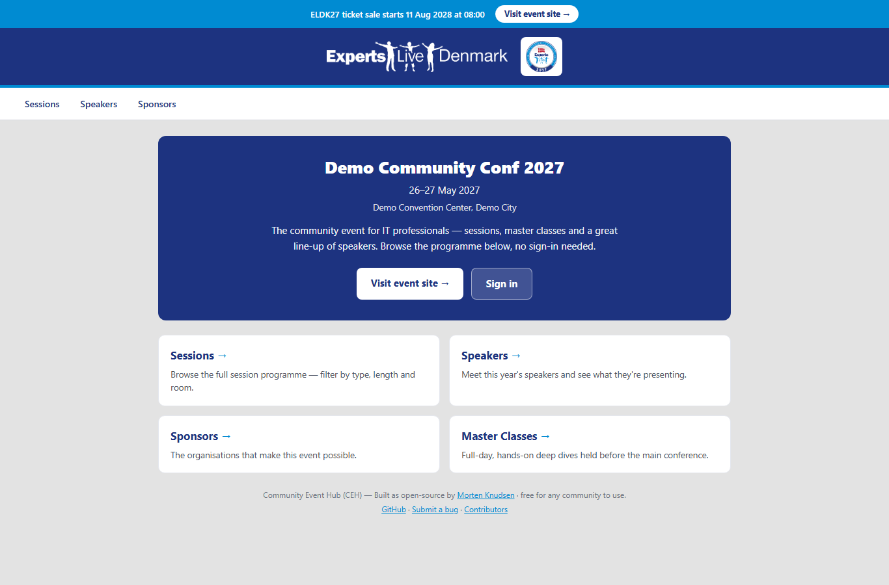
*The public front door of an edition: event details, programme and a sign-in, with no login required. A new edition is a new configuration row, not a new build.*

- **One hub, every year, every community.** The same platform powers each edition
  and each community event. Launching a new edition is a matter of configuration —
  a new event and its settings — never a rebuild. The year lives only in your web
  address and the event's display name, so nothing has to be re-coded season to
  season.
- **Clean separation of product, code and your community.** The product is
  Community Event Hub; your community keeps its own name and branding throughout.
- **Everything about an edition is configuration.** Event details, sponsors,
  content, hotel, integrations and speaker deadlines are all settings you can edit,
  not code you have to change.
- **A sanitized public template.** A scrubbed template version of the platform is
  published openly, while your real configuration, logos and production settings
  stay private.
- **Everyone has a profile they own.** Every signed-in person — whatever their
  role — gets a "My profile" page to keep their own name and phone up to date.
  Their email (their sign-in) and role (set by the organizers) are shown but kept
  safe from accidental edits, and a person can only ever change their own details.
  *(✅ 2026-06-15)*
- **One shared Resources page for all crew.** A single, always-current place for
  the practical info everyone needs — venue and floor plan, the event site, the
  exhibitor/crew guide, and how to reach the organizers. Organizers maintain it
  entirely as edition settings (no developer needed); links and downloads are
  grouped into tidy sections, and the page shows a friendly "nothing here yet"
  message until content is added. *(✅ 2026-06-15)*
- **Go-live test-data cleanup — clear the rehearsal cast in one click.** ✅ 2026-06-18 —
  while you set the hub up you can seed a synthetic test cast (speakers, sponsors,
  volunteers, attendees) to rehearse every flow. Before the edition goes live, a
  single organizer page lists everyone marked as a test user and clears them out so
  they never skew your real counts, exports or emails. It is safe by design: a clean
  test person is removed outright, but a test person who picked up real-looking data
  during the rehearsal is kept and simply deactivated instead of deleted, so nothing
  can be left dangling — and your genuine registrations are never touched. You see
  exactly who will go (and what happens to each) before you confirm, and the action
  can be re-run any time.

## 2. Sign-in & embedding — frictionless, no new passwords

- **One-time PIN by email — no new account to remember.** Crew sign in with just
  their email: the hub sends a 6-digit PIN that expires in 15 minutes and works
  once. No passwords to create, reset or forget. Sensible safeguards are built in
  (rate limiting, lockout after repeated wrong tries, and neutral messaging that
  never reveals whether an email is registered).
- **"Stay signed in" — one simple choice.** *(corrected 2026-07-07 — the old
  day/week/month dropdown was replaced by a single checkbox, operator 2026-06-22.)*
  At login a **Remember me** checkbox (ticked by default, §170) keeps you signed in
  for a year on that device; untick it for a short 8-hour session that refreshes as
  you keep using the hub. See §25 for the full one-tap sign-in model.
- **Magic-link login.** Invitation emails can carry a tap-to-sign-in link, so crew
  land straight in their hub without typing a PIN.
- **Never a dead end — gentle sign-in recovery.** ✅ 2026-06-17 — if a tap-to-sign-in
  link has expired (or is otherwise no longer valid), the page doesn't leave anyone
  stuck: it explains what happened and offers a one-tap **"Request a new sign-in
  code"** that takes the person to the email + code sign-in — and, when the expired
  link is recognised, it pre-fills their email and remembers where the link was
  taking them, so they get a fresh code and land on the right page without retyping
  anything. A deactivated account is told to contact the organizers instead.
  Mobile-friendly. *(Language note 2026-07-07: the hub is **English-only** by operator
  directive 2026-06-18 — every "bilingual / English and Danish" claim in this catalog
  describes the pre-directive state; the Danish UI was retired.)*
- **Pre-filled login links.** A link of the form `/Login?email=<address>` opens the
  sign-in page with the email already filled in, so a person only has to request their
  code — a small convenience that never bypasses the PIN. It works in every environment
  because each link uses that environment's own web address.
- **Ready for single sign-on.** The sign-in system is designed so a trusted
  identity provider can be added as a drop-in option in future, without disrupting
  the PIN experience.
- **Embeds safely in your event portal.** The hub can appear inside your existing
  conference platform (e.g. a Backstage portal) as a seamless embedded panel, with
  the security controls needed to keep that safe.
- **Anonymous visitors go straight to sign-in.** *(✅ 2026-06-21)* The separate public
  landing page was removed; someone who isn't signed in now lands directly on the
  **sign-in** page. The public, no-login programme pages (Sessions, Speakers, Sponsors,
  Master Classes, Agenda) remain reachable by their own addresses.
- **Sign-in sessions survive a deploy.** *(✅ 2026-06-21)* Sessions now persist across
  releases — a deploy no longer signs everyone out — because the hub uses a **shared
  data-protection key ring** rather than per-instance keys. People stay signed in
  through an update.

## 3. Crew profiles & roles — the right hub for each person

- **A complete crew profile.** Each person has one profile per edition: name,
  contact details, role, accreditation (MVP / Expert / RD / MS Employee), awards,
  clothing sizes, and status flags like verified and packed. *(corrected 2026-07-07:
  the "awards", "verified" and "packed" fields do not exist on the participant
  profile — the profile carries name/contact/role/accreditation/clothing sizes;
  award PREFERENCES are captured on the swag form, not as profile status flags.)*
- **Test-data tagging for a clean go-live (2026-06-14).** Any profile can be marked
  as test/dummy data, so when the event goes live the team can remove or deactivate
  all test entries in one step without touching a single real registration.
- **A tailored hub per role.** Every role — **Organizer, Speaker, Volunteer, Sponsor,
  Media (press / photo / video), Event partner, Attendee** — sees a hub built around
  what that person actually needs to do. *(Corrected 2026-07-07: the earlier list named
  roles that no longer exist as roles — "Masterclass Speaker" became the
  `SpeakingPreDay/MainDay` speaker flags, "Speaker-Sponsor" became the multi-hat
  capability model (✅ 2026-06-22), Video/Photography are covered by Media, and VIP has
  no hub role.)*
- **A friendly one-time welcome.** New crew get a welcome page the first time they
  arrive, once per edition.
- **Activate or deactivate people in a click.** Organizers can filter crew by role
  and status and switch someone active or inactive; deactivated people can no
  longer sign in.
- **Edit any participant from the grid.** Every row has an obvious **Edit / Modify**
  action that opens the full participant editor — name, email, persona/role, active
  state and sponsor-company link — validated and saved with a confirmation. The
  "Modify on behalf" was DELETED 2026-07-24 (§303b) — "Switch to user" is the one act-as feature. *(✅ 2026-06-15, revised 2026-07-24)*
- **Delete a participant safely, with a confirmation prompt.** Every row has a
  **Delete** that opens a confirmation modal first. People with linked data
  (sessions, volunteer tasks, claims, history) are **deactivated** instead of being
  permanently removed, so nothing important is ever silently lost; a never-engaged
  row is fully removed (its hotel/swag/sign-up/login leftovers cleaned up first).
  Bulk **Deactivate** is also available for ticked rows. Every removal is audited.
  *(✅ 2026-06-15)*
- **Link a sponsor contact to their company.** When editing someone, organizers can
  set or clear the sponsor company a contact belongs to, so that person sees exactly
  their company's sponsor tasks — and unlink them just as easily. *(✅ 2026-06-14)*
- **One person, several hats — handled cleanly.** *(✅ 2026-06-22)* A real person often
  wears more than one hat: a sponsor on a booth who also gives a talk, an organizer who
  presents, a digital sponsor who both signs the contract and runs a Master Class. The
  hub now models this properly — each person has **one main role** plus any number of
  **add-on capabilities** layered on top — so the same human is no longer forced into a
  single box or duplicated across rows.
- **Speaking is a capability anyone can have.** *(✅ 2026-06-22)* Being a speaker is now
  a hat a person wears, not a separate role: anyone — a sponsor contact, an organizer —
  can present. Each speaker carries **which day(s) they present** (the pre-day Master
  Class and/or the main-day sessions) and a **funding category** that says who covers
  them: **fully supported** (the hub covers their hotel, travel, swag and the rest), a
  **self-funded sponsor speaker** (their company covers them), or an **organizer who
  presents** (counted as an organizer, not added to the external-speaker tally). This
  is what decides who is counted and funded as a speaker.
- **Everyone gets exactly what they're due — counted once.** *(✅ 2026-06-22)* There is
  now a **single source of truth** for who receives each orderable thing — polo and
  swag, an award, hotel, travel, the appreciation dinner and lunch. It works out each
  person's entitlements from **all** their hats combined and **counts each person once**,
  so someone who is both a sponsor contact and a speaker never double-orders a polo or a
  lunch. An organizer can **manually include or exclude** any person for any single item
  (with a reason) when the defaults need a tweak, and can **mark two rows as the same
  human** so a person who appears under two emails is still only counted once.
- **A "Speaker & order review" screen for organizers.** *(✅ 2026-06-22)* One organizer
  page brings the whole picture together: every speaker with their day(s) and funding
  category, and a live, de-duplicated count of who is due each orderable item — so the
  team can see at a glance how many polos, dinners, hotel rooms and lunches to order,
  set a person's funding, link "same person" rows, and apply per-item include/exclude
  overrides in one place. Mobile-first, in English and Danish.

### Volunteer work structure — run a big volunteer pool without a bottleneck *(✅ 2026-06-15)*

For events with dozens of volunteers, organizers can break the work into a clear,
three-level structure and hand the day-to-day running of each area to a trusted
volunteer — so the organizing team isn't the single point of contact for everyone.

- **A three-level work tree.** Organizers build **Categories** (broad areas like
  Registration or A/V), each split into **Subcategories**, each holding concrete
  **Tasks**. Volunteers are assigned to tasks, and everything rolls up so a task
  always shows which subcategory and category it belongs to.
- **Two owners per category — oversight and hands-on.** Each category has a
  **lead**, who is an organizer providing oversight, and a **supervisor**, who is a
  volunteer appointed from the pool to actually run that category. Appointing a
  supervisor is a one-click organizer action that gives that volunteer management
  rights for **just that category** — they remain an ordinary volunteer everywhere
  else.
- **Supervisors run their own area.** A supervisor gets a dashboard for the
  categories they run: add subcategories and tasks, assign volunteers, move tasks
  along, and answer help requests — all limited to their own categories.
- **Volunteers see exactly their tasks.** A "My tasks" view groups a volunteer's
  assigned work by category and subcategory, lets them update their own progress,
  and shows any help they've asked for.
- **A built-in help channel.** A volunteer who is stuck on a task can **ask their
  category's supervisor for help** in one tap. The supervisor sees it (and the
  category's organizer lead can too, for oversight) and replies; each request moves
  from open to answered to resolved.
- **The supervisor is emailed when help is needed.** Raising a help request also
  **notifies the category's supervisor by email** (with the organizer lead copied in
  for oversight), so they don't have to be watching the dashboard to know a volunteer
  is waiting — the email shows the task, the category and the volunteer's message. The
  request is still saved and visible in the hub even if mail can't be sent.
- **Mobile-first.** Every screen — the organizer tree, the supervisor dashboard and
  the volunteer "My tasks" — works on a phone at the venue, and the hub home page
  surfaces each volunteer's assigned-task count and a link to their supervisor
  dashboard when they run a category.

### Volunteer "My schedule" — your whole day, in one place *(✅ 2026-06-15)*

Every volunteer gets a single mobile-first page that answers "what am I doing, and
when?" at a glance — built for someone standing at the venue with their phone.

| Volunteer "My schedule" | …on a phone |
|---|---|
| [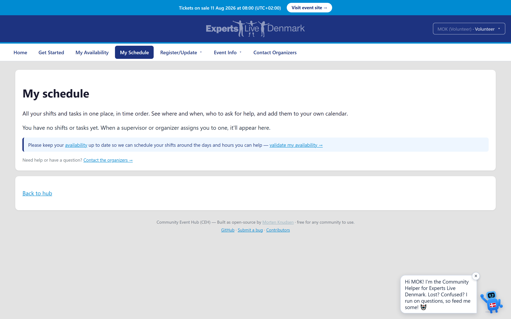](img/volunteer-schedule.png) | [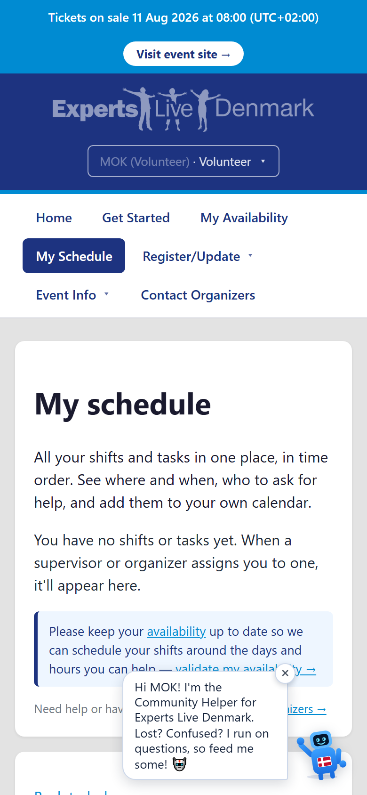](img/volunteer-schedule-mobile.png) |

*A volunteer's whole day in one place — shifts time-ordered, who to ask, and one-tap calendar subscribe — and the same view on a phone at the venue.*

- **All your shifts and tasks, time-ordered.** One page lists every task you're
  assigned to across all areas, sorted so dated work comes first (earliest first),
  then by shift window, with undated work last — no hunting through category groups.
- **Where, when and who to ask.** Each entry shows its bucket and subcategory, the
  due date and shift window, and the **go-to people**: the bucket's supervisor(s)
  plus the ELDK lead — so you always know who to turn to.
- **Ask for help in one tap.** Stuck on a task? Ask your supervisor for help right
  from the entry; they're notified by email and you see their reply inline.
- **Add it to your own calendar.** Subscribe your shifts to the calendar you
  already use, or download a single shift as a `.ics` — the same private, always-up-
  to-date personal feed used for deadlines, now carrying your volunteer work too.
  *(retired 2026-07-07: the subscribable per-person calendar feed and the `.ics`
  downloads were removed (§193/§201) — "add to calendar" actions now EMAIL a proper
  calendar invite to your inbox instead; see §38.)*
- **Update your progress.** Move a task along (Open / In progress / Done) without
  leaving the page.
- **Fully bilingual + accessible.** English and Danish throughout, mobile-first at
  ~360px, with labelled controls for screen readers. *(No self event-check-in —
  that stays in Zoho Backstage.)*

### Volunteer self-service shifts — confirm, decline or swap *(✅ 2026-06-16)*

Volunteers stay in control of their own shifts on one mobile-first page, so the
coordinator is not chased down for every change.

- **Confirm you can take a shift.** For each shift you're assigned, tap "I can take
  this" to confirm your availability — the shift shows a green Confirmed badge.
- **Decline a shift you can't work.** Can't make it? Decline it with an optional
  short reason. Your assignment isn't silently dropped — a coordinator is signalled
  to reassign it, and the shift shows "Declined — needs reassigning".
- **Request a swap.** Want to hand a shift back or to someone else? Request a swap
  (with an optional note); the coordinator picks it up the same way.
- **Read the instructions for each shift.** The per-shift instructions are shown
  right where you decide, so you know exactly what the shift involves.
- **Change your mind any time.** An "undo" puts a declined or swap-requested shift
  back to normal and withdraws the coordinator nudge automatically.
- **Coordinators see it in one place.** Declines and swap requests surface on the
  existing organizer action queue — no new inbox to watch.
- **Yours only, and safe.** You can only act on shifts you're actually assigned to;
  the page never trusts who the browser claims to be. English and Danish, mobile-
  first at ~360px, with labelled controls and a status region for screen readers.
  *(No self event-check-in / live headcount — that stays in Zoho Backstage.)*

### Volunteer self-service, unified — one schedule, your availability, signup *(✅ 2026-06-21)*

The volunteer experience now gathers everything a volunteer manages into one place,
keeps the supervisor tools out of an ordinary volunteer's way, and opens a no-login
way to sign up.

- **One unified "My Schedule".** Assigned **shifts and tasks** now live on a single
  page, each with the actions a volunteer needs: **confirm**, **decline**,
  **request-swap**, **withdraw**, and **ask-for-help** — so a volunteer manages their
  whole commitment in one view instead of two.
- **My Availability — tell organizers when you can work.** A volunteer sets their
  availability **per event day**: **full**, **half** or **blocked** — so planners know
  who is free before they assign work.
- **An anonymous shift-signup survey at `/volunteer/signup`.** A no-login page lets a
  prospective volunteer sign up — capturing their **identity and shift availability** —
  which lands in the normal validation queue, just like other interest-form sign-ups.
- **The Supervisor dashboard shows only to actual supervisors.** The supervisor tools
  are now shown **only to volunteers who actually run a category**, so an ordinary
  volunteer's hub stays focused on their own work.
- **An Event-logistics fold-out and action guidance.** The volunteer hub carries a
  fold-out with the practical **event logistics** plus short action guidance, so a
  volunteer knows what to do and where to find it. Mobile-first, in English and Danish.

### Volunteer Buckets & resource allocation — plan staffing, then commit *(✅ 2026-06-15)*

On top of the work structure, organizers get a planning surface that turns a long
task list into a staffed plan, with a draft-it-then-commit workflow so nothing is
assigned by accident.

- **Buckets group the work, with two clear go-to tiers.** Tasks live in **Buckets**.
  Each Bucket has **one or more supervisors** (the go-to volunteers who run it) and an
  **ELDK lead** (the go-to person for the supervisors) — a simple chain of
  volunteer → supervisor → ELDK lead so everyone knows who to ask.
- **Richer task detail.** Every task can carry a time, status, criticality
  (need-to-have / nice-to-have), the responsible team, an ELDK lead, how many people
  it needs, pre-requisites, expectations and per-task instructions. The **ELDK lead
  can mark a task completed**, signed and time-stamped.
- **Import the plan in one action.** Organizers upload the detailed volunteer plan
  (CSV) and the hub creates the buckets and tasks for them, derives the bucket from
  each task's responsible team, fills in the task detail, and links named helpers to
  the volunteers already in the hub. Re-importing is safe — it updates rather than
  duplicates.
- **AI-assisted guidance.** For any task missing a pre-requisite or an expectation,
  the hub suggests one from the task name — using a real AI model when the event has
  configured one, or a sensible built-in rule of thumb otherwise. Every suggestion is
  fully editable and can be regenerated.
- **See the gaps at a glance.** Each task shows a **red/green** indicator of needed vs
  assigned people — green when it's covered, red (with the shortfall) when it's short
  — so organizers can spot under-staffed tasks across every bucket.
- **Plan as a draft, then commit.** Organizers map people to tasks into a **draft**
  and watch the red/green coverage update live as a *simulation* — but no one is
  actually assigned yet. Only **Commit** turns the draft into real assignments;
  **Discard** throws the draft away. Two organizers can plan at the same time without
  stepping on each other.
- **Volunteers see the full picture.** A volunteer's "My tasks" view shows each task's
  instructions, pre-requisites and expectations, plus their bucket's supervisor(s) and
  ELDK lead, so they know exactly what to do and who to ask.

### Onboarding lifecycle — from sign-up to set-up *(✅ 2026-06-15)*

A clear path from "someone is interested" to "they're ready to go", with the
organizing team in control of who comes on board.

- **A holding queue for new people.** Prospective volunteers, speakers and
  media-team don't go live automatically. They land in a **pre-selection queue** in
  a holding state — both the speaker sync results and the volunteer interest-form
  sign-ups arrive here for review. Each person moves through three stages:
  **inactive → preselected → active**, and only an **active** person can sign in.
- **Validate, then activate — one or many at once.** Organizers review the queue
  (filter by where each person came from), then preselect or activate people one row
  at a time, or tick several rows and activate them together with a single click.
- **Remove duplicates and spam from the queue.** Each queue row has a **Delete**
  button (behind a confirmation dialog) so an organizer can clear an obvious duplicate
  or spam entry. Queue rows are people who haven't gone live yet, so a clean row is
  removed outright; if a row somehow already has linked data it is safely deactivated
  instead of deleted, so nothing is ever orphaned. *(✅ 2026-06-16)*
- **A short onboarding wizard tailored to each persona.** Once activated, each
  person runs a quick, mobile-first wizard covering only the steps that apply to
  them — a speaker verifies a bio + picture and completes hotel, appreciation and
  swag; a volunteer or media-team member skips the public bio; a sponsor or
  organizer just does appreciation + swag. Each step is saved on its own (and the
  moment it was completed is recorded), with a progress strip showing what's done,
  and a persona is "fully onboarded" once it has finished all the steps it needs —
  not a fixed checklist for everyone.
- **An onboarding dashboard for organizers.** A dashboard shows counts and lists by
  **stage** — Pre-selected, Invited, In-progress, Completed — each with a completion
  percentage and **filterable by persona** (speakers / volunteers / media / sponsors
  / organizers), plus per-step progress (counting only people who need that step) and
  a per-person grid of who has and hasn't completed each step — so the team can see at
  a glance who still needs a nudge.
- **Re-open a step to send a reminder.** If something changes — say a speaker decides
  they want a hotel after all — an organizer can re-open just that step for that
  person, which queues a reminder asking them to complete it.

### Multi-hotel management — split the crew across several hotels *(✅ 2026-06-15)*

When the rooms don't all fit in one hotel, organizers can define several hotels and
place each person in the right one, then manage the room block per hotel.

- **Organizer-defined hotels.** A simple management page to add, edit and remove the
  hotels for the edition — each with a name, address and a contact email for the
  reception/booking desk.
- **Tidy several hotels at once.** *(✅ 2026-06-17)* As well as deleting one hotel at a
  time, organizers can tick several and remove them in one go. A clear confirmation
  box names exactly **how many hotels** are about to be deleted before anything
  happens, and anyone currently placed in a removed hotel is **automatically
  un-assigned** (their participant record is kept, just no longer pointing at the
  now-gone hotel) — so a mis-imported or duplicated room block is quick to clean up
  without losing anyone.
- **Assign each person to a hotel.** From the hotel-assignments page, an organizer
  picks which hotel each participant stays in (or leaves them unassigned), in one
  click per person.
- **Everyone grouped by hotel.** The same page lists everyone **grouped by hotel** —
  Hotel 1's list, Hotel 2's list, and a "Not assigned" group — with a per-hotel
  headcount and how many are confirmed, plus each person's room-need flag, so the team
  can manage each hotel's room block at a glance. Empty hotels still show, so it's
  obvious a hotel has no one in it yet.
- **A confirmation number per person.** Once a hotel returns a reservation number,
  the organizer records it against that person.
- **Room-block occupancy at a glance.** *(✅ 2026-06-17)* Each hotel can carry the
  **size of the room block** you reserved there (set it on the hotel's edit form). A
  new **Room block occupancy** page then shows, per hotel, the reserved block against
  the number of people you've placed there — counting only those who actually said
  they need a room — with the rooms still free and a clear **within block / over by N /
  no block set** status. A roll-up across all hotels shows your total reserved rooms,
  how many room-needers are placed, how many rooms are still free, and — importantly —
  **how many people who need a room aren't placed in any hotel yet**, so it's obvious
  whether the room plan still holds. A green banner confirms when everything fits; an
  amber one flags exactly what needs attention. Read-only (it doesn't move anyone),
  mobile-first and available in English and Danish.
- **The hotel details land in the person's email.** When a participant's hotel
  calendar invite/email goes out, it now names their **assigned hotel, its address and
  their confirmation number** (the per-person number takes priority over any legacy
  vendor number), so each person sees exactly where they're staying. In the test
  environment all such mail is still safely redirected to the team inbox.
- **Mobile-first and bilingual.** Both pages work on a phone and are available in
  English and Danish.

## 4. Self-service forms — crew fill in their own details

Each form is short, mobile-friendly, and wired so that completing it does the right
follow-up automatically.

- **Appreciation dinner.** RSVP with a calendar invite, and capture dietary needs
  for the dinner.
- **Hotel.** Book a room and receive a hotel calendar invite; this feeds the
  rooming list and the room-night forecast.
- **Lunch.** Sign up for pre-day and main-day lunch.
- **Speaker info & editable bio (✅ 2026-06-15).** Speakers manage their own
  details and edit their **public bio** in tabbed sections (Bio · Tagline · Links
  & Social · Photo · Sessions). The bio is seeded from Sessionize but owned by the
  speaker — anything they change is kept and the nightly Sessionize sync won't
  overwrite it (see §6). Mobile-first, keyboard- and screen-reader-friendly.
  *(corrected 2026-07-07: the bio editor has FOUR tabs — Bio · Tagline · Links &
  Social · Photo; there is no Sessions tab (sessions live on the speaker hub).)*
- **Preferred email for calendar & messages (✅ 2026-06-15).** Many speakers don't
  use the email they registered with on Sessionize for their day-to-day calendar
  and mail. A speaker can set a preferred address on their form ("blank = use your
  Sessionize address"); when set, **all** calendar invites and emails — from the hub
  **and** Zoho Backstage — go to that address instead. Their Sessionize/community
  email stays their sign-in and the key the hub matches them on, so login keeps
  working and a Sessionize re-import never disturbs the preference. The field is
  mobile-first, validates the address format, and shows a clear confirmation when it
  changes.
- **Swag.** Choose polo, jacket and award preferences.
- **Travel.** Submit a reimbursement claim, which automatically creates the
  matching invoice/payout task. *(✅ 2026-06-24)* The upload-invoice/receipts button moved
  down to sit just above the submit, and the submit button is now clearly labelled
  **"Request Travel Reimbursement"**.
- **Volunteer sign-up.** A single guided, multi-step wizard that sets up the right
  tasks for each volunteer (the older one-page form was retired so there is exactly
  one path — ✅ 2026-06-14).
- **Late-change alerts done right.** If someone edits their hotel, dinner or shift
  details after the change deadline, organizers are notified of the late change;
  edits before the deadline stay quiet — no inbox noise.
- **Every form confirms it saved (✅ 2026-06-16).** Submitting any self-service form
  — hotel, dinner, lunch, swag, travel, speaker details, the volunteer wizard and
  the first-run onboarding wizard — now shows the same clear "saved" confirmation
  banner, announced to screen readers and dismissable, so no submit is silent.
- **Clear, in-place guidance when something's missing (✅ 2026-06-16).** Forms now
  flag exactly which field needs attention right next to it, and re-check on the
  server so nothing slips through. Examples: the dinner asks you to pick yes/no/maybe,
  the hotel form requires a room choice and valid check-in/check-out dates
  (check-out after check-in), the swag form needs a polo choice, and the travel form
  requires an amount when you pick "Other".
- **Structured dietary & allergy capture for catering (✅ 2026-06-16).** The dinner
  and speaker forms replace the unusable free-text allergy box with a structured
  picker: a diet choice (vegetarian, vegan, pescatarian, halal, kosher) plus
  tick-boxes for the common allergens (gluten, nuts, shellfish, dairy, egg, fish,
  soy, sesame and more), with a free-text box only for anything not listed. Because
  it's structured, the caterer gets real head-counts ("how many gluten-free, how many
  vegan") instead of a pile of notes. Day-catering (collected on the speaker form)
  and the Appreciation Dinner are tracked separately. Mobile-first and accessible
  (the allergen group is a labelled fieldset).
- **Ask for a change after the deadline (✅ 2026-06-17).** Once the change deadline
  passes, the forms become read-only — but that's no longer a dead end. A locked
  form now shows a **"Request a change"** link that opens a short page where you
  describe what needs updating (for example "my arrival moved to the 8th, please
  change my check-in"). Your request goes straight to the organizers' to-do list, and
  the page shows you which of your requests are still pending so you don't have to ask
  twice. No more emailing around to fix a detail after the cut-off. Mobile-first,
  available in English and Danish, and accessible.
- **You only see the forms that apply to you (✅ 2026-06-22).** A speaker now sees
  exactly the forms they're actually due, based on who funds them. A self-funded
  sponsor speaker — whose company covers their stay and travel — no longer sees the
  hotel, travel or swag forms, so they're never asked to fill in something that isn't
  theirs to claim; a fully-supported speaker still sees them all. Forms follow the same
  single source of truth that decides each person's entitlements, so what's offered and
  what's ordered always agree.

## 5. Tasks & reminders — nothing slips, no inbox spam

- **A personal to-do list for every person.** Each crew member sees only their own
  tasks, can tick them off, and the list fills itself from the forms they complete
  and the role they hold.
- **One consistent "what do I still owe" checklist, everywhere.** The same unified
  checklist — what's pending, what's done, and a clear **overdue** badge with the
  number of days late — now renders identically on the hub home, the Tasks page and
  the attendee My-event page, instead of competing landing surfaces each showing a
  different list. Pending items deep-link straight to the form that completes them,
  and a sponsor contact's company-scoped tasks are included, so the checklist never
  says "all done" while sponsor work is still outstanding. *(✅ 2026-06-15)*
- **Speaker deadlines, scheduled for you.** Each speaker automatically gets a dated
  task for every key milestone, so the path from accepted to on-stage is laid out
  for them. The milestones now carry confirmed, fixed calendar dates (2026-06-14):
  verify bio + photo in the hub (1 Oct 2026), upload a draft preview deck (20 Jan
  2027) and upload the final slide deck (3 Feb 2027) for all speakers, plus a
  Master-Class-only "submit title and abstract" (20 Jun 2026). Reminders count down
  (14 / 7 / 3 / 1 days) to each fixed date. *(corrected 2026-07-07: the countdown
  cadence was simplified — the hub sends a SINGLE reminder on the day a task is due
  (never twice), plus the §232 attendee sign-up cadence: first nudge two weeks after
  the welcome, then every two weeks until answered.)*
- **A speaker hub that shows the whole journey at a glance.** Speakers (and
  master-class speakers) get their own page that turns those milestones into one
  cohesive, mobile-first tracker: a progress bar (X of N done), a per-milestone
  card with a live countdown ("12 days to go" / "due today" / "overdue 3 days"),
  a one-tap "Mark done" / "Reopen", a clear "next up" summary, and a quick link to
  finish their speaker details and travel claim — so a speaker always knows exactly
  where they stand without digging through the generic task list. *(✅ 2026-06-14)*
  *(retired 2026-07-07: the milestone tracker (progress bar / countdown / "next up"
  cards) was removed from the speaker hub on 2026-06-24 — it duplicated the task
  list. The hub now leads with "My Sessions"; deadline work lives on My Tasks, and
  the readiness rollup is the "Am I ready?" page (/Speaker/Readiness).)*

  | Speaker hub | …on a phone |
  |---|---|
  | [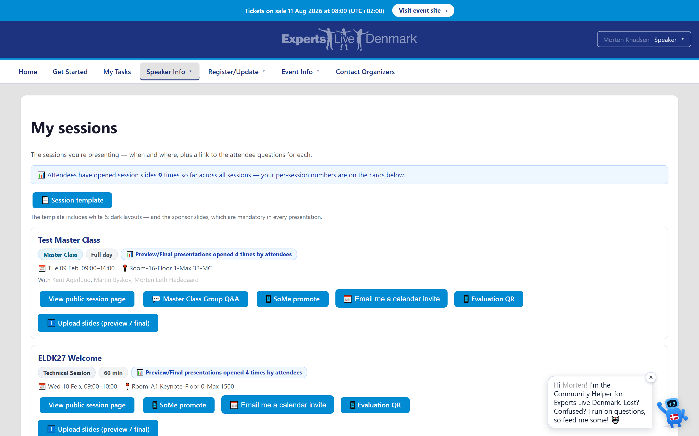](img/speaker-hub.png) | [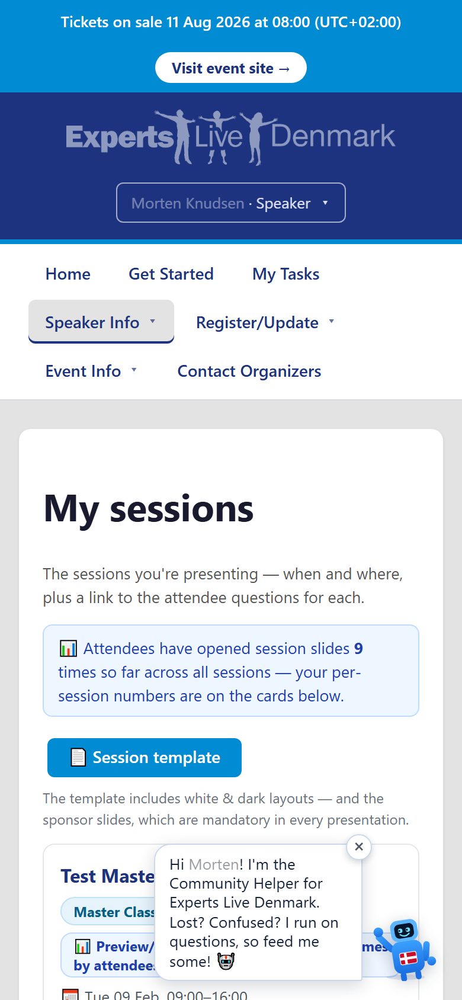](img/speaker-hub-mobile.png) |

  *The speaker hub turns deadlines into a progress tracker with live countdowns, "My sessions" and a public-profile preview — mobile-first, the same on a phone.*
- **"My sessions", right on the speaker hub.** The hub now shows each session a
  speaker is presenting — title, day and time, room (or a clear "to be scheduled" /
  "room to be assigned" when the grid isn't published yet), any co-speakers, a
  "master class" badge where it applies, a one-tap jump to the attendee questions
  for that session (with an open-question count), and — once they're announced — a
  link to their public session page. Speakers see exactly how and where they
  present without asking an organizer. *(✅ 2026-06-16)*
- **A My Sessions hub — every session as a card with its own actions.** *(✅ 2026-06-21)*
  The speaker's sessions are now laid out as a **per-session grid**, each card carrying
  the actions for that talk: **SoMe Promote** (build a share post), **Calendar Sync**
  (download the session `.ics`) *(corrected 2026-07-07: Calendar Sync now EMAILS a
  calendar invite (§193/§38) rather than downloading a file)*, an **Evaluations** link once results are published, and
  a **Session Template**. A small **per-session action legend** explains what each action
  does, so a speaker manages each talk in place. Mobile-first, in English and Danish.
- **Bio is now a dedicated bio-only page.** *(✅ 2026-06-21)* A speaker's public bio lives
  on its own focused page, separate from their personal details, so editing the bio is a
  single clear task. The other **speaker details — preferred email, accreditation,
  country, gender and "first-time speaker"** — have moved to **My Profile**, keeping each
  page about one thing. *(corrected 2026-07-07: since 2026-06-24 those fields live on
  the **Speaker Details** page (/Speaker/Details), not My Profile — see the "One
  'Speaker Details' page" entry in §6.)*
- **Speaking days are derived automatically.** *(✅ 2026-06-21)* A speaker's **speaking
  days** are now worked out from their accepted sessions rather than asked for separately,
  and are shown and managed on the organizer **Speakers** page — so the days a speaker is
  needed always match the sessions on the agenda.
- **A Calendar + Event-logistics fold-out for speakers.** *(✅ 2026-06-21)* The speaker
  hub now carries a fold-out covering the practical event logistics a speaker needs —
  **hotel, dinner, lunch, speaker gift and travel** — plus a one-tap **Contact
  Organizers**, so everything a speaker needs for the day is gathered in one place.
  Mobile-first, in English and Danish.
- 🗑 **RETIRED 2026-08-02 (§748.1) — the speaker ratings page is gone until its four-point
  replacement (C10) is built.** It read the retired 1–5 scale, so it could only ever have shown an
  empty list — which to a speaker reads as *"nobody rated me"* rather than *"not built yet"*. The
  page now redirects to the speaker home; the per-session evaluation-QR download it also carried is
  unaffected and still works. Speakers continue to receive their **Score / Open-feedback PDFs**.
  History below.
- **See how your sessions were rated.** A speaker now has a self-service "My session
  ratings" page: for each of their own sessions it shows how attendees rated it
  (the quick 1–5 smiley score they leave via the room QR code), the average and
  number of ratings, and every anonymous written comment — newest first — plus an
  overall score across all their sessions. Speakers no longer have to wait for an
  organizer to forward the results; they can check the feedback for their own talks
  whenever they like. The comments are anonymous and a speaker only ever sees their
  own sessions. *(✅ 2026-06-17)* *(corrected 2026-07-07: final session results are
  now delivered as the organizer-uploaded per-session **Score / Open-feedback PDFs**
  (§28/§37), downloaded from the speaker's session cards; the "My session ratings"
  page (/Speaker/Evaluations) remains for the in-room QR ratings/comments view.)*
- **Preview your public profile.** From the hub a speaker can preview their public
  speaker page exactly as attendees will see it — the moment the organizers select
  them for the line-up. Until then the hub explains the preview unlocks at
  announcement and points them to polish their bio and photo first (their edits are
  always kept). *(✅ 2026-06-16)*
- **Speaker deadlines in your own calendar.** Speakers can subscribe their milestone
  deadlines to their personal calendar with one tap (copy link or subscribe), so new
  and moved dates stay in sync automatically — the same trusted per-person calendar
  feed volunteers already use. *(✅ 2026-06-16)* *(retired 2026-07-07: the per-person
  calendar feed and subscribe/copy buttons were removed (§201); tasks now offer an
  emailed calendar invite instead (§193/§38).)*
- **A reminder engine that's gentle and reliable.** Reminders go out on a sensible
  cadence per type — speaker milestones counting down (and a nudge if overdue), a
  weekly digest of what's still pending, weekly sponsor and form chasers, and a
  short series for general tasks. It never double-sends and quietly catches up if a
  day is missed. *(corrected 2026-07-07: the multi-touch cadences (countdowns,
  weekly digests, chaser series) were simplified to a SINGLE reminder on the day a
  task is due — never re-sent — plus the §232 attendee sign-up cadence (first nudge
  two weeks after the welcome, then biweekly until answered). "Never double-sends
  and catches up quietly" still holds.)*
- **Tuned entirely through settings.** Whether each reminder type is on, how often
  it goes, exactly what it says, and who receives it (including CC, BCC and
  escalation) are all configurable — no code changes. *(corrected 2026-07-07: not
  implemented as described — what exists is the per-edition feature switches (§16)
  and the editable email templates (§10); per-type cadence, CC/BCC and escalation
  tuning are NOT settings today.)*
- **Built to minimize email.** The guiding principle is to nudge only when
  something is actually overdue.
- **Sync your reminders to your own calendar.** Every speaker, volunteer and
  organizer can subscribe their hub deadlines and shifts to the calendar they
  already use — Outlook, Google or Apple. Add the link once and it keeps itself
  up to date: new reminders, moved deadlines and completed items flow through
  automatically, with a gentle pop-up reminder a week and a day before each due
  date. Each person sees only their own items. The hub shows a one-click
  "Subscribe" link with a copy button and short per-app instructions, plus a
  "Download .ics" button to drop a single item straight into a calendar. The
  subscribe link is private to each person and an organizer can reset it at any
  time. *(✅ 2026-06-15)* The subscribe link now uses a short, friendly address.
  *(retired 2026-07-07: the whole subscribable per-person feed — subscribe link,
  copy button, per-app instructions and the .ics downloads — was removed (§201);
  "add to calendar" is now an emailed calendar invite per item (§193/§38).)*
- **The event lands in your calendar the moment you're activated.** When an
  organizer activates a person, their activation email carries a calendar invite
  for the event itself — one tap and the dates are in their calendar, alongside the
  link to subscribe to their personal deadlines. *(✅ 2026-06-15)* *(retired
  2026-07-07: the activation-email .ics attachment and the subscribe link went with
  the feed retirement (§201); calendar entries now arrive as per-action emailed
  invites (§193/§38).)*
- **Organizers can turn calendar sync on or off.** A simple switch (on by default)
  controls calendar sync for the whole edition — when off, the personal feed and
  the activation invite are disabled and the "Add to my calendar" card is hidden.
  *(✅ 2026-06-15)* *(corrected 2026-07-07: the switch remains, but it now governs the
  EMAILED calendar invites for the edition — the personal feed and activation invite
  it used to control were retired (§201).)*
- **Preview your own calendar feed before you share it.** Right on the calendar
  settings page, an organizer now sees a read-only preview of exactly what their
  personal calendar feed contains — each item with its date and where it happens —
  so they can confirm the feed looks right before passing the subscribe link along.
  *(✅ 2026-06-18)* *(retired 2026-07-07: removed together with the personal feed (§201).)*
- **Key dates, tailored to each role — and synced to your calendar.** Everyone now
  sees a short table of the dates that actually apply to them: move-in, logistics,
  packing, setup, pre-day/master-class and main day, plus the timed moments on the
  pre-day (Party 16:00, Group photo 17:30, Appreciation Dinner 18:00). A speaker
  never sees move-in; sponsors don't see the group photo — each entry is shown only
  to the roles it's tagged for (**Media** covers both the video and photo crew).
  Every row carries a one-tap **"+ calendar"** download, and the whole list is part
  of the personal calendar feed, so dates land in your own calendar and stay current.
  Organizers manage it all at **Schedule / key dates** (reached from the Logistics
  hub) — add/remove entries, mark them all-day or timed, and tick which roles see
  each one; sensible defaults are seeded automatically. *(✅ 2026-06-20)*
  *(retired 2026-07-07: the role-tailored key-dates table was retired — the
  participant-facing list, its per-row "+ calendar" downloads and its place in the
  personal feed are gone; key dates reach people through the get-started flows,
  tasks and emailed invites instead.)*
- **Key dates that open straight in your calendar — and read more clearly.**
  *(✅ 2026-06-24)* Each Key Dates entry now carries **Outlook** and **Google**
  "add to calendar" links that **open the calendar with the event prefilled** (the
  `.ics` stays as an Apple/other fallback), so adding a date is one tap instead of a
  file download. The list is also **grouped by month** with headers and tidier rows on a
  phone, and the calendar **subscribe** link now uses a plain `https` address so more
  calendar apps accept it. *(retired 2026-07-07: retired together with the key-dates
  table and the subscribable feed — see the entry above.)*
- **Anyone can RSVP to the Party — no login.** A public page at **`/Party`** asks for
  name + email and an opt-in to attend the Party (16:00–18:00 on the pre-day). It's
  spam-hardened (honeypot + IP hash), upserts by email (re-submit to change your
  mind), and offers an **"Add to my calendar"** download on confirmation — no email
  invite (so no inbox needed, no spam risk). Organizers get the **attending
  headcount** + a CSV at **Party RSVPs** (Logistics hub) — the figure for the Bella
  Center food order. Signing up grants no hub access. *(✅ 2026-06-21)*
- **One shared "My Tasks" panel, with a completion %.** *(✅ 2026-06-27)* The three role task pages
  (speaker, sponsor and volunteer/organizer) are now the **same shared panel**, carrying a **"Task
  checklist" completion percentage** and a consistent **pending-on-top, completed-at-the-bottom**
  ordering, so everyone reads their tasks the same way and can see at a glance how far through they are
  (§147).
- **Readiness and deliverables roll up at the top of My Tasks.** *(✅ 2026-06-27)* The speaker **"Am I
  ready?"** readiness summary and the sponsor **deliverables %** now render at the **top of the My
  Tasks page** rather than as a separate menu item, so a person sees their headline status above the
  task list itself (§144/§145).
- **A "Submit travel reimbursement" task you can simply tick.** *(✅ 2026-06-27)* Speakers travelling
  from outside Denmark get a **"Submit travel reimbursement"** task they can **mark done themselves**
  without having to claim anything through the form — a lightweight acknowledgement for speakers who
  handle reimbursement their own way (§143).

## 6. Sessions & surveys — from call-for-speakers to the schedule

| Public speaker line-up | Public session detail |
|---|---|
| [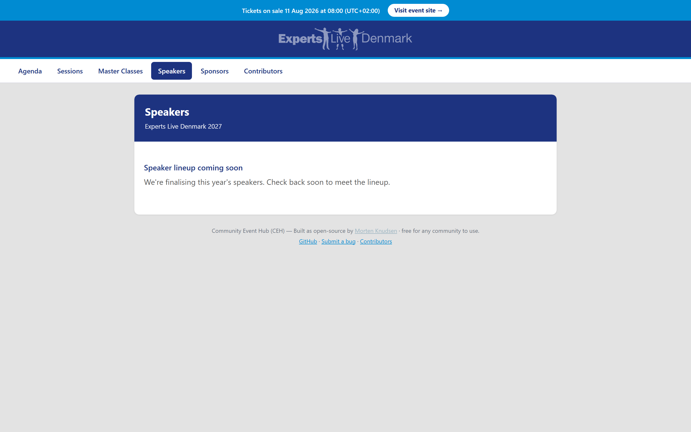](img/public-speakers.png) | [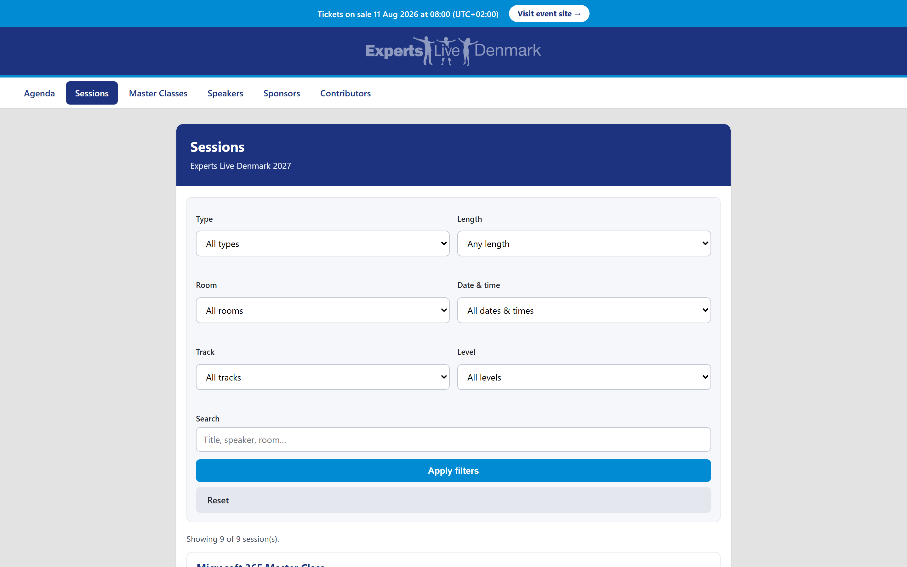](img/public-session-detail.png) |

*The public, no-login programme: only published speakers appear (each links to their sessions), and every talk has a shareable detail page with "Add to my calendar" and "ask the speaker".*

- **Pull your speakers straight from Sessionize.** Connect a Sessionize API
  endpoint and the hub pulls the **accepted**-speaker list automatically — nightly,
  or on demand from an organizer button — creating or updating speakers (matched on
  email, never overwriting roles) and reporting anyone it skipped. No file shuffling.
  - *Setup (one time):* in Sessionize open your event → **API/Embed** → create a
    new API endpoint → name it → choose **JSON** → include all built-in fields →
    enable the **speaker emails** advanced field (required, or every speaker is
    skipped — email is the match key) → configure the **accepted-speakers** view →
    **save** → copy the endpoint id. The URL looks like
    `https://sessionize.com/api/v2/<your-event-id>/view/All`.
    The endpoint id is ordinary operator configuration (not a secret): put it in the
    hub's per-edition config (your private `integrations.<edition>.json` or gitignored
    custom config). Keep the real id out of the public mirror, but it is plain config —
    not a Key Vault secret.
- **Set or switch your Sessionize endpoint from the hub — with a safe change prompt.**
  An organizer **endpoint settings page** lets you set or edit the Sessionize endpoint
  id (and view) for the edition right in the hub, on top of the deployment default —
  no redeploy. The endpoint that's currently in effect is shown, and the live importer
  picks up a newly-saved id immediately. **When you change the endpoint** (the typical
  case is switching from your call-for-speakers event to the accepted-lineup event),
  the hub asks how to treat the speakers you've already imported:
  - **Replace** — replace the existing data and re-import the accepted speakers from
    the **new** endpoint. This is the **normal production path**; it runs as a **Full
    import** (every bio field re-seeded from the new endpoint).
  - **Merge** — merge with what's already there (**for testing only**, e.g. checking a
    new endpoint's data against existing rows). It runs as a **delta sync** and
    **never flushes a speaker's own edits**.
  Your choice and the endpoint are saved per edition; the page records the choice and
  points you at the matching import button — it never starts an import on its own, so
  switching the endpoint is always a deliberate two-step action. *(✅ 2026-06-15)*
- **Sessions come across too — linked to their speakers.** The same Sessionize
  pull also imports your **sessions** (the Sessions/All view), creating a session
  record for each talk and **linking it to its speaker(s)** — a session can have
  several co-speakers and a speaker several sessions. Each speaker's linked
  session(s) show up on the organizer **speaker overview** (with a total session
  count), so you can see who is presenting what at a glance. Sessions upsert by
  their Sessionize id on every pull (nightly or on-demand) — new and changed
  sessions are refreshed in place, nothing is duplicated and nothing is deleted.
  Sessions stay **inside the hub** (they are not pushed to speakers' public profiles
  or to Backstage). *(✅ 2026-06-15)*
- **Add your own sessions in the hub.** Not everything comes from Sessionize — add a
  **sponsor session** (or any other session) directly in the hub, alongside the
  imported ones. Hub-added sessions are clearly marked and are **safe across
  re-imports**: a Sessionize pull never touches or removes them. *(✅ 2026-06-15)*
- **Preview before you import — see exactly what would change.** Before committing a
  Sessionize import (delta or full, API or spreadsheet) you can run a **dry-run
  preview** that changes nothing and shows **how many speakers would be created,
  updated or left unchanged** — and, crucially, **which speaker bios would be
  overwritten**, with the ones a speaker has personally curated in the hub clearly
  flagged. A full import is the only one that overwrites, so the preview spells out
  the cost up front; a delta preview confirms it would overwrite nothing. The real
  import is a separate, explicit click behind a clear confirmation, so a blind import
  can never silently clobber curated speaker content. *(✅ 2026-06-16)*
- **Delete a bad or duplicate session — safely.** Organizers can **delete a session**
  from the sessions admin, behind a confirmation dialog. The delete is safe by design:
  a session that has collected **attendee questions, evaluations or master-class
  bookings is protected** and won't be deleted (you're told what to clear first), so
  attendee input is never silently lost; a clean session is removed along with its
  speaker links (nothing is left orphaned). If the session came from Sessionize you're
  reminded that a future import will bring it back unless it's removed there too.
  *(✅ 2026-06-16)*
- **Remove someone from the speaker roster — safely, without deleting the person.**
  On the speakers admin, each speaker has a **Remove from speakers** action (single,
  behind a confirmation dialog, or in bulk for a ticked selection). It removes the
  **speaker profile** — bio, photo, accreditation, publish flag — so the person is no
  longer a speaker, while **keeping them as a participant** (their login, hotel,
  travel and everything else are untouched). It is safe by design: a speaker who is
  **still linked to a session on the agenda is protected** and won't be removed — you
  unlink the session(s) first, so the running order is never silently orphaned. The
  bulk action reports honestly how many were removed and how many were kept because
  they're still on the agenda. *(✅ 2026-06-17)*
- **Type and length on every session.** Each session carries a **type** (Community
  Master Class, Community Tech Session, or Sponsor Session) and a **length** (full
  day, 20, 50 or 60 minutes). Imported sessions get a sensible default (length from
  the scheduled times, with a full-day session treated as a master class); you set
  them yourself on hub-added sessions, and can adjust any session. The session list
  **filters by type and length** so you can find exactly the set you want.
  *(✅ 2026-06-15)*
- **A clear set of session types, with a public and organizer filter.** *(✅ 2026-06-22)*
  Every session is now typed from a standard list — **Keynote, Technical session,
  Master Class, Ask the Experts, Panel discussion** and **Welcome** — so a programme
  reads consistently however the session was created. The type is read from the source
  when a session is imported, with an organizer override per session. Both the **public**
  sessions page and the **organizer** session admin gain a **type filter**, so an
  attendee can show just the keynotes (or just the Master Classes) and the team can work
  through one type at a time.
- **A public sessions overview anyone can browse.** A clean, no-login page at
  **`/Sessions`** lists the live edition's sessions with their **speaker(s), type,
  length, room and scheduled time**. Visitors **filter by type and length** (and by
  room), and **search** by title, speaker or room — so an attendee can quickly find the
  talks that interest them. Each **session title links to its own detail page**, and each
  **published speaker's name links to that speaker** — so you can hop from a talk to the
  person and back. It is read-only and mobile-first, with a friendly empty state when
  nothing is published yet. *(✅ 2026-06-15)*
- **A shareable page for every session.** Each talk has its own clean, no-login page at
  **`/Sessions/{id}`** with its **title, abstract, type, length, room and time**, the
  **speaker(s)** (cross-linked to their speaker page) and one-click links to the
  session's **master-class info & setup page** (master classes) and **"ask the speaker a
  question"** page — so a single talk can be deep-linked, shared and indexed. A scheduled
  talk also offers a one-click **"Add to my calendar"** download (`.ics`) so an attendee
  can drop the session straight into Outlook / Google / Apple Calendar from the public page
  — no login, and re-downloading updates the same entry instead of duplicating it.
  Read-only and mobile-first. *(✅ 2026-06-15)* *(retired 2026-07-07: the public
  per-session `.ics` download was removed (§193) — signed-in flows email a proper
  calendar invite instead; the public page itself remains.)*
- **A public speaker lineup anyone can browse.** A clean, no-login page at
  **`/Speakers`** introduces this year's speakers — each with their **photo, tagline and
  the session(s) they're presenting** (each session linked to its detail page). Only
  speakers the organizers have **chosen to publish** appear, so the lineup is never shown
  before it's ready: until speakers are selected the page shows a friendly **"speaker
  lineup coming soon"** message, and each speaker appears automatically the moment
  they're selected. Every published speaker also has their **own page at `/Speakers/{id}`**
  (bio + their sessions) — and that same publish gate means an unselected speaker is never
  linked or reachable. Read-only and mobile-first. *(✅ 2026-06-15)*
- **A public front door at `/`.** Anyone landing on the site — not signed in — gets a
  welcoming page with the **event name, dates and venue**, a **Visit-event / Sign-in**
  call to action, and clear cards into the public **Sessions, Speakers, Sponsors and
  Master Classes** pages — so the public programme is shareable and discoverable without
  a login. Signed-in crew still go straight to their personal hub. Mobile-first,
  accessible, and bilingual (English / Danish). *(✅ 2026-06-15)* *(Superseded
  2026-06-21: the `/` landing page was retired so an anonymous visitor now goes straight
  to sign-in; the public programme pages stay reachable by their own addresses — see §2.)*
- **A day-by-day agenda anyone can scan.** A public, no-login page at **`/Agenda`** lays
  the programme out as a **running order, grouped by day** and shown in start time order —
  each talk with its **time, room, type and speaker(s)**, deep-linking to the full session
  page. It's the "what's happening, and when" view that sits alongside the searchable
  `/Sessions` list (the list is for finding and filtering; the agenda is for planning your
  day). Talks that don't have a time yet are kept off the timetable (and pointed to the
  list), and the page shows a friendly "running order coming soon" message until the
  schedule is published. Linked from the public front door, mobile-first, accessible, and
  bilingual (English / Danish). *(✅ 2026-06-17)*
- **Every public section is one tap away.** The public navigation (shown to anyone who
  isn't signed in) now reaches the whole public site — **Agenda, Sessions, Master classes,
  Speakers, Sponsors and Contributors** — so no public page is an orphan. "Master classes"
  jumps straight to the programme pre-filtered to the master-class talks, and that filter
  (like every Sessions filter) lives in the page address, so a filtered view is **shareable
  and bookmarkable** — send someone the link and they see exactly what you saw. Mobile-first
  and bilingual. *(✅ 2026-06-18)*
- **Times shown in the event's local time, not UTC.** Public timestamps now read in the
  venue's wall-clock time: the **master-class logistics** "last updated" stamp and the
  **survey-results "latest response"** time are shown in the event's timezone with a clear
  zone label (e.g. `UTC+01:00`) instead of raw UTC — so a reader never has to do the maths.
  *(✅ 2026-06-18)*
- **A clearer "no responses yet" survey dashboard.** When a topic-interest survey has no
  responses, the live-results page now leads with a friendly **headline** (not just a small
  line of text), so a freshly-shared dashboard reads as "ready and waiting" rather than
  looking broken. Bilingual (English / Danish). *(✅ 2026-06-18)*
- **Manage your surveys from one organizer page.** A new **Surveys** page (in the
  *Sessions & speakers* area) lists every survey with its **response count** and whether it's
  **open or closed**, and for each one you can:
  - **Grab the shareable links** — the public survey link and its results link, each with a
    one-tap **Copy** button (and shown as plain, selectable text so it works even with
    JavaScript off);
  - **Open or close submissions** — flip a survey **closed** when you're done collecting and
    the public page shows a friendly "this survey is closed" message while the **results stay
    viewable**; **activate** it again any time. (Surveys are open by default.)
  - **View the results right there** — the same demand breakdown the public dashboard shows,
    embedded in the organizer page, plus a link to open the full public dashboard;
  - **Reset responses before a fresh send-out** — a safe, **type-to-confirm** action that
    deletes every response for that one survey (and nothing else), so you can start clean
    before sending it out. Organizer-only, and every reset is recorded in the logs.
  Mobile-first and bilingual (English / Danish). *(✅ 2026-06-18)*
- **A Contributors page that credits people properly.** The public **Contributors** page now
  shows each person with an **avatar** (their photo when provided, otherwise their initials),
  their **name** (linking to their profile when available) and their **role** — a polished,
  mobile-first credit roll for the organizer team and everyone who helps build the hub.
  *(✅ 2026-06-18)*
- **A QR code for every room — on the screen and in the slides.** Give each physical
  room a single QR code linked to that room. The hub generates it, stores the image on
  your **SharePoint**, and attaches its link to every session in the room — so each
  speaker gets a **"Download QR"** button to drop the code straight into their
  PowerPoint. *(SharePoint storage is set up once by your operators; until then the hub
  tells you it isn't wired rather than inventing a link.)* *(✅ 2026-06-15)*
- **Collect session feedback, deliver it to the speaker.** Two evaluation paths: a
  physical **HappyOrNot** smiley box at the room (results read off its report and, with
  one click, **emailed to the session's speaker(s)** after the talk), and a **QR-code
  evaluation** form you can attach per session. Both reach the speaker's preferred
  inbox. *(A future option to collect feedback on attendees' own devices via an API is
  designed as a drop-in.)* *(✅ 2026-06-15)*
- 🗑 **RETIRED 2026-08-02 (§748.1) — superseded by the four-point QR feedback page.** What follows is
  kept as history, not as a description of the hub today: the 1–5 page now redirects to the current
  feedback page and its results dashboard is gone (the live one is *Evaluation results*). The two
  scales measure differently and cannot be mixed, which is why one had to go rather than both being
  offered.
- **Quick attendee evaluation page (HappyOrNot-style) + results dashboard.** Every
  session has a **public, no-login rating page** (`/sessions/<token>/evaluate`,
  addressed by the same unguessable per-session token as the ask page) where an
  attendee taps a **1–5 smiley** and, if they like, leaves a short comment — built for
  phones, takes a second, fully anonymous. **Point the room QR at it** (the organizer
  session view shows the exact link to encode). **Light anti-abuse, no login:** one
  rating per attendee/session (a re-visit on the same device updates their rating
  rather than stacking duplicates), plus a honeypot and a soft rate-limit — the same
  spam-resistance the public forms use. Organizers get a **results dashboard**
  (*Session evaluations*) with **per-session and per-room** averages, counts and the
  anonymous comments, **filterable by session type and room**. *(A future option to
  collect the same ratings on attendees' own devices via an API would feed the same
  dashboard with no other changes.)* *(✅ 2026-06-15)*
- **Let attendees ask questions for a session — before the event.** Every session
  has a **public, no-login link** (`/sessions/<token>/ask`, addressed by an
  unguessable per-session token so it can't be guessed) that lands on a clean
  mobile-first page showing the session and its speaker(s) with a single "ask a
  question" form. Great for masterclass logistics or topics attendees want covered.
  *(corrected 2026-07-07: the anonymous public ask page was removed — asking a
  question now requires being signed in, so every submission is attributable; the
  in-hub Q&A boards (speaker Questions, Master Class Q&A) carry the flow.)*
  - **Questions stay inside the hub — never posted publicly.** A submitted question
    goes only to the organizers and the session's speakers. Name and email are
    optional (ask anonymously if you like); only the question text is required.
  - **Organizers see everything; speakers see their own.** Organizers get an
    edition-wide view of all questions (grouped by session, with each session's
    shareable ask link). A speaker sees and answers the questions for the session(s)
    they're on — and a reply is **visible to the co-speakers on the same session**
    too, so a masterclass team can coordinate what to prepare.
  - **Spam-resistant by design.** The public form carries a honeypot and a soft
    per-IP rate-limit (same approach as the public survey), so bots and floods are
    quietly dropped without bothering real attendees. *(✅ 2026-06-15)*
  - **Speakers are told when new questions arrive — no need to keep checking.**
    When attendees send in new questions for a speaker's session(s), the hub emails
    that speaker a short digest ("you have N open questions across M of your
    sessions") with one button straight to the page where they read and answer them.
    It is sent on the hub's normal daily schedule, only counts **open** (unanswered)
    questions, and is **smart about repeats**: a digest only goes out again once a
    genuinely new question arrives — answering or closing questions never triggers a
    re-send, so a speaker is never spammed about the same questions twice. Their own
    Questions page also shows a live "N open questions awaiting your reply" line and a
    note that the digest will reach them. Co-speakers on a shared session each get
    their own digest. *(✅ 2026-06-17)*
- **Or import from a spreadsheet.** Prefer files? Upload your Sessionize Excel export
  instead and the hub reads the columns in any order, with the same create/update
  rules and skip reporting. No network dependency — just the file. *(Speakers only;
  the API pull is the path that also brings sessions.)* *(retired 2026-07-07: the
  Sessionize Excel/spreadsheet import was removed — the API pull is the only import
  path.)*
- **Imported speakers get welcomed automatically.** New speakers receive their
  welcome email on import, once — sent to their preferred address if they set one.
- **Re-imports respect a speaker's preferred email.** A speaker's preferred
  contact email (see §4) is a hub-collected preference: a Sessionize re-import
  matches on the original community email and refreshes bio/social links, but
  never overwrites the preferred address. *(✅ 2026-06-15)*
- **Push approved speaker bios to your public site — safely.** When your lineup is
  set, the hub can mirror each speaker's bio (tagline, biography, blog, LinkedIn, X)
  out to your Zoho Backstage speaker page. It is built to be safe by default:
  - **No one goes public by accident.** A speaker is only ever made *visible* on
    Backstage when you explicitly approve them (a per-speaker "selected for publish"
    switch that starts **off** for everyone). Until then their bio is only ever
    written as a hidden **draft** — an unselected speaker is never exposed.
  - **Off until you turn it on.** There is no automatic or scheduled push; it runs
    only when an organizer chooses to run it. *(◻ live activation pending — needs your
    Backstage credentials and a selected lineup; built + tested, off by default.)*
    *(corrected 2026-07-07: "manual only" is no longer accurate — an HOURLY push job
    runs once the edition's speaker/session sync direction is set to CEH→Zoho (§57/§58);
    updates to an already-linked record are queued for operator APPROVAL before they
    push (§59), and the per-speaker "selected for publish" gate still applies.)*
- **Speakers own their bio — Sessionize just seeds it.** Each speaker's public
  profile (bio, tagline, LinkedIn / X / blog links, photo) is seeded from
  Sessionize but **belongs to the speaker** once they touch it. *(✅ 2026-06-15)*
  - **Edit it yourself, in tabs.** On their own page a speaker edits their bio in
    tidy tabbed sections — **Bio · Tagline · Links & Social · Photo · Sessions** —
    mobile-first and keyboard/screen-reader friendly. One Save stores everything.
  - **The nightly sync never flushes your edits.** The scheduled Sessionize pull
    runs in **delta** mode: it adds **new** speakers and fills only fields that are
    still **empty and untouched**. Any field a speaker has edited in the hub is
    left exactly as they wrote it — re-imports can't overwrite it.
  - **One-click full refresh when you want Sessionize to win.** An organizer can
    run **"Full import from Sessionize"** to pull **all** accepted speakers and
    **all** fields and force-refresh every bio from Sessionize (clearing speaker
    edits) — the deliberate complete re-seed, with a created / updated / skipped
    summary. Neither path ever changes a speaker's role, deletes anyone, or sends
    email.
- **Welcome people you add by hand, too.** When an organizer creates a participant
  manually, they can send the welcome email right then — or send it later from the
  edit screen — using the same branded template. It is sent only once per person, so
  there is no risk of a duplicate welcome. *(✅ 2026-06-14)*
- **Public, no-login surveys.** Run a beautiful 3-step survey at its own web
  address — pick a track, rank topics, set your level — with a live results
  dashboard anyone can view. Spam protection is built in and no sign-in is
  required.
- **Call-for-speakers demand survey.** Gather what your audience actually wants:
  weighted topic rankings, per-track breakdowns and a level distribution, all on a
  shareable results page that helps you shape the agenda.
- **Mobile-first and polished.** Surveys feature a clean hero, per-step imagery,
  friendly skill levels, clear ranking, and per-track deep links — designed for
  phones first.
- **Public master-class logistics page.** Every master class gets its own clean,
  no-login web page where the speaker(s) and organizers publish setup instructions
  for attendees — "bring your laptop charged", what to install beforehand, how to
  prepare the environment. Share the link with booked attendees or drop it into the
  Backstage session description. Only an involved speaker or an organizer can edit
  the text (they simply sign in); everyone else just reads it. A "show public link"
  button on the organizer session view and on the speaker hub gives you the URL in
  one click. Mobile-first and accessible. *(✅ 2026-06-15)*
- **A Master Class communication page at `/MasterClass/{slug}`.** *(✅ 2026-06-21)*
  Every master class's public page now opens with a standard, plain-language **"What is
  a Master Class?"** explainer and a short **laptop / charging FAQ** above the per-class
  logistics, so a first-timer understands what to expect — bring a charged laptop, what
  the format is — before reading the class-specific setup notes. The same page carries
  the speaker- and organizer-edited logistics underneath. Mobile-first, accessible and
  bilingual (English / Danish).
- **A Master Class landing page the speakers run.** *(✅ 2026-06-22)* Every Master Class
  now has its own landing page that **its speakers edit themselves** — what to expect,
  "bring a charged laptop", and anything to prepare in advance — so attendees arrive
  ready. It's **visible only to attendees who hold a confirmed seat** in that class, and
  it adds two ways to talk to the speakers before the day: a **group Q&A** the class and
  its speakers can all read and post in, and **private 1:1 questions** an attendee can
  send straight to the speakers. When someone confirms their seat, their confirmation
  email **links them to this page** alongside the self-service controls to manage their
  seat or waitlist place.
- **Master-class participant sync from Zoho Booking.** Pull the people who booked a
  master class straight into the hub, linked to the right class — one-way from Zoho
  Booking, so Booking stays the source of truth. Each master class has its own
  Booking endpoint that organizers set in master-class management, and a "sync now"
  button. Re-running the sync never creates duplicates, and newly-booked people land
  in the normal validation queue (they can't sign in until an organizer activates
  them). Until your Booking endpoint and credentials are connected it honestly
  reports "not configured" rather than inventing participants. *(✅ 2026-06-15)*
  *(retired 2026-07-07: the Zoho Booking participant sync was retired on 2026-06-27 —
  Master Class seats are chosen and managed IN the hub (§9); attendees come from the
  ticket/order sync, not Booking.)*
- **Speaker emails pulled from Sessionize's secured side-view.** Sessionize keeps
  speaker emails off the public speaker view (privacy) and serves them only through
  a separate, token-protected view. The hub now reads that secured view and matches
  it to each speaker, so the import gets the email it needs to create the account —
  without it speakers were silently skipped. The token is stored as a secret, never
  in the repo. *(✅ 2026-06-20)*
- **Sessionize sync runs every hour.** The speaker + session pull now refreshes
  hourly instead of once a day, so new acceptances and schedule tweaks show up the
  same hour. It's still additive and safe — new people and empty fields only, never
  deletes, never emails, and a missed hour is simply caught the next run. *(✅ 2026-06-20)*
- **Your own talk lands in your calendar.** Each speaker's accepted session(s) —
  title, room and time — are added to their personal calendar feed automatically, so
  the talk they're giving sits alongside the key dates they need to be there for.
  *(✅ 2026-06-20)* *(retired 2026-07-07: the personal feed was retired (§201); a
  speaker now uses the per-session "Calendar Sync" action, which emails them the
  session's calendar invite (§193/§38).)*
- **One "Speaker Details" page, with a cleaner speaker menu.** *(✅ 2026-06-24)* A
  speaker's name, bio and socials, photo, accreditation/skills, country and contact email
  now live on a single **Speaker Details** page (with **Save** and **Save & Sync to Zoho**),
  instead of being scattered. The speaker menu was tidied to match: the standalone **Bio**
  item is gone, replaced by **Speaker Details** and **Help Promote** (the share-graphics
  page), and **My tasks** moved into a more sensible order. The old speaker form redirects to
  the new page.
- **Richer speaker records from the import.** *(✅ 2026-06-24)* The hub now stores each
  speaker's **Zoho Backstage and Sessionize ids** and **first/last/full name**, and the
  Sessionize import pulls a speaker's **profile picture into the shared SharePoint store**
  (rather than relying on a remote link). Newly-imported speakers start in the **most-locked
  rollout ring**, so nothing (email, sync) reaches them until an organizer promotes them.
- **MS accreditation as a multi-select, plus a country picker.** *(✅ 2026-06-24)* The
  Speaker Details page captures **Microsoft accreditations as a multi-select** (which maps to
  the speaker's Zoho skills) and offers a proper **country dropdown**, so these fields are
  consistent and easy to fill instead of free text.

## 7. Sponsors — managed as companies, with the right tasks

| Public sponsors page | Sponsor portal |
|---|---|
| [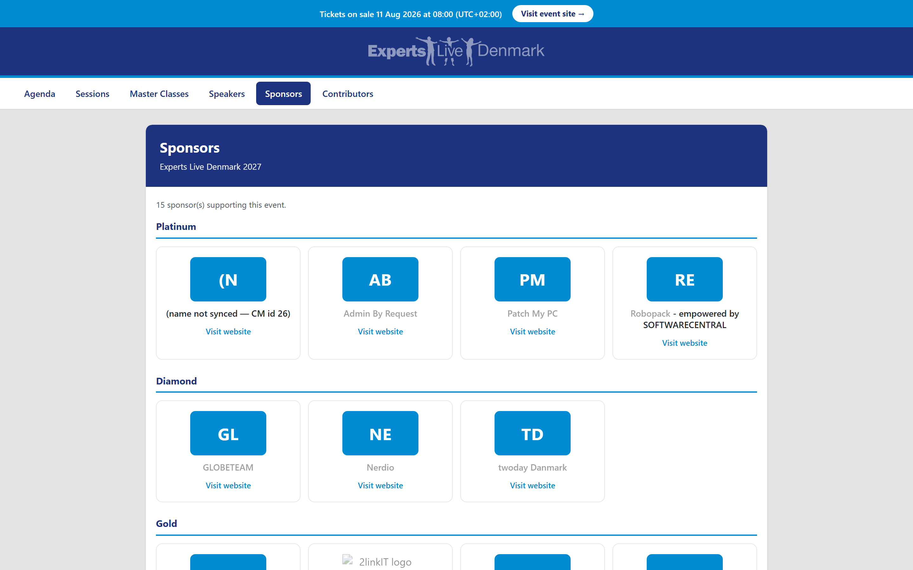](img/public-sponsors.png) | [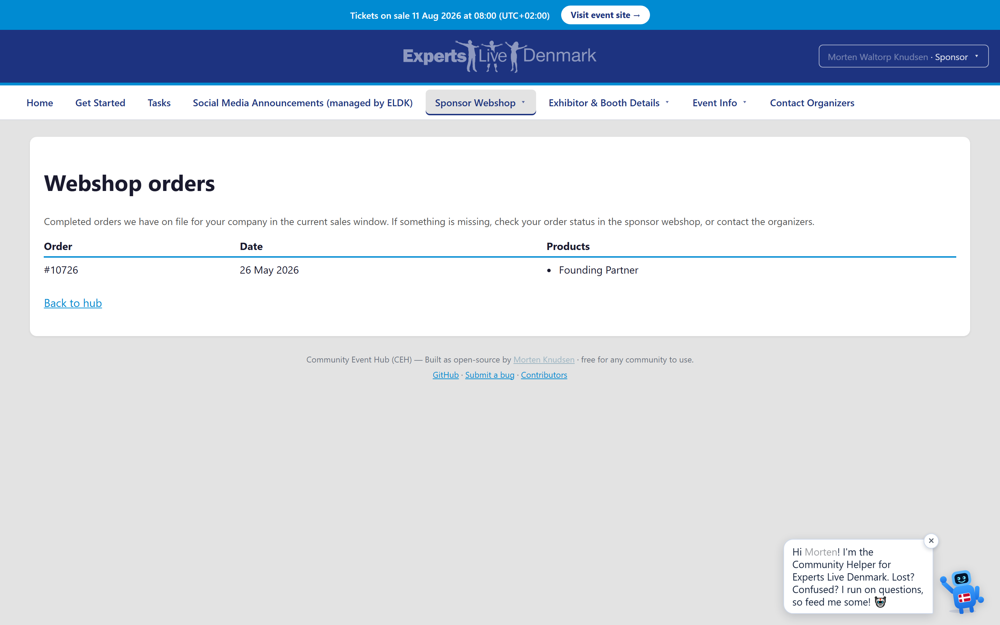](img/sponsor-portal.png) |

*Sponsors grouped by tier on the public page (with an initials badge when no logo is uploaded), and the signed-in sponsor portal: profile, booth, deliverables checklist, leads and order status — one company's view.*

- **A sponsor is a company, not a single contact.** Every contact at a sponsor
  company sees that company's shared tasks, so nothing depends on one person.
- **Sponsor packages — digital or booth, with clear roles per contact.** *(✅ 2026-06-22)*
  A sponsor company now carries its **package**: **Silver is digital** (no booth), while
  **Gold, Diamond and Platinum include a booth** (an exhibitor presence), so whether a
  sponsor exhibits follows straight from what they bought. Each contact at the company
  can be flagged independently as a **booth member**, a **signer** and an **event
  coordinator**, so the right person gets the right tasks and emails. The appreciation
  dinner is for the supported crew and speakers, so plain booth members aren't added to
  it by default — but a booth member who **also speaks** is included through the speaker
  side, so no one is missed.
- **Your company directory stays the source of truth.** Company and contact details,
  including who signs and who coordinates the event, come from your central company
  directory; the hub reads from it and never duplicates it.
- **Always the right public company name.** Sponsor-facing text shows the company's
  chosen public name, with a sensible fallback chain so a name always appears.
- **A public sponsors page that thanks your supporters.** A clean, no-login page at
  **`/Sponsors`** lists your sponsor companies **grouped by tier** (Platinum, Diamond,
  Gold, Feature, and other supporters), each with their **logo**, their **public
  company name**, and an optional **link to their website**. When a company hasn't
  uploaded a logo yet, a tidy initials badge stands in. Read-only and mobile-first,
  with a friendly empty state before sponsors are announced. *(✅ 2026-06-15)*
- **Sponsor tiers fill in automatically from their booth order.** ✅ 2026-06-18 — the
  public sponsors page groups companies by tier, and now a company lands in the right
  tier group on its own: when its booth order is processed, the hub reads the booth
  tier from the order and stamps it onto the company, so a sponsor appears under
  Platinum / Diamond / Gold / Feature without an organizer setting it by hand. A
  company that orders several booth products is filed under its **highest** tier. It is
  also safe to override: the automatic stamp only ever fills a blank tier or raises a
  lower one, so a tier you've deliberately bumped (for example, a comped upgrade) is
  never quietly downgraded on the next order sync.
- **A real "become a sponsor" call-to-action.** *(✅ 2026-06-17)* The public sponsors
  page now offers a prospective sponsor a clear way to reach out — a prominent
  **"Contact us about sponsoring"** button that opens either a pre-filled email (with
  the event name already in the subject) or your hosted sponsorship page/form,
  whichever you've set. It shows in **both** the "sponsors coming soon" state and the
  populated page, and if you haven't set a sponsorship contact it simply doesn't
  appear (no dead button). Mobile-first and available in English and Danish.
- **Clean up stale sponsor entries — safely.** Sometimes a booth order is processed
  under a wrong or later-changed company id, leaving an **orphaned company card**
  (logo, description, website, tier) on the public sponsors page even though no one
  from that company is in the edition any more. The sponsors admin now lists these
  **stale company facts** (only the rows whose company has **no active contact**) and
  lets an organizer delete them behind a confirmation dialog, so they stop showing
  publicly. It is safe by design: the facts of a **live** sponsor — one that still has
  an active contact — are protected and can't be deleted from here (handle the
  contacts first). *(✅ 2026-06-17)*
- **Booth tasks generated from what each sponsor bought.** Each booth product is
  recognized automatically and turned into the right set of tasks — shared booth
  basics plus the extras that come with each tier (Platinum / Diamond / Gold) — so
  new booth products need no setup.
- **A baseline checklist for every sponsor.** Logo upload, onboarding, company
  description, attendee-bag insert and shipment, and the app-game are set up for all
  sponsors.
- **Deadlines that make sense.** Most sponsor deadlines are anchored to the event
  date; logo and description deadlines are anchored to the first order — all
  configurable per edition.
- **No duplicate tasks, ever.** Tasks are de-duplicated across orders, so a company
  never sees the same item twice.
- **Clear, friendly task wording.** The sponsor task list is hand-curated for
  clarity, with narrative guidance rather than raw order data.
- **Automatic work stays invisible.** Things the platform handles behind the scenes
  (webshop-to-portal sync, ERP sync, currency checks, masterclass reconciliation)
  are never shown to sponsors as to-dos.
- **Reminders reach the right people.** Assigned tasks nudge the responsible contact
  with event coordinators copied; unassigned tasks go to the coordinators; signers
  are never bothered with task reminders.
- **Tidy buttons instead of long links.** Task instructions render link text as
  clean buttons, hiding long underlying URLs.
- **Per-task upload folders with change alerts.** Each task can have its own upload
  folder with a simple edit link, and the hub notices when files change — and now
  reliably sees every file in a folder, however many there are. *(✅ 2026-06-14)*
- **Sponsor details and sponsor tasks, side by side.** Sponsors get a details card
  (company info, linked contacts, who manages them) alongside their task list.
- **Full sponsor management for organizers.** Organizers can add, link or remove
  coordinators, set the default signer and coordinator, and create or edit tasks
  targeted at all exhibitors, all sponsors, or a specific tier.
- **Accounting that keeps itself in step.** *(🟡 2026-06-15)* New sponsors flow into
  your accounting system as customers, their contacts are created with the right
  roles (who signs, who coordinates), and webshop orders become accounting orders —
  all using the sponsor's chosen public company name. Each step is idempotent, so
  re-running never creates duplicates. *(Optional + off until your accounting/webshop
  credentials are configured; until then it shows exactly what it would do and never
  touches a live system.)*
- **Accounting → webshop contact reconcile, manual and on a timer.** *(✅ 2026-06-24)* The
  hub keeps your sponsor webshop in step with the accounting system: it **creates any
  missing webshop contact** from an accounting contact (respecting the one-user-per-company
  limit), **fills the default signer and event coordinator only when they're empty**, and
  **alerts the organizer** if a company is missing one of those roles. It runs both from a
  one-click **"Reconcile ERP → webshop"** organizer button **and automatically every 30
  minutes** so saves on either side don't drift. It is behind the `erp-webshop-reconcile`
  feature flag (off by default) and **skips a contact that already exists** rather than
  duplicating it.
- **Tax-ID checked before a sponsor is created.** *(🟡 2026-06-15)* A new sponsor's
  company tax-id is validated automatically, catching typos and invalid numbers up
  front rather than at invoicing time.
- **Right currency, right rate.** *(🟡 2026-06-15)* Orders in a foreign currency get
  a currency check at creation time, with today's exchange rate when a rate source is
  configured — so cross-currency orders are handled correctly instead of silently
  mis-booked.
- **A single sponsor portal — everything you owe and are owed, in one place.**
  *(✅ 2026-06-16)* Signed-in sponsors get a self-service home at **`/Sponsor`** that
  pulls together everything about their sponsorship: their **company profile and
  logo** (with the chosen public name, or a tidy initials badge when no logo is
  uploaded) and **booth tier**; **booth & logistics** quick-links (floor plan,
  exhibitor guide, full logistics); their **deliverables checklist** — the same
  pending/completed view used across the hub, so what's still needed and what's done
  look identical everywhere; a read view of their **leads** (recent + total, with
  links to capture and download); and **order & invoice status** drawn straight from
  the records the hub holds. Where invoicing isn't configured yet, the portal says so
  plainly and shows orders as *pending* rather than inventing an invoice. Each
  sponsor sees only their own company's data, mobile-first and in English or Danish.
- **A sponsor landing card and orientation guidance.** *(✅ 2026-06-21)* The sponsor
  portal now opens with a landing card showing the company's **logo, a short
  description and an overview** of their sponsorship, and the sponsor-tasks page carries
  short **orientation guidance** so a contact knows what's expected of them. **Key dates**
  have moved under **Event logistics**, keeping the home view focused.
- **A Sponsor Webshop fold-out.** *(✅ 2026-06-21)* Sponsors get a **webshop** fold-out
  to **buy extra services**, see their **orders**, and view the **linked contacts** for
  their company — all inside their own portal. Mobile-first, in English and Danish.
- **Exhibitor & Booth Details and Leads fold-outs.** *(✅ 2026-06-21)* Two further
  fold-outs round out the portal: **Exhibitor & Booth Details** surfaces the **Zoho
  dashboard** plus an **in-hub capture-lead failover** so booth staff can still log a lead
  if the Zoho path is unavailable, and a **Leads** fold-out gives a **leads export page**.
  Mobile-first, in English and Danish.
- **An "Our Booth" page with the booth number and the Expo map.** *(✅ 2026-06-27)* Exhibiting sponsors
  get an **"Our Booth"** page that shows **their booth number** (the company's `BoothLabel`) alongside
  the **Expo floor map**, so booth staff know exactly where they are. It sits inside the merged **Event
  logistics** fold-out and is **exhibitor-gated** — sponsors without a booth don't see it (§146). The
  venue images on it are the same **live SharePoint pictures** described in §15.
- **A cleaner sponsor menu.** *(✅ 2026-06-27)* The sponsor navigation is tidied to a **single "Event
  logistics" entry**, and the **deliverables %** has moved into the **Sponsor Tasks** page rather than
  standing as its own menu item, so the menu stays short and obvious (§145).

## 8. Sponsor leads — capture, screen and route booth leads

- **Capture leads at the booth, right in the hub.** *(✅ 2026-06-14)* Booth staff
  can type in the people they meet at their stand — name, email or phone,
  company, job title, and what they were interested in — straight from any phone,
  with no app install and no scanner setup. Each captured lead lands immediately
  in the company's leads pipeline and download feed, is screened for junk on the
  way in (the same 0–100 quality check as synced leads), and shows in a
  "recently captured at your booth" list so staff can see what they have logged.
  At least an email or a phone is required so every lead is followable-up, and an
  obviously invalid email is caught before saving. This works alongside the Zoho
  Backstage scanner — a booth can use either or both.
- **A leads API for sponsors.** Sponsors can pull their own leads as JSON or CSV via
  a simple, secured endpoint, with ready-made script samples and a browser-friendly
  "Your Leads API" page.
- **Secure, revocable access per sponsor.** Each sponsor gets its own access key and
  token; keys are shown once and stored only as a secure hash, and access can be
  revoked instantly.
- **A real lead pipeline.** Leads live in a proper pipeline with a live grid to
  Reply, mark Processed, set Interest, or flag Ignore/Junk — nothing is ever hard-
  deleted.
- **Timely notifications.** Sponsors can opt into a daily digest or near-real-time
  alerts of new leads, with junk skipped and recipients defaulting to all the
  company's contacts.
- **Smart junk screening.** Each lead gets a 0–100 quality score and label, and only
  unmistakable test entries are auto-flagged as junk — operators stay in control.
- **See *why* a lead scored the way it did.** *(✅ 2026-06-17)* The quality-score badge
  on the leads grid now expands to a plain-language "why this score?" breakdown — the
  starting baseline plus each factor that moved the number up or down (has a usable
  email, has a full name, company filled in, has a phone, unreachable, or looks like a
  test/junk entry) and the final total. The same logic that scores a lead produces the
  explanation, so the badge and the breakdown always agree. No more guessing why a lead
  was flagged. Available in English and Danish, phone-first.
- **Contact your leads with one tap — no API key needed.** *(✅ 2026-06-18)* Your "Your
  leads" page now lists every lead, inquiry and booth meeting captured for your company
  right in the hub, with a one-tap **Email** and **Call** button on each — opening your
  own mail or phone app with the person already addressed. You don't need to set up the
  download API or run a script to follow up; the API and CSV feed stay there for anyone
  who wants to automate. Junk and ignored leads are hidden, the newest are first, and a
  lead with no email or phone is clearly marked. Phone-first, English and Danish.

## 9. Attendees & masterclass reconciliation — one clear picture

> **Scope note (2026-06-26):** the Attendee **"My Event" dashboard** and **self check-in** are
> **out of scope** — **event check-in (and live headcounts) are owned by Zoho Backstage**, not the
> hub. The former `/Attendee/MyEvent` dashboard, its self check-in ("I'm here") and the retired
> `/Attendee/MyPlan` personal-plan page were not delivered as hub features, and their screenshots have
> been removed. What the hub owns for attendees is **reconciliation**, the in-hub **Master Class**
> chooser / waitlist, and the organizer **attendee browser** (below).

- **Tickets and masterclass seats reconciled automatically.** The hub compares
  two-day tickets against masterclass bookings and surfaces the mismatches — no
  booking, no ticket, or duplicate bookings — with branded chaser emails to sort
  them out.
- **Attendee status in the hub, bookings stay at the source.** Attendees are synced
  in for visibility, with deep links back to the booking system; the hub never tries
  to re-do seat reservations, capacity or waitlists.
- **People decide identity, not algorithms.** "Same person, two emails" cases are
  resolved by a human or by the attendee via a chaser — never auto-merged.
- **Reconciliation now follows the in-hub Master Class selection.** *(✅ 2026-06-24)* Now
  that attendees choose their Master Class inside the hub, reconciliation is sourced from the
  hub's own confirmed seats rather than the old external bookings. The only chaser is sent to
  a **2-day-ticket holder who hasn't picked a Master Class in the hub** — a new
  **"choose your Master Class"** email — and each attendee's status reflects their in-hub
  selection. The now-impossible cases (duplicate bookings, and missing-ticket chasing — the
  pull is already filtered to 2-day buyers) and their emails were **removed**, so no one gets
  an irrelevant nudge.
- **An attendee browser for organizers.** A clean, read-only view with tiles,
  search, filters and CSV export (correctly handling accented names). Corrections
  happen at the source system, keeping data trustworthy.
- **A focused attendee menu.** *(✅ 2026-06-21)* An attendee now sees a minimal,
  uncluttered menu built around just what they need — **Home, Master Class** and
  **Waitlist** — instead of a long mixed list, so the things an attendee actually
  uses are one tap away. Mobile-first, English and Danish.
- **Choose your Master Class right in the hub.** *(✅ 2026-06-21)* The external booking
  deep-link is replaced by an **in-hub Master Class chooser**: an attendee can **sign
  up** for a master class, **give up a seat** they no longer want, download the session
  **`.ics`**, and toggle a **reminder** — all without leaving the hub. The hub card and
  the waitlist also carry short **orientation guidance** so a first-timer knows what a
  Master Class is and how seats work. Phone-first, in English and Danish.
- **Master Class waitlist with auto-email on a seat opening.** *(✅ 2026-06-21)* When a
  master class is full, an attendee can join its **waitlist**; the moment a seat frees up
  (someone gives up their place), the next person on the list is **emailed automatically**
  so they can claim it. Mobile-first, in English and Danish.
- **A clearer Master Class Selection page.** *(✅ 2026-06-24)* The attendee Master Class
  Selection page is easier to read and act on: the "you're confirmed" line moved off the
  hard-to-read green style to a **high-contrast, neutral** banner, and **"Add to my
  calendar" now opens the calendar entry** (a prefilled Outlook/Google web-calendar event)
  instead of silently downloading a file — one tap on phone or desktop, with the `.ics` kept
  as a fallback. The separate "Master Class info & what to bring" prep content has been
  **consolidated onto the Master Class Q&A page**, so everything about a class lives in one
  place.
- **Master Class selection cards show seats, details and capacity.** *(✅ 2026-06-24)* Each
  master class card on the selection page now shows **"N of M seats available"** next to the
  title and availability traffic-light, and the **abstract and speaker(s)** sit in a
  collapsed "Session details" disclosure you expand to read — so the list stays scannable on
  a phone while the full detail is one tap away. Per-class **capacities** are organizer-set.
- **A rebuilt `/MyMasterClass` in three clear sections.** *(✅ 2026-06-27)* The attendee Master Class
  page is reorganized into **three sections**: **my current class**, **other classes** (each marked
  **Available** or **FULL**, with **"N of max seats left"** and the **waitlist count**), and the
  **policies**. Switching between classes is now an **atomic, race-safe SWITCH** with a **hard
  overbooking guard** — the move runs under a serializable transaction so you **never lose your current
  seat to a failed switch**, and if the target filled in the meantime it stops cleanly with **"Sorry —
  this could not be completed: the Master Class is now full."** rather than overbooking. Your
  **waitlist position** now shows both **in the page and in the email**, actions confirm with an
  **inline flash**, the **consent wording is cleaner**, and the old teaser block has been removed
  (§139/§140).

## 10. Email & notifications — on-brand, controllable, safe

- **Reliable, branded email delivery.** All mail is sent through a professional
  relay from your event sender address.
- **One branded template engine.** Every email uses a shared branded shell with
  per-type content and simple token substitution; templates are built to render
  correctly across email clients, including Outlook.
- **A library of ready templates.** Welcome notes, reminders, chasers, app-game and
  broadcast messages all come as branded templates.
- **Every email is on-brand — including invitations, task nudges and payout
  confirmations.** Sign-in invitations, manual task reminders and travel-reimbursement
  confirmations now use the same branded shell as the rest, so all mail looks
  consistent and adapts automatically to each community's branding. *(✅ 2026-06-14)*
- **A one-tap welcome email for every role.** *(✅ 2026-06-15)* Send everyone a warm,
  mobile-first welcome that introduces the Event Hub as the one place for their part
  in the event, with a single button — **"Open my Event Hub — signs you in
  automatically"** — that signs the person in and drops them straight into their own
  role hub, no password and no code to type. Each role (organizer, speaker, Master
  Class speaker, volunteer, sponsor, attendee, video and photography crew) gets its
  own line about what their hub is for, the email explains how the Hub sits alongside
  the public Zoho Backstage site (Backstage = the public site, schedule and tickets;
  the Hub = its behind-the-scenes self-service companion), and it sets the tone that
  the Hub is brand-new this year so a friendly "reply if anything breaks" invites
  feedback. It ships as both a designed HTML email and a plain-text version. The
  sign-in link is a genuine secure auto-login link (not just a pre-filled address),
  and the welcome is **available in the development environment only** while the Hub
  is being shaken out, with every test send safely redirected to the team's test
  inbox; it can be re-sent as often as needed and the team can see who has received
  it.
- **A welcome tailored to each role — page and email.** *(✅ 2026-06-22)* The first-login
  experience is now written for the role the person actually holds. A **speaker**,
  **volunteer**, **sponsor**, **media** or **event-partner** gets a first-login **welcome
  page** and a **welcome email** that talk about their part — the forms, tools and tasks
  that apply to them — instead of one generic message for everyone. **Organizers and
  attendees don't receive a generic welcome**: organizers already know the hub, and
  attendees are looked after by their Master Class confirmation, so no one gets a welcome
  that doesn't fit. Mobile-first, in English and Danish.
- **An Email Center for organizers.** Preview any template safely, send a one-click
  test to yourself, and watch a delivery pulse with a filterable history of what's
  been sent.
- **An in-portal email template editor.** *(✅ 2026-06-22)* Organizers can edit the
  wording of the hub's emails right in the back-office — adjust the subject and body of
  any template, **preview** it safely with sample values before saving, and **reset to
  default** at any time. Edits take effect immediately, with no redeploy, and stay scoped
  to your own edition.
- **Send a test copy to any address.** *(✅ 2026-06-17)* Beyond the "send to me" test, an
  organizer can type **any mailbox** — a colleague's, a role test account — and send the
  selected template there to confirm it really arrives. The hub is honest about the outcome
  before it tries: if the address isn't on the safety allowlist it tells you it would be
  **dropped** (so you're never left waiting for mail that will never come), and in the test
  environment it tells you when the copy is **redirected** to the shared test inbox. A typo or
  malformed address is caught up front. Mobile-first and bilingual (English / Dansk).
- **Broadcast to exactly the people you mean.** *(✅ 2026-06-15)* Send one personalized
  message individually (branded layout, personal "Hi {FirstName}") to a precisely chosen
  audience. **Filter the audience** by role group (speaker / sponsor / volunteer / organizer
  / attendee and the crew roles), by **status** (active only, inactive only, or both), and
  with a one-tick **"exclude test users"** safeguard (on by default) so a real broadcast
  never reaches the synthetic go-live test cast; attendees reconciled from Zoho can be
  included too. Before anything is sent you see the **recipient count and the actual filtered
  list** (email, first name, group) — what you preview is exactly what is sent. **Start from
  a reusable template** — *blank*, *generic announcement*, *friendly reminder*, or
  *welcome / introduction* — then edit it freely; simple **{FirstName} / {EventName} tokens**
  are filled in per recipient. An inline **"variables you can use" legend** spells out each token
  with a plain-language meaning and an example, and a tap drops the token straight into your subject
  or message — so you never have to remember the exact spelling *(✅ 2026-06-18)*. Sending stays
  resilient (a single bad address never stops the batch) and resume-safe (re-sending the same
  subject only reaches people who have not yet received it). Mobile-first and screen-reader friendly.
- **Per-persona onboarding emails that send themselves.** *(✅ 2026-06-15)* Each crew group
  (volunteer / speaker / media-team / sponsor / organizer) has its own short **set of getting-started
  emails**. The moment an organizer **activates** someone, that person automatically receives their
  group's onboarding emails — **no approval, no extra click**. It is safe to activate the same people
  twice: nobody is ever emailed the same onboarding message a second time.
- **Re-send any email to one person, on demand.** *(✅ 2026-06-15)* From the Email Center, pick a person
  and a template and send it again — useful when someone says "I never got it". You can set that person's
  **secondary email** at the same time so the copy lands where they want.
- **A complete email log.** *(✅ 2026-06-15)* Every email the hub sends — welcome, sign-in codes,
  reminders, broadcasts, onboarding and manual re-sends — is recorded. Organizers get a log view that
  shows **all** emails and **per person**, **filterable by name or email**, with the subject, category,
  the address it went to (and any CC), and whether it succeeded. Nothing is sent off the books.
- **The log now includes what the system sends to itself.** *(✅ 2026-08-04)* Alerts and notices the
  platform sends to a **mailbox** rather than to a person — job failures, hand-entry lists, invoice
  notices, integration refusals — are listed in the email log alongside participant mail, marked
  **ops** so the two can never be confused. They were always recorded; now they are visible.
- **Re-send a failed email straight from the log.** *(✅ 2026-06-18)* When a logged email
  shows **Failed**, organizers get a one-click **Re-send** button right on that row — it
  retries the exact same template to the exact same person, with their secondary-email CC
  and the safety allowlist applied just like the original. The retry is itself logged, so
  you can see whether the second attempt went through. Only failed emails that targeted a
  known person are re-sendable; a broadcast or a sign-in code (which has no template/person
  on record) shows no button and is honestly explained, never a fake success. English and
  Danish.
- **A secondary email per person (optional CC).** *(✅ 2026-06-15)* Anyone can add an **extra address**
  that gets **copied on every email** to them — a colleague's inbox, a shared team alias or a personal
  backup. It is purely additive: the main message still goes to the person's primary (or, for speakers,
  their preferred) address, with the secondary CC'd on top. Add it during onboarding (organizer) or later
  in your own hub profile; mobile-first and validated.
- **Scheduled task reminders, per group.** *(✅ 2026-06-15)* The daily deadline reminders now carry the
  person's group, so reminders to volunteers, speakers, media crew, sponsors and organizers are tracked
  per persona in the log. As before, reminders fire at 14 / 7 / 3 / 1 days before a deadline and are never
  sent twice. *(corrected 2026-07-07: the countdown was simplified — a task now gets a
  SINGLE reminder on its due day (still never twice); the §232 attendee sign-up nudges
  run on their own welcome-anchored biweekly cadence.)*
- **"Complete this step" emails when a step is re-opened.** *(✅ 2026-06-15)* When an organizer re-opens
  someone's onboarding step, the hub emails that person a friendly note pointing them straight at the
  wizard to finish it — automatically on the nightly run, or instantly via a **"send now"** button on the
  Action Queue. Each re-opened step is chased exactly once.
- **Names and titles can never break a branded email.** *(✅ 2026-06-18)* A person, company or task name
  that happens to contain characters with special meaning in web pages — an ampersand, an angle bracket or
  a quote (e.g. *"Tom & Jerry"*, *"R&D <invoice>"*) — is now always rendered as plain readable text inside
  every branded email, never as broken or unsafe markup. Previously some emails handled this and others did
  not, so the same name could look fine in one mail and garbled in another. There is now **one consistent
  rule applied in a single place**, so every current and future email is safe by default. The email's
  subject line still reads exactly as typed. This is a behind-the-scenes correctness and safety fix; nothing
  changes in how organizers compose or send mail.
- **Polished, dependable emails.** *(✅ 2026-06-22)* A round of finishing touches makes
  every email look right and work right wherever it lands: a **white-banner logo** that
  reads cleanly on any background instead of vanishing on a dark theme, a **slim, tidy
  footer**, **call-to-action buttons that actually work** (including a one-tap "open my
  Event Hub" button on the welcomes and a "manage my seat & waitlist" button on the
  Master Class confirmation) and **clickable, plain-language links** in place of long raw
  web addresses. Delivery is steadier too: a transient hiccup at the mail relay is
  **retried automatically** rather than dropped, so messages get through.
- **A tidier Master Class cancellation email.** *(✅ 2026-06-24)* The "your place was
  cancelled" email reads more cleanly: the redundant "Questions? Email…" and sign-off lines
  are gone, the class is referred to by its own title (which already says "Master Class"),
  and the event name is bolded — so the message is short and clear.
- **Readable hint text everywhere — no more green.** *(✅ 2026-06-24)* The light info/hint
  text used across the hub (waitlist notes, the Master Class selection confirmation, and the
  like) was a hard-to-read green; it is now a **neutral dark slate** applied in one place, so
  every hint line reads cleanly on any screen.
- **Send a template test to any address — from the editor.** *(✅ 2026-06-24)* The email
  template back-office gained a **"Send test to address"** action: an organizer types any
  mailbox and sends the selected template there as a **real** send (deliberately exempt from
  the rollout-ring gate) to check its content end to end before it goes to real recipients.
- **Emails name the event clearly, and explain the sign-in button.** *(✅ 2026-06-24)* The
  event name now reads in **bold** (with its short code) wherever an email mentions it, and a
  short **hint sits just below the sign-in button** explaining that it signs the person in —
  so a recipient knows what the button does before they tap it.

## 11. Organizer hub — run the whole event from one place

| Command center | Live dashboard |
|---|---|
| [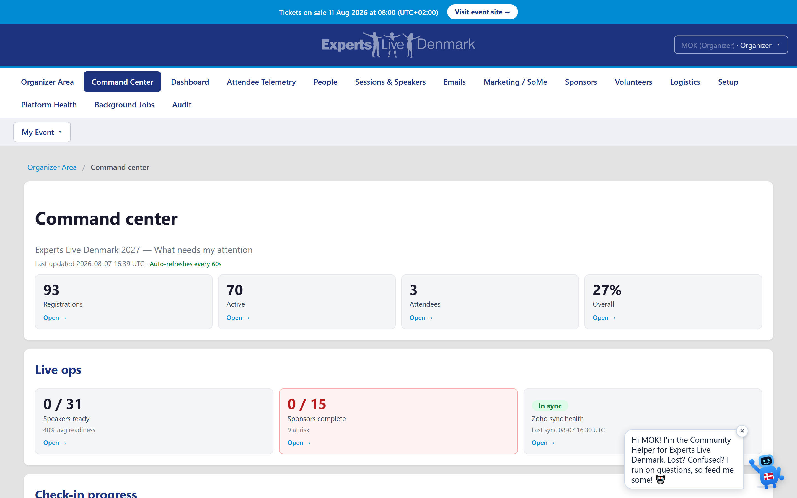](img/organizer-command-center.png) | [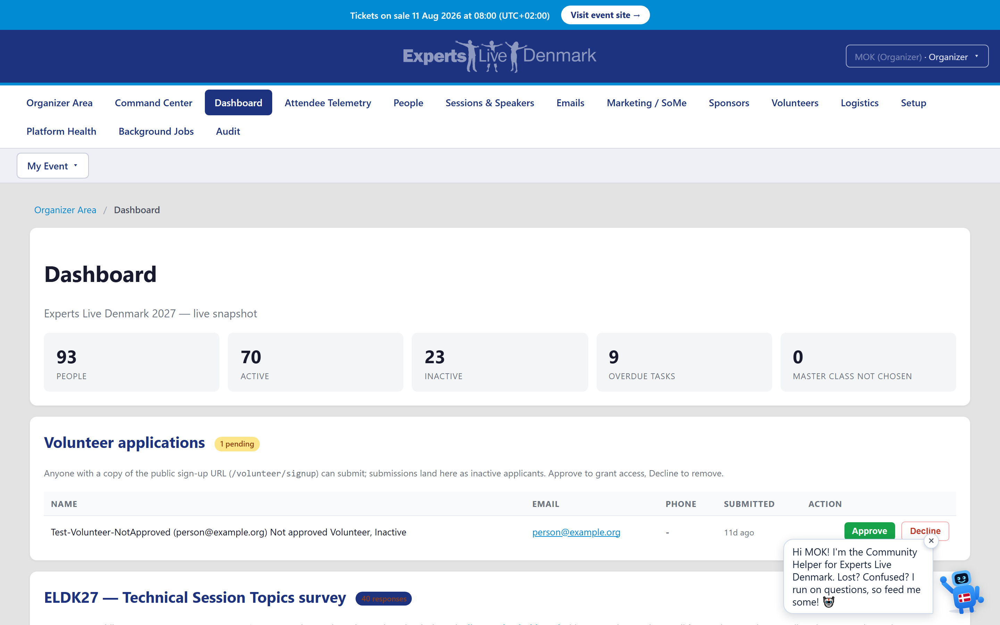](img/organizer-dashboard.png) |

*"Is the event on track, what do I do next?" — the command center triages the whole event with every number a link into the matching list; the live dashboard shows form completion, participants by role, tasks, sponsor and volunteer coverage at a glance.*

- **A clearer menu that fits your role.** *(✅ 2026-06-15)* The top menu is now two
  clearly separated groups instead of one long mixed list. Everyone sees a tidy
  **"My event"** bar — Home, My profile, My tasks, Resources, and just the forms that
  apply to them (hotel, dinner, lunch, swag, travel, volunteer shifts, the speaker
  area). Organizers additionally get a single **"Organizer area"** dropdown that
  gathers every management tool in one place — dashboards, participants, the
  pre-selection queue, onboarding, the action queue, email/broadcast, speakers and
  sessions, Sessionize, sponsors, social graphics, volunteer structure and the
  acting-as log. A regular attendee, speaker, volunteer or sponsor never sees the
  management tools at all. The dropdown collapses to one tap on a phone and is fully
  keyboard- and screen-reader-friendly.
- **The organizer menu is grouped, not a flat wall of links.** *(✅ 2026-06-16)*
  Inside the "Organizer area" dropdown the management tools are now arranged into a
  few clearly-labelled, collapsible sections so you can scan straight to what you
  need: the three things you reach for most — **Organizer home, Command center and
  Dashboard** — sit at the top, and everything else is folded under **People**,
  **Sessions**, **Comms**, **Sponsors**, **Volunteers** and **Logistics**. Open a
  section to reveal its tools; the section that contains the page you're on opens
  automatically. Nothing was moved out of reach — every tool that was in the menu is
  still there, just sorted into its group. Works the same on a phone, in English and
  Danish, with full keyboard and screen-reader support and the current page clearly
  marked.
- **A lean hub-level menu with button-grid hub pages.** *(✅ 2026-06-21)* The top menu
  is now leaner, pointing at a small set of **hubs**; each hub page lays its tools out
  as a **button grid**, so **every admin page is reachable as a tile** on its hub
  rather than buried in a long dropdown. Mobile-first, in English and Danish.
- **Retired the dead Sponsor Portal page.** *(✅ 2026-06-21)* The unused organizer
  Sponsor Portal page was removed, so the back-office no longer carries a dead link.
- **A cross-role event overview.** One read-only page that answers "where does
  the whole event stand?" in a glance: participation counts by role
  (organizer / speaker / sponsor / volunteer / attendee), task completion split
  per role and per category, speaker milestone-deadline progress (how many
  speakers cleared each deadline), volunteer coverage (assigned vs. still-open
  tasks across the volunteer work tree), sponsor task and lead totals, and
  attendee check-in numbers — topped by "needs attention" tiles for overdue
  tasks, unassigned volunteer tasks, open help requests and pending volunteer
  applications. Pure aggregation over existing data: it changes nothing.
  Mobile-first and screen-reader friendly. *(✅ 2026-06-15)* The "needs attention"
  tiles are now **clickable** — each opens the matching list already filtered to
  exactly the rows it counts (e.g. the overdue-tasks tile lands on the open tasks
  sorted by due date, pending volunteers on the inactive volunteers), so a number
  that needs action is one tap from the work. *(✅ 2026-06-18)*
- **Download "who hasn't onboarded yet" as a chase-list.** *(✅ 2026-06-17)* The
  onboarding dashboard now has a one-click **CSV export** of everyone still working
  through onboarding — anyone who hasn't finished every step their role needs. Each
  row carries the person's name and email, where they are (pre-selected / invited /
  in-progress), how far along they are, and — most usefully — **exactly which steps
  they're still missing** (bio, photo, hotel, appreciation, swag), so you can follow
  up with the right ask. The export honours the dashboard's **persona filter** (export
  just the speakers, just the volunteers, …) and opens cleanly in Excel, with Danish
  names intact. Read-only — it never changes anyone's data. Mobile-first, in English
  and Danish.
- **Re-open one onboarding step for a whole group at once.** *(✅ 2026-06-17)* When
  something changes for everyone — a hotel-booking deadline moves, the swag order
  re-opens — you no longer have to re-open that step person by person. Filter the
  onboarding dashboard to a group (speakers, volunteers, …), pick the step, and
  **re-open it for everyone in that group who had already completed it** in a single
  action. Each affected person is automatically queued a reminder to do that step
  again, exactly like the per-person re-open. The action only touches people who
  actually finished the step and whose role needs it (nobody else is disturbed), it
  tells you honestly how many were re-opened (or that nobody had it done), and you
  confirm before it runs. Mobile-first, in English and Danish.
- **A command-center landing — "is the event on track, what do I do next?"**
  The prominent **Command center** in your menu opens one screen that triages the
  whole event for you: how many people registered (and how many are active),
  attendee numbers, **onboarding completion %** overall and per group (speakers,
  volunteers, sponsors, organizers — most-behind first), **hotel / swag / lunch /
  dinner headcounts**, how many **sessions** are scheduled vs. still need a slot,
  and **sponsor** status. At the top sits a prioritized **"what needs my
  attention"** call-out — overdue tasks, things due today, unassigned volunteer
  shifts, open help requests, people still waiting to be approved, attendee
  reconciliation mismatches, open action items and unscheduled sessions. Every
  number is a button that drops you straight into the matching list already
  filtered, so nothing is a dead end; when there is genuinely nothing to act on it
  says so ("all clear") instead of inventing a red badge. It also shows a literal
  **today's / overdue tasks** list. Read-only — it changes nothing — mobile-first,
  bilingual (English / Danish) and screen-reader friendly. *(✅ 2026-06-16)*
- **A comms cockpit — schedule, send and track all outreach in one place.**
  *(✅ 2026-06-16)* The **Comms** page is now a single cockpit for everything you
  send. One **timeline** brings together your email and your scheduled social posts
  — what already went out and what is going out next, newest first with the upcoming
  posts floated to the top. A **"who got what"** table shows, per person, the *real*
  outcome from the actual send log — **delivered**, **dropped** (held back by the
  safety allowlist) or **failed** — never an optimistic "we tried" tally; a
  matching **by-campaign** view rolls the same honest outcome up per kind of message
  (welcome, onboarding, reminders, broadcast…). When a message didn't reach
  someone, the **resend** panel lists exactly those people and lets you send it
  again in one click (using the same trustworthy per-person send the Email Center
  uses — and the resend then shows up on the very same cockpit). It also surfaces
  the **next things going out**. All of it is a read-only view over data you already
  have; the cockpit still links out to the full Email Center, Email Log, Broadcast,
  invitations, welcome, reminders and the social-post queue — it brings them
  together rather than replacing them. Mobile-first, English / Danish, screen-reader
  friendly (live status regions, captioned tables).
- **See the mail the machine sends — "Engine & ops mail".** *(✅ 2026-08-04)* The cockpit now has
  its own section for everything the platform sent to a **mailbox** instead of to a person: job
  failures, hand-entry lists, invoice notices and integration refusals, with when it went, what it
  said and whether it arrived. It is deliberately kept **apart** from the participant tables — a
  welcome mail and a job-failure alert answer different questions, and hundreds of alerts mixed into
  one list would bury the mail the page exists to track. The participant counters at the top say how
  much ops mail there is and how much of it did not arrive, and link straight down to it.
- **Exports & printable run-sheets — on-site operations on paper.** *(✅ 2026-06-16)*
  The day of the event still runs on offline artifacts, so an **"Exports & run-sheets"**
  page (under Logistics) gives you both **downloadable CSV files** and **print-friendly
  run-sheets** for the five lists you carry to the floor: the **attendee list**, the
  **lunch headcount** (per pre-conference day, plus who eats which day), **room &
  session sheets** (the running order per room, with each session's room-QR link and
  speakers), the **volunteer rota** (who works which task, where and when, from the
  volunteer plan), and **badge data** (each active person's name, role and company —
  the fields a badge printer or mail-merge needs). Hit **Download CSV** on any list, or
  use your browser's **Print** to save a tidy PDF — the page switches to a clean,
  ink-friendly layout (buttons and menus hidden) when printed. Everything is a
  read-only view of data you already have inside your own edition; it never changes
  anything and is **not** an event check-in tool (that lives in your ticketing system).
  Mobile-first, English / Danish, and screen-reader friendly (captioned tables,
  labelled download buttons).
- **Dinner run-sheet & the catering dietary roll-up — what the kitchen actually needs.**
  *(✅ 2026-07-25)*
  Two more lists on the same **Exports & run-sheets** page, both as CSV and Excel. The
  **Appreciation Dinner run-sheet** turns the dinner into a real order: the seat total
  (confirmed people **plus their guests**), then a row per confirmed guest with their
  role, how many they bring, their diet and their allergens. The **catering dietary
  roll-up** is the sheet you hand the kitchen — how many people need each diet and each
  allergen avoided, per occasion, plus how many free-text notes a human still has to
  read. Allergy information your guests give you now reaches the people cooking, instead
  of only sitting in the form they filled in.
  Both count **active people who actually said yes** — someone who withdrew, or who
  declined the dinner, never inflates a food order — and the roll-up always reconciles
  with the run-sheet, so the numbers you order against and the names you seat can never
  disagree.
- **A live dashboard.** See form completion, participants by role, tasks and
  overdues, sponsor completion, attendee mismatches and volunteer coverage at a
  glance, with live pipeline cards for leads and event prep.
- **Practical data grids.** Work through participants and hotel bookings (with inline
  active and check-in/out toggles and filters) and tasks (inline edit), each with
  CSV export.
- **Find a person fast — search, filter and sort everyone.** *(✅ 2026-06-16)* The
  most frequent organizer action made instant. A dedicated **"Find a person"** box
  (prominent in your menu) searches every participant in the edition by **name or
  email** and lists the matches with a one-tap link straight to that person — handy
  when someone walks up at the desk and you just need to pull them up. The full
  **Participants** grid carries the same power for working through a list: free-text
  search on name + email, filter by **status** (active / inactive / everyone — where
  "active" means exactly who can sign in), by **persona/role** and by **sponsor
  company**, and **sort** by name, email, persona or status (click a column to
  reverse). Everything runs on the server inside your own event, so a long
  participant list stays fast and the results always match who can actually log in.
  Mobile-first, English / Danish, and screen-reader friendly (labelled controls, a
  live result count, and a captioned results table).
- **Bulk participant operations.** Tick several people on the Participants grid and
  deactivate, reactivate, or change their role in one action instead of one row at a
  time. Every bulk action stays inside your own event, is safe to re-run (already-in-state
  rows are skipped, not double-applied), and reports exactly how many actually changed.
- **Bulk session clean-up.** *(✅ 2026-06-16)* Tick several sessions on the Sessions
  grid and **delete them in one action** instead of one row at a time — ideal for
  clearing duplicates after an import. The same safety as the single-row delete applies
  to every row: a session that has **attendee data** (questions, evaluations or
  master-class bookings) is **protected** — it can't even be ticked, and the result
  banner tells you how many were kept. Clean sessions are removed together with their
  speaker links; if any deleted session came from Sessionize you're reminded a
  re-import will bring it back. A confirm dialog shows the live count before anything
  is deleted, and the whole batch commits together. Mobile-first, English / Danish,
  screen-reader friendly.
- **Bulk volunteer-task actions.** *(✅ 2026-06-16)* When building the volunteer work
  structure (Category → Subcategory → Task), tick **any tasks across the whole tree**
  and either **set their status** (Open / In progress / Done / Cancelled) or **delete**
  them in one action — so an organizer planning a rota of dozens of tasks doesn't edit
  one row at a time. Status changes are safe to re-run (a task already in that status is
  skipped) and report exactly how many changed; a bulk delete removes the clean tasks
  with their volunteer assignments, while any task that already has **help-request
  history** is **kept** (so coordination history is never lost) and counted in the
  result. A confirm dialog shows the live count, and the batch commits together.
  Mobile-first, English / Danish, accessible.
- **Act as a participant — see and do their part.** *(✅ 2026-06-15)* From the
  Participants grid an organizer can **"Switch to user"** to **switch INTO** that
  person — they land on the user's **own hub home** and navigate the **whole app**
  exactly as that user sees it (their tasks, forms and every page), and act on their
  behalf (complete a task, submit a form). It is full impersonation, not a limited
  form: the switch lands on the user's My-Event view, **never** the small
  "Modify on behalf" quick-edit page. It is unmistakably an organizer-acting-as
  session: a banner across the top names who is being helped, and **"Return to
  organizer"** drops the organizer straight back to their own session. Only real
  organizers can start it, an acting-as session can never start another one, and
  every switch, return and on-behalf change is written to an **acting-as audit log**
  the team can review.
- **Filter the grid by persona and sponsor company.** *(✅ 2026-06-15)* Alongside the
  active/inactive filter, narrow the grid by **persona** (organizer, speaker, sponsor,
  volunteer, attendee, crew) and, for sponsors, by **sponsor company** (shown with the
  company's public name), so finding the right group in a large cast is quick.
- **Active by default, with a show-inactive toggle.** *(✅ 2026-06-15)* The grid shows
  **active** participants by default — meaning people who can actually sign in (activated
  and not withdrawn) — with a toggle to show inactive or everyone. The status badge
  reflects that same combined rule, so "Active" on the grid always means "can sign in".
- **Modify a person's logistics on their behalf.** *(✅ 2026-06-15)* A lighter,
  explicit alternative to switching into the user: from the grid the **"Modify on
  behalf"** quick-edit lets an organizer change a couple of practical things **for**
  someone — whether they need a hotel room, their polo size — **without** leaving the
  organizer seat. The change is written to the very same record the person sees, so it
  **shows up on their own view** immediately, and a late change still raises the usual
  action-queue item so nothing slips past the team. (For anything beyond these fields,
  use **Switch to user** to act as them across the whole app.)
- **Cancel a participant.** *(✅ 2026-06-15)* Remove someone from the event like a
  cancellation: they become inactive, drop out of the active views, and can no longer
  sign in — reversible at any time.
- **Secure links — let an assistant fill things in.** *(✅ 2026-06-15)* For a VP or
  speaker who has someone handle their admin, an organizer can issue a **secure
  link**. The link signs the assistant in **scoped to just that one person**,
  to fill in their onboarding and tasks on their behalf — nothing else. Each link is
  **time-bound** (you choose how many days), **revocable** in one click, and limited to
  the single participant it was issued for; the link holder can never reach organizer areas
  or act as anyone else. Every use is recorded in the acting-as audit log.
- **Hotel management.** Export the rooming list, import confirmation IDs, send
  updated calendar invites, and track it all on a dashboard.
- **Group photos.** Register a company and contact, schedule a slot, and send
  calendar invites that update cleanly rather than duplicating.
- **App game.** Register a sponsor's gift and send the gift reminder.
- **Travel reimbursements.** See all claims, register payouts, and send confirmation
  emails.
- **Swag ordering.** Produce a multi-sheet vendor spreadsheet for polo, award and
  jacket orders.
- **Lunch and dinner overviews.** See pre- and main-day lunch numbers and the
  appreciation-dinner list with allergies.
- **A sponsor admin area.** Manage the sponsor task catalog, run the leads pipeline
  (issue, rotate or revoke keys, set notification preferences, action leads), and
  watch a sponsor status dashboard sorted overdue-first.
- **An action queue for late changes.** When a participant edits an
  already-submitted hotel booking or dinner RSVP close to the lock date — exactly
  the changes that may contradict what was already sent to the hotel or caterer —
  the hub surfaces it as an action item for organizers. The queue groups items by
  type with live open counts, lets you mark each resolved with a note (or re-open
  it), and exports the open list to CSV. Early edits stay quiet, so the queue
  shows only what genuinely needs a human to re-confirm. The organizer dashboard
  card carries the open-item badge. *(✅ 2026-06-14)*
- **Built-in safety on file handling.** Organizer tools that read files are guarded
  against path-traversal.
- **Find anyone fast on the big grids — search, sort, pages and safe bulk.** *(✅ 2026-06-15)*
  The high-traffic organizer grids — **Participants, Speakers and Attendees** — now carry
  free-text **search** (by name / email), clickable **column sorting** (with a clear ▲/▼
  direction and screen-reader `aria-sort`), and **pagination** so a long list (Attendees can
  run to many pages) loads one page at a time instead of everything at once. All of it runs
  **server-side** — the database does the filtering, ordering and paging, so the page stays
  fast no matter how many people are registered. Where a grid already supports bulk actions
  (deactivate / reactivate / change persona on Participants; set pre-day / main-day on
  Speakers) those now go through a **confirmation dialog that states how many rows you
  selected** before anything is applied — no accidental mass change on a stray click. Mobile-first,
  keyboard-accessible, and fully English / Danish. Attendees stays read-only by design (it is
  reconciled from the source systems), so it gets search/sort/paging but no bulk writes.
- **Same fast search, sort and pages on the Sponsors, Leads and Sessions grids — plus a one-click
  sponsor drill-down.** *(✅ 2026-06-16)*
  The remaining back-office grids now match the rest: **Sessions** (search by title, room or
  speaker; sort by title / type / length / room), **Sponsor leads** (search by name, email or
  sponsor; sort by captured date, sponsor, name or status; defaults to newest first; the
  show-ignored/junk toggle is preserved across every action), and the **Sponsors** company roster
  (search by company or contact; sort by company, contacts, open / done / overdue / total tasks or
  next due) — all filtered, ordered and paged **server-side** so they stay fast as the event grows,
  with a clear "showing X–Y of Z" count and ▲/▼ + `aria-sort` headers. Each Sponsors company row is
  now a **link straight to that company's people** on the Participants grid (its sponsor contacts,
  pre-filtered), so you can jump from "who is this sponsor" to "show me their contacts" in one click.
  Mobile-first, keyboard-accessible, English / Danish.
- **A data-freshness panel — see at a glance whether every sync is still running.** *(✅ 2026-06-17)*
  A new **Data freshness** page (under the Logistics tools) answers a question that is otherwise easy
  to miss until it bites: *is each data source still being fed, or has a sync quietly stopped?* It
  lists each major source — outbound email, attendee sync, master-class bookings, sponsor leads,
  speaker and session imports, attendee questions, session ratings and social-media posts — and for
  each shows **when it last produced data**, **how long ago that was**, and a clear state: **up to
  date**, **looks stale** (it has gone quieter than expected for that source, so it is worth a check),
  or **no data yet** (a brand-new edition does not light up red). A summary banner at the top tells you
  in one line whether everything is current or how many sources look stale. It is read-only — it
  reports what already happened and never sends or changes anything. Mobile-first, keyboard-accessible,
  English / Danish.
- **Breadcrumbs — always know where you are in the back-office.** *(✅ 2026-06-18)* The organizer area
  is a deep set of hubs and feature pages reached through one compact menu, which made it easy to lose
  your bearings on a deep page. Every back-office page now shows a small **breadcrumb trail** at the top
  — for example **Organizer area / People / Participants** — where each step before the current page is
  a one-click link back to its hub and to the organizer home. It appears automatically on every
  organizer page (and stays out of the way everywhere else), reads correctly to screen readers (a
  navigation landmark with the current page marked as such), wraps cleanly on a phone, and is shown in
  English and Danish.
- **Unsaved-changes guard on the participant editor.** *(✅ 2026-06-18)* If you start editing a
  participant and then try to leave the page without saving, the browser now asks you to confirm — so a
  stray click or back-button never silently loses your edits. Saving (or pressing Cancel) leaves
  normally with no prompt, and the **Save** button shows a busy state and locks while the save is in
  flight so a double-click can't post twice.
- **Loading skeletons on the big grids — the portal never looks frozen.** *(✅ 2026-06-18)* The
  high-volume organizer grids (**Participants, Speakers, Attendees, Sessions, Sponsors**) re-load the
  whole page when you search, change a filter, sort a column or page through results, which left a brief
  moment where nothing seemed to happen. Now, the instant you trigger one of those, the grid dims its
  current rows and shows an animated **loading skeleton** over them while the next page comes back, and
  screen-reader users hear a polite "Loading…" announcement. It clears by itself when the new page
  arrives (and when you press the browser Back button). It honours the "reduce motion" accessibility
  setting (you still get the dimmed "busy" look, just without the animation), works down to a narrow
  phone screen, and is shown in English and Danish. A CSV download link is deliberately excluded so a
  file download doesn't flash the skeleton.

## 12. Hosting & reliability — production-grade by design

- **Defined entirely as code.** The full environment (database, web app, scheduled
  jobs, storage, secret vault, logging and monitoring) is described as code for
  consistent, repeatable deployments.
- **Scheduled jobs that just work.** Background jobs handle reminders, order pulls,
  attendee reconciliation, portal sync, sponsor-lead delivery and upload-change
  watching on their own schedules, each individually switchable.
- **Set how often a job runs — yourself, with no release.** *(2026-07-28)* The jobs page has a
  **Runs every** box: type a number of minutes, press Set, and the new frequency applies from the
  next check. Jobs tied to a **time of day** ("every morning at 07:20") instead read *fixed time*,
  with no box — an input that cannot work is worse than none. The Schedule column states each job's
  real cadence, so what you read and what you set are always the same number.
- **The settings page tells you when a release will not take effect.** *(2026-07-28)* Email
  audience is always the **narrower** of a feature's own release ring and the outbound-email master
  switch. Release a feature more broadly than the master and the page now says so, naming the ring
  that actually applies — instead of displaying an audience that would never receive anything.
- **Welcome emails have their own safety ceiling.** *(2026-07-28)* Every welcome — speaker, sponsor,
  volunteer, media, event partner — is held to a dedicated release cap that starts at the internal
  test audience and is raised deliberately, in phases. It sits *underneath* the on-screen switch, so
  widening a setting by mistake cannot release a welcome to everyone. Re-sending a welcome by hand
  obeys exactly the same limits as the automatic send.
- **Scripted, safe deploys with rollback.** Releases build a versioned artifact,
  deploy, and health-check; a one-command rollback is always available.
- **Zero-downtime production releases.** Production deploys go to a staging slot,
  warm up, then swap in — so visitors never see downtime.
- **Separate environments, shared upstreams.** Development and production are fully
  separated, while shared upstream services are reused across both.
- **Resilient on a budget.** The platform absorbs database cold-starts gracefully
  and runs happily on cost-efficient, auto-pausing infrastructure.
- **Schema managed as code, kept in sync.** Database structure is versioned and
  applied in a controlled way, and every release keeps the development and production
  schemas in step (the same versioned changes apply to both, with a per-release note).
- **Dev mirrors prod.** Development holds the same data as production so it is a true
  rehearsal — the one deliberate difference is that all email in development is safely
  redirected to a single test address.
- **Test users stay separate from real ones.** Synthetic test accounts are tagged so
  they can live alongside real participants without ever skewing real counts, exports
  or dashboards.
- **A safe public-mirror workflow.** Publishing to the public template runs through a
  controlled, allow-listed process with a dry-run pre-flight, so only intended
  content is ever made public. *(corrected 2026-07-07: the mirror filter is
  DENYLIST-based — everything is published EXCEPT the excluded paths (internal docs,
  per-edition config, secrets patterns) — not an allowlist; the dry-run pre-flight
  stands.)*
- **Strong delivery governance.** Protected branches, required reviews, automated
  checks that scan for secrets, and a consistent commit convention keep the codebase
  clean and safe.
- **Custom domains per environment.** Each environment binds its own verified custom
  domain with a managed certificate.
- **Reconcile jobs ride out a flaky upstream.** *(✅ 2026-06-27)* The ERP→webshop reconcile job is
  hardened against a temporarily unavailable webshop (HTTP 503): it **retries transient faults**,
  **continues gracefully company-by-company** so one bad company never sinks the whole run, and only
  **alerts an organizer after two consecutive failed runs** — tracked through a persisted job-health
  marker — so a single blip never raises a false alarm (§138).

## 13. Accessibility — usable by keyboard and screen reader *(✅ 2026-06-15)*

The participant-facing pages had their first accessibility pass, targeting **WCAG 2.1
AA**. Nothing about the look changed for mouse users; the work is markup, ARIA and CSS
only (no database or data-model change).

- **Correct page language.** The page now declares its real language (English) so a
  screen reader pronounces the copy correctly. The Danish-formatted date picker
  (dd/mm/yyyy, Monday-first) is unchanged.
- **Skip to main content.** A keyboard user can jump straight past the header and
  navigation to the page body with the first Tab, instead of tabbing through every
  menu item on every page.
- **Visible keyboard focus everywhere.** Every link, button and field shows a clear
  focus ring when reached by keyboard, so it is always obvious where you are — without
  drawing a ring on ordinary mouse clicks.
- **A real navigation landmark with "you are here".** The primary menu is announced as
  navigation, and the current page is marked so assistive tech (and sighted users) can
  tell which section they are in.
- **Forms that announce themselves properly.** Grouped choices (RSVP, speaking days,
  lunch days, swag extras, shifts, "do you need a hotel/travel") are now proper
  fieldsets with a group label; every read-only field has an associated label; and
  success / error messages are announced the moment they appear.
- **An accessible survey wizard.** The public 3-step topic survey announces its current
  step, its "pick one/two/three more" counter updates live, and the rank (1st / 2nd /
  3rd) buttons report their pressed state — all keyboard operable.
- **Links that open elsewhere say so.** Links that open a new tab (event site, GitHub,
  template downloads) now tell screen-reader users they will leave the page.
- **Checked by automated tooling.** A new axe-core accessibility test suite scans the
  login, survey and per-role hub pages for WCAG A/AA violations (see TESTS.md), so
  regressions are caught.
- **Consistent, accessible feedback after every action.** A shared set of UX building
  blocks now gives the whole hub the same dependable behaviour:
  - **Clear "saved" / error messages.** After you submit a form, a tidy banner confirms
    the result ("✓ Saved") or explains an error. Success banners fade away on their own;
    errors stay until you have dealt with them, and both are announced to screen readers
    the moment they appear. There is always a Dismiss button.
  - **Helpful, to-the-point form errors.** When something is missing or wrong, the message
    appears **right next to the field** that needs fixing, plus a short summary at the top of
    the form — so you are never left guessing. As a first beneficiary, the **travel
    reimbursement** form now catches the case where you pick "Other" but forget to enter the
    amount (it used to save a blank claim silently); it now asks you to fill it in.
  - **A clear "are you sure?" step before big or irreversible actions.** Before something
    like sending a broadcast email, a confirmation dialog shows exactly **how many people**
    will be affected and what will happen, and is fully keyboard- and screen-reader-friendly
    (close with Esc, the backdrop, or Cancel). Sending a broadcast now shows the recipient
    count up front.
  - **An honest "did it actually work?" confirmation after every send and QR provisioning**
    *(✅ 2026-06-16)*. After an organizer sends a broadcast, emails session-evaluation results
    to speakers, or provisions a room QR code, the hub now tells them **truthfully** what
    happened — never an optimistic "done" when it wasn't. A real send confirms **"sent at
    &lt;time&gt; — N recipient(s)"**; a successful QR provisioning confirms **"done at
    &lt;time&gt;" plus the stored link**. If a send reached **nobody** (for example everyone was
    filtered out by the recipient-safety allowlist, or had already received it) or a QR couldn't
    be stored, that is shown as a distinct, clearly-not-a-success notice **explaining why** — and
    a real failure shows the reason. The confirmation is colour- and icon-coded (green success,
    blue "nothing happened", red error), announced to screen readers, and available in English
    and Danish.
  - **Small interaction cues that prevent confusion and accidental double-submits** *(✅ 2026-06-18)*.
    Four lightweight, accessible touches now work the same everywhere, with no setup:
    - **"Copied!" feedback.** The *Copy link* button on the subscribable-calendar cards (the hub
      home, the Speaker hub and the Volunteer schedule) now copies the link and briefly confirms
      **"Copied!"** on the button — announced to screen readers — instead of silently doing nothing.
      (This unifies three slightly different copy buttons onto one shared behaviour.)
      *(retired 2026-07-07: those subscribable-calendar cards were removed with the
      personal feed (§201); the shared "Copied!" behaviour lives on in the remaining
      copy buttons, e.g. the survey and leads links.)*
    - **Live character counters.** Long free-text fields show a live **"used / limit"** counter as
      you type — turning amber as you approach the cap — so you are never surprised by a hard limit.
      It is on the public **ask-a-question** and **rate-this-session** boxes, the **volunteer
      application** note, the **speaker bio**, and the sponsor **lead-capture** notes.
    - **Submit feedback + double-click guard.** When you submit one of those forms, the button shows
      a busy **"Saving…/Sending…"** state and is locked while the post is in flight, so an
      impatient double-tap can never send your question, rating or application twice.
    - **Unsaved-changes guard.** If you start filling one of those forms and then try to leave the
      page without submitting, the browser asks you to confirm — so you don't lose what you typed.
    All four are progressive enhancements (everything still works with JavaScript off), mobile-first
    (~360px), and bilingual (English + Danish).

## 14. Bilingual UI — English and Danish *(✅ 2026-06-15)* *(retired 2026-07-07)*

> **Retired 2026-07-07:** the hub is **English-only** by operator directive
> **2026-06-18** — the language switcher, the Danish translations
> (`SharedResource.da-DK.resx`) and the browser-language fallback were removed.
> This whole section (and every "English and Danish" / "bilingual" claim elsewhere
> in this catalog) describes the pre-directive state; the resource-key architecture
> it built remains and still serves the English strings.

The participant-facing pages can now be shown in **English (default) or Danish**.
The work is markup + resource files only — **no database or data-model change**.

- **Pick your language anywhere.** A small **English / Dansk** switcher sits in the top
  bar of every page (including the anonymous sign-in page). Your choice is remembered in
  a cookie, so it sticks across pages and visits — and works inside the embedded event
  view too.
- **Follows your browser by default.** If you have never picked a language, the page
  honours your browser's preferred language (Danish browsers see Danish), otherwise it
  falls back to English.
- **The page language is now dynamic.** The `lang` the page declares to a screen reader
  switches with the chosen language (English → `en`, Danish → `da-DK`), so the
  accessibility work keeps announcing copy with the correct pronunciation. The
  Danish-formatted date picker (dd/mm/yyyy, Monday-first) is unchanged regardless.
- **Every participant page is now bilingual.** The first slice covered the highest-traffic
  journeys (**sign-in**, the shared **layout**, the **role hub** home page, **My tasks**,
  **My Event** check-in, the **Speaker hub**). The completion slice translated the rest of the
  participant surface so nothing is half-English anymore:
  - **First-run onboarding:** the one-time **Welcome** landing page and the mandatory
    **onboarding wizard** (verify bio, bio picture, hotel, appreciation, swag) — every step,
    label, and button is bilingual.
  - **Self-service forms:** Hotel preference, Appreciation Dinner RSVP, Lunch logistics, Swag
    preferences, Travel reimbursement, Speaker details, and the 3-step Volunteer sign-up wizard.
  - **Sponsor pages:** the booth **lead-capture** form (and its recent-leads list) and the
    **Sponsor tasks** page including the per-task action row (mark complete / reopen / add to
    calendar, the company-info upload form, and due-date badges).
  - **Attendee detail:** the Master Class ticket / booking page.
  - **Survey:** the full 3-step survey **wizard** (track → top-3 topics → level, including the
    dynamic in-page status messages and level pickers) and the live **Results** dashboard.
  - **Organizer navigation:** the organizer-area links in the top bar.
  - **Hub status cards:** the role sub-cards on the home page now report their "on file / not yet
    submitted" status in the chosen language.
  - Factual content that isn't UI chrome — fixed deadline dates, the organizer-team credits, and
    external/social links — stays as data in both languages.
- **Easy to extend.** Strings live in one shared resource file per language
  (`SharedResource.resx` for English, `SharedResource.da-DK.resx` for Danish); adding a
  language or translating more pages is a resource-file edit, not a code rewrite.

### Public Sessions list + Master Class logistics pages now bilingual *(✅ 2026-06-18)*

The last two **public, no-login** pages that still showed only English are now bilingual,
so an anonymous Danish visitor sees a fully Danish page (no schema or data change):

- **The Sessions list (`/Sessions`).** The heading, the filter bar (Type / Length / Room / Search
  labels, the placeholder and the "All types / Any length / All rooms" options), the "Showing N of M"
  count, the friendly empty states ("nothing published yet" vs "no match — clear the filters"), and
  every session card's **type / length / room tags**, the "With <speakers>" label and the "Master
  class info & setup" / "Ask the speaker a question" links all follow the chosen language.
- **The Master Class logistics page (`/MasterClass/{slug}`).** The not-found message, the hero
  "Master Class logistics & setup" / "Presented by …" meta, the "Before you arrive" section and its
  "nothing published yet" empty state, the "last updated" stamp, and the involved-speaker/organizer
  **edit logistics** affordance (heading, field label, placeholder, help note and Save button) are
  all bilingual.

### Signed-in Hub status badges now bilingual + accessible *(✅ 2026-06-18)*

The **Done / Pending status chips** on the signed-in Hub home (the role sub-cards for
hotel, dinner, volunteer shifts and volunteer work) were the last hardcoded-English
fragments on that page — the badge text ("Submitted" / "Pending") was baked into the
markup and never followed the chosen language. They now read from the shared
`Status.Done` / `Status.Pending` resource keys, so a Danish participant sees **Færdig /
Mangler**. The leading status glyph (✓ / ⚠) is marked decorative (`aria-hidden`) so a
screen reader announces only the localized word, and the chip styling moved from inline
styles into mobile-first `.hub-badge` CSS classes (the chip stays on one line and wraps
with its caption at ~360px). No schema or data change.

## 15a. Social-media post editor: one field, live variables, first publish *(✅ 2026-08-05)*

The hub now **publishes to the community's LinkedIn company page** on a schedule the organizer
controls, and the post editor was rebuilt around a single idea: **you write the words, the hub fills
in the rest — every time it publishes, not once when the post was planned.**

**Write once, stays current.** A post has **one text field**. Anything that can change on its own —
the organizer credit, the event hashtags, sponsor and speaker details — is written as a **variable**
such as `{Organizers}` or `{EventTags}`, placed wherever you want it in your own copy. The value is
filled in **at the moment the post publishes**, so a sponsor who updates their description the day
before, or a speaker added to a session later, is picked up automatically. Posts are planned months
ahead, which makes this the difference between a campaign that stays accurate and one that quietly
goes stale.

**A preview that tells the truth.** The editor shows the post exactly as it will publish, with
today's real values in place — and every variable **highlighted in colour**, so you can see at a
glance which words are yours and which keep updating themselves. A variable with nothing behind it
yet is shown in red rather than hidden: the post still publishes, and you can see what is missing.

**Built for working through a long campaign.** Walk the posts one at a time with large
previous/next buttons, filter by **post type** and by **state** — *Planned (not approved)*,
*Scheduled (approved)* or *Published* — and see each post's id, the exact date and time it goes out,
and whether it is approved, at the top of the page. The graphic is shown **above** the text, the way
LinkedIn displays it.

**Nothing publishes by accident.** A post is planned, then approved, then published — three separate
steps. Posts whose sponsor has not yet delivered both their **logo and their social-media text** are
held back and named, so you know exactly who to chase. When a post does go out, the organizers are
e-mailed with a **link to the live post**, the graphic it used, and the exact text that published.

### What a post waits for, and what never gets one *(✅ 2026-08-06)*

**A post cannot go out with a blank in it.** If any value the post needs is still missing — a
sponsor's own social-media text, a session's teaser — the post is held and **tells you which value it
is waiting for**, in words you can act on. It becomes approvable by itself the moment the value
arrives; nobody has to come back and re-check it.

**A session is announced from its description.** The short teaser in a session post is written from
the session's own description, so a session that has none is held rather than announced — an
announcement assembled without it would describe the talk in words nobody wrote. Add the description
and the post is ready.

**Sessions you never want posted about.** Some sessions are a format rather than a talk — open
"ask the experts" slots, house-keeping items — and an automatic announcement for them makes no
sense. Enter a **title filter** in the social-media settings (one per line; `*` matches anything, so
`ask the experts*` covers all of them) and those sessions are left out of the campaign entirely. The
settings page **lists the sessions each filter currently matches**, so you can see what a filter does
before it does it, and an empty filter list excludes nothing.

## 15. Social-media graphics & shared file store *(✅ 2026-06-15)*

The hub now produces **ready-to-share social graphics** for speakers and sponsors, keeps every
graphic and speaker picture in **one shared file store (SharePoint)**, and lets speakers share
their graphics in their own words — all with an organizer review step so nothing goes out before
it's approved.

- **Speaker graphics, generated for you.** From a template background plus the speaker's photo
  and name, the hub composes a polished **PNG** graphic. The image engine is cross-platform and
  needs no special server setup.
- **Approval before anything is visible.** A generated speaker (or per-session) graphic is **not
  shown to the speaker until an organizer reviews and releases it**. Organizers get a simple
  review queue: release to the speaker, or pull it back.
- **Organizers can swap in their own design.** An organizer can **replace** any generated graphic
  with their own artwork. The link to the graphic **stays exactly the same**, so anything already
  pointing at it keeps working — only the picture behind the link changes.
- **Sponsor graphics for your own posts.** The hub also builds sponsor graphics (template +
  sponsor logo) **for the organizers' own social-media use**. These are **internal only** and are
  **never shown in the sponsor's view**.
- **Speakers share in their own context.** On a **"My share graphics"** page, speakers see their
  released graphics and can **download the PNG** or open a **ready-to-edit draft on LinkedIn or
  X** — they review and post it themselves; the hub never posts on anyone's behalf.

### The ELDK27 promotion artwork — designed and locked *(✅ design 2026-08-01 · engine in build)*

The 2027 edition's social artwork is **composed by the hub from the event photograph**, rather than
drawn by hand for each speaker as it was for ELDK26. The look is now fixed in code, so every graphic
across the line-up is identical in treatment:

- **One canvas, one layout.** 1200 × 627 (the LinkedIn/X link-card size) — the event photograph
  toned down behind a thin white frame, the **Experts Live Denmark mark** top-left, the speaker's
  name and session title lower-left, and a **circular speaker badge** on the right: the photo cropped
  to a circle inside a blue ring reading *"Where the Microsoft community meets"*, with a **SPEAKER**
  plate across the bottom.
- **The decorative layers are drawn, not supplied.** The frame, the ring and the sponsor panel are
  composed from the brand palette at render time, so the artwork follows a palette change instead of
  needing a designer to redraw a template each edition.
- **A GIF is the same design, repeated.** A session with one speaker is a **PNG**; a session with two
  or more is a **GIF**, one frame per speaker, two seconds a frame, in the identical layout. A
  master class is always a GIF of everyone teaching it.
- **The sponsor panel takes the logo's shape.** The white plate is sized to the logo it carries —
  a square mark gets a near-square panel, a long wordmark a long one — with the logo fitted inside,
  never cropped or stretched to fill.
- **When and where, once.** A single line carries the **event dates and city**; the event name is
  deliberately left off it, because the wordmark already says it.
- **The event mark is a file, not a deploy.** The white logo is read from the same SharePoint
  template folder as the background photograph, so replacing it is a file drop.
- **Coming with the engine:** graphics rebuilt automatically every 15 minutes when something
  changes — a speaker joining or leaving a session, a replaced photo, a sponsor changing tier — plus
  **grouped GIF sets per speaker track and per sponsor category**. The renderer and the approved design
  ship today; the automatic build sweep is the next step, so graphics are still placed by an
  organizer until it lands.
- **"I'm speaking at &lt;event&gt;" button.** One click builds a **LinkedIn draft** with the event
  dates, the ticket link (the edition's public event URL) and the speaker's session — the speaker
  finalizes the wording and posts when ready.
- **Pictures are kept, not just linked.** When a speaker picture comes in (e.g. from the speaker
  import), the hub **downloads the image and stores it** in the shared file store, rather than
  relying on a link that might disappear.
- **One place to point each group.** An organizer **settings page** lets you configure, **per
  group** (volunteers, speakers, media, organizers), the **SharePoint location** where that
  group's details and files live.
- **Ready for your social-media calendar.** Approved graphics are exposed to the social-media post
  scheduler as ready-to-use branding — the right image plus a prefilled draft caption — so a scheduled
  post can pick up the correct, approved artwork automatically. Only **released** speaker/session graphics
  are offered (the approval step still applies), and sponsor graphics stay for your own internal posts.
- **Live SharePoint venue images, served safely through the hub.** *(✅ 2026-06-27)* A reusable
  component now shows **live venue/booth pictures straight from allow-listed SharePoint folders** —
  drop or replace an image on SharePoint and the hub reflects it (with a **~15-minute cache**). Every
  image is **proxied through the hub's own credentials**, so a **SharePoint link is never exposed** to
  the visitor, and a **committed `wwwroot` image** stands in as a fallback if SharePoint is briefly
  unavailable. It backs the sponsor **"Our Booth"** page (§7) and any other venue imagery (§146).

*External connections (the SharePoint tenant/site and per-user LinkedIn/X posting) are set up by
the operator with their own credentials; until configured, the hub still generates graphics and
builds share drafts — it simply doesn't push anything to an external system.*

### LinkedIn company-page post scheduler *(✅ 2026-06-15)*

A **social-media calendar** for your event's LinkedIn **company page**: organizers schedule posts
for speakers and sponsors (and one-off announcements), and the hub publishes them automatically at
the right time — with a review-and-fine-tune step so every post is exactly right before it goes out.

- **A queue you curate.** Each post has a type (**Speaker**, **Sponsor**, or **Ad-hoc**), a
  scheduled date and time, post text, an optional branding image, and a tag set. See the whole
  calendar at a glance.
- **Auto-written, your-edit-wins.** The hub can **auto-write** a sensible post from the linked
  speaker or sponsor — or you turn auto off and write it yourself. Either way, **your manual edit
  always wins**, and a later refresh never overwrites your wording.
- **The right approved graphic, attached automatically.** An auto post pulls in the **approved
  branding graphic** for its speaker, session or sponsor (a session post prefers the per-session
  graphic). It only ever uses a graphic that has passed the **organizer release/approval step** — a
  graphic still awaiting approval is **not** attached; the post shows a clear **"awaiting approved
  graphic"** note and publishes as text-only until the graphic is released, so a post never carries a
  broken image. The moment the graphic is approved, a refresh attaches it. A branding image you set
  yourself is always kept, and turning auto off keeps your own static image.
- **Preview exactly what will publish.** A **Preview** button renders the post precisely as it will
  go out, including whether it will actually fire on its schedule.
- **Turn a post off without deleting it.** Each post has an **Active/Inactive** toggle — if a
  speaker drops out, flip the post inactive and it simply won't publish.
- **Ad-hoc posts.** Compose a one-off post (image + text + schedule) straight into the same queue.
- **Smart, compliant tagging.** Sponsor posts tag the **signer**, the **event coordinator** and the
  **sponsor company**. Speaker posts tag **organizers only** — LinkedIn doesn't allow tagging an
  external speaker from a company page, so instead…
- **5-minute speaker heads-up.** Five minutes before a speaker post publishes, a **designated
  organizer gets an email** so they can manually add the speaker's real LinkedIn handle.
- **Publish notifications.** Choose a list of organizers to be emailed whenever a post publishes —
  with a simple on/off toggle. Nothing is ever double-posted, and any failure is recorded, not lost.

*The connection to LinkedIn (which company page, and the access token) is set up by the operator
with their own credentials; until it's connected, the whole calendar — scheduling, tagging,
previews, pre-alerts and notifications — works in a safe, no-post mode that never sends anything to
LinkedIn.*

## 16. Feature settings — turn capabilities on when you're ready *(✅ 2026-06-17)*

The hub is built so that **nothing optional "just happens"**. The core experience — signing in,
searching, viewing and editing, and the public pages — is always on. Every optional integration and
piece of automation is **off until an organizer turns it on**, so you can switch things on one at a
time, test each, and never have a new release spring a surprise on a live event.

- **One Feature settings page.** A single organizer page (under **Setup → Feature settings**) lists
  every optional capability, grouped into clear chapters: **Email**, **Speakers and sessions**,
  **Sponsors and exhibitors**, **Social media**, **Surveys**, **Reminders and digests**, and
  **Attendees**. Each capability has a plain-language name and description and a simple
  **Enable / Disable** button.
- **Off by default, opt-in.** New optional capabilities start **switched off**. You decide when each
  one goes live for your edition — so a deploy that ships a new integration never starts running it
  automatically.
- **Release rings, with the ring shown.** *(✅ 2026-06-21)* Feature flags now default to
  **Ring 1**, and each flag shows its **release ring**, so an organizer can see at a glance
  which stage of rollout a capability is in.
- **Attendee welcome & auto sign-in (off by default).** *(✅ 2026-06-21)* A new flag,
  **"Attendee welcome & auto sign-in"**, enables **attendee auto-provisioning** plus a
  **one-click magic-link welcome** when a 2-day ticket is synced — so a new attendee can be
  set up and signed in from a single link. It ships **switched off** and only runs once an
  organizer turns it on. *(corrected 2026-07-07: the dedicated "attendee-welcome"
  flag was removed on 2026-06-23 — attendee welcomes (§34/§217) are now gated by the
  shared **welcome-email** feature (plus **magic-link** for the sign-in link) and
  released ring-by-ring like all user-impact email; there is no separate attendee
  switch on the Feature settings page.)*
- **Disabled features stay visible.** A turned-off capability is never hidden — it stays on the page,
  **dimmed with a small "Disabled" label**, so you always know it exists and can turn it on later.
- **Switches that really take effect everywhere.** Turning a capability off makes it genuinely inert:
  the background jobs and sync services check the switch and **do nothing** when it's off — no
  imports, no posts, no digests, no sends. It's not just hidden in the screen; the work actually
  stops. This now covers **every** optional sync — Sessionize speaker/session import, the sponsor
  order pull, the sponsor leads pipeline, the sponsor upload watcher, the Backstage/Zoho exhibitor
  sync, the social-media scheduler, and the attendee reconciliation — **on both the scheduled run AND
  the matching "do it now" button** in the screen, so the toggle you see always equals what actually
  happens. A turned-off "do it now" button responds with a clear *"turned off — enable it in
  Settings"* message instead of silently doing nothing.
- **Prerequisite hints.** Some capabilities build on another (for example, digest emails need the
  reminder job). The page shows what each one needs and **warns** if you've enabled something whose
  prerequisite is still off, so you're never left wondering why nothing happens.
- **Email controls, front and centre.** A global **email master switch** turns **all** outbound email
  off instantly — sign-in codes, welcomes, reminders and digests — across the whole hub. Alongside it
  the page shows the **safe-recipient allowlist** and any **test redirect** in force, so it's always
  clear who can and can't receive mail. The hub never mails anyone outside the allowlist, and with the
  master switch off it sends to nobody at all.
- **Per-edition.** Every switch is set per edition, so a new edition starts clean and you tailor it to
  that event.
- **Bilingual & mobile-first.** The whole page is available in English and Danish and works on a phone.

## 17. Exhibitor & booth sync — sponsors who exhibit, kept in step *(✅ 2026-06-25)*

When a sponsor's package includes a booth, the hub now treats them as a real **exhibitor** in your
event-platform booth system and keeps the two sides in step automatically — with strong guards so a
record is never lost and a contact's address is never accidentally locked out.

- **Booth sponsors become exhibitors automatically.** The moment a sponsor with a booth package is
  picked up from the webshop, the hub **creates the matching exhibitor** in your booth platform
  (not just a request that waits for a human). A sponsor who buys a booth simply appears as an
  exhibitor, with no manual step. *(corrected 2026-07-07: auto-creation happens only
  when the booth-platform write credential is configured — otherwise the run records
  a **"would create"** outcome and emails the event coordinator to create the
  exhibitor by hand, so "no manual step" holds only in the fully-connected setup.)*
- **Booth category and slot filled in for you.** Each new exhibitor is created with the right
  **booth category** for its tier and its **booth slot** (e.g. `E-26`) read from the order — and an
  existing exhibitor is updated in place when the slot is assigned later, never re-created.
- **Manage booth members — add and really remove.** A sponsor can add the people staffing their
  booth, and the **"remove" button now genuinely removes** that person from the booth in the
  platform (it resolves the right person by email and deletes only that booth member). It is
  member-only and belt-and-braces: the hub also remembers the removal locally, so a removed person
  can never quietly re-appear on the next sync, and re-adding the same email brings them back.
- **A record is never deleted — by anyone.** The sponsor/exhibitor record itself — which carries
  their leads, inquiries and identity — is **never deleted by the hub**, not even to immediately
  re-create it, because that would orphan everything tied to it. The sync only ever creates, links
  and updates; removing booth *members* is the only delete it performs.
- **Fill in the blanks across systems — never overwrite.** The hub reconciles a sponsor's
  **website, LinkedIn, X/Twitter and company description** across the webshop, the hub and the booth
  platform, filling **only the fields that are blank** on each side and **never overwriting a value
  someone already set**. It pulls a missing value in from the webshop, then pushes it up to the
  booth platform if that side is blank — so a sponsor's links and description quietly become complete
  everywhere.
- **The contact email is protected from a known lock-out.** The booth platform blocks a record after
  a few updates to its contact email, so the hub sends the contact email **only when it has genuinely
  changed** — a no-op re-send of the same address is never sent. A real change still goes through; a
  pointless one can never burn an attempt and lock the sponsor out.
- **Self-healing and honest alerts.** The sync **self-heals** a stale link (re-finding a record that
  moved) and runs frequently so saves on either side don't drift. When something genuinely fails, an
  **operator alert email** goes out that carries the **actual error** (not a "see logs" pointer), and
  these engine/ops alerts are delivered **regardless of release-ring gating** so they always reach the
  organizer. *(External booth-platform credentials and the one pinned booth-category id are operator
  config; until they're set the sync runs in a safe no-write mode and reports what it would do.)*

## 18. Get-started wizards for every role *(✅ 2026-06-25)*

Every signed-in person now gets a guided **"Get started"** checklist tailored to exactly what they
need to do — building on the speaker and sponsor wizards with the same shell for organizers,
volunteers, event partners and media.

- **A wizard for each role.** "Get started" now appears for **organizers, volunteers, event partners
  and media** as well as speakers and sponsors. Each lists the steps that role should complete, in a
  sensible guided order, with a clear *"Continue — step X of Y"* that always matches the list.
- **Only the steps that apply to you.** The wizard shows **only the steps the person is actually
  entitled to**, from their role and what they bought or were granted. A speaker who is funding their
  own trip doesn't see hotel, travel or swag steps; a supported speaker does; a sponsor who also
  speaks gets exactly the combined set — so no irrelevant step ever shows and no required one is
  missing. The self-service forms enforce the same entitlement, so a form a person isn't entitled to
  is genuinely closed, not just hidden.
- **A saved value counts as done.** Every step (and its standalone page) is marked **complete
  automatically once there is a saved entry for it** — no separate "mark complete" click. The wizard
  and the task list always agree on what's finished.
- **Consistent numbering, fail-soft steps.** Every step is numbered and counted, so the progress line
  is always correct. A step that depends on an integration that isn't configured (for example the
  sponsor "your contacts" step when accounting isn't connected) is shown as a gentle guided link
  rather than blocking the wizard.
- **"Get started" is now a TRUE in-wizard stepper.** *(✅ 2026-06-27)* The checklist is no longer just a
  list of links — each step's **real form now renders inline inside the wizard**, with **Previous /
  Next** controls, a **"Step X of N"** header and a **percent progress bar**, so a person walks the
  whole onboarding without ever leaving the wizard. **Save & next** persists the current step and then
  **advances to the next step that still needs doing** — it never links out, and it never loops back
  onto a step that's already done. If a form doesn't validate, the **same step re-renders** with the
  message so nothing is lost. It's all driven by **one generic `/Forms/Wizard` host** that's shared with
  the standalone form pages, so the wizard and the direct page are always the same form and stay in
  step (§148).
- **A new optional "Calendar email" first step, and a tidier step order.** *(✅ 2026-06-27)* The speaker
  Get-Started flow opens with a new **optional "Calendar email"** step so a speaker can point calendar
  invites at the address they actually use (§141). **Travel** and **both presentation uploads** are no
  longer wizard **steps** — they remain deadline tasks on the task list, not gates in the guided flow —
  giving the wizard a cleaner **canonical order** (§142).

## 19. Forms, saving and timeliness polish *(✅ 2026-06-25)*

A cross-cutting pass over saving and the self-service forms so nothing is lost and everyone can see
when something was last saved.

- **"Last saved" on the key self-service save pages.** The hub shows the **date and time a record was
  last saved** beside the Save button, read from the record itself, so a person can tell at a glance
  whether their latest change is in. It now appears on the main self-service save pages: **Speaker
  Details**, **Sponsor Company Details**, **Volunteer Availability**, and the participant forms
  **Travel, Hotel, Dinner, Lunch and Swag**. (Pages whose underlying record has no "saved-at" stamp —
  for example the basic profile — don't show the line.)
- **Auto-save so nothing is forgotten.** On Company Details, **plain text fields auto-save** as you
  move on (with a quiet *Saving… / Saved* status), and **adding or removing** something syncs
  immediately — so the common "I forgot to press Save" mistake can't lose work. Saving to the hub is
  kept separate from syncing out to external systems, which only happens on a real change.
- **Policy links where they're needed.** A **Policies** menu (Privacy Policy + Code of Conduct) is
  available to **every role**, and the **volunteer sign-up agreement** step links to the same two
  policies so an applicant agrees with them in front of them.
- **Travel reimbursement made clearer + a two-step gate.** The travel form is now an explicit
  two-step flow — **Step 1: Upload Receipt**, then **Step 2: Request Travel Reimbursement** — with
  Step 2 **blocked until at least one receipt is uploaded**, matching button styling, the covered /
  not-covered guidance folded into the intro, and an added long-haul reimbursement option. On
  submission the request (with receipts) is also emailed to the finance inbox for automatic
  bookkeeping.
- **Hotel confirmation numbers + an updated invite.** An organizer can enter a hotel's **booking
  confirmation number** once the hotel releases it; the reservation flips to **CONFIRMED** and
  **everyone placed in that hotel gets an updated calendar invite** carrying the number, updating
  their existing entry in place. Participants see the number read-only on their hotel form.
- **Volunteer availability that matches reality.** The volunteer availability options (in both the
  portal form and the public survey) now match the real schedule day by day, with sensible
  exclusivity (choosing "Full day" or "Not able to help" clears the other choices for that day).
- **Clearer volunteer menu.** The volunteer menu reads **My Hub Profile → My Assignments → My
  Onboarding Tasks**, renamed and reordered so it's obvious what each item is.
- **Public company name everywhere — including admin.** Sponsor- and organizer-facing screens always
  show the company's **chosen public name**, never an internal id or the legal/billing name, with a
  sensible fallback only as a last resort.

## 20. Attendee telemetry, for organizers and sponsors too *(✅ 2026-06-25)*

The anonymous attendee-insights view now lives **inside the sponsor and organizer areas** as well as
on the public page, so the people who plan the event can see the same picture.

- **The same insights in three places.** A shared panel renders the **same ranked, full-text tables
  and topic filters** (job roles, where attendees are from, and more) on the **public** page, in the
  **sponsor** area and in the **organizer** area — all built from the same attendee-telemetry data,
  so the numbers always agree.
- **Ranked, readable breakdowns.** Each topic appears in the filter dropdown **and** as a ranked
  table with full (never cut-off) labels, and the view shows which filter is in force.
- **In-area links.** Sponsors and organizers reach it from their own menus, mobile-first and in
  English and Danish.

## 21. Speaker area — session truth, reminders and sharing *(✅ 2026-06-25)*

A focused pass over the speaker experience: cleaner profile and tasks, session details that come from
the live agenda, automatic notice when a session moves, and one-click sharing.

- **Session time and place from the live agenda.** A speaker's session shows its **time and
  location** from the event platform's agenda, the "view public session page" link points at the
  **platform's session details**, and the calendar sync includes the session's when and where.
- **Automatic notice when a session changes.** A background engine watches the agenda for **time or
  location changes** and **emails the affected speaker** when their session moves. It is
  organizer-controllable and ring-gated, and it seeds quietly the first time so no one is emailed for
  a change that didn't really happen. It is **connected to the event platform's agenda feed and reads
  it live**; if a read ever fails it safely no-ops rather than guessing. The **broad rings
  (ring 2/3) are auto-enabled by date — 1 Dec 2026 by default** (an organizer can override the date),
  while **ring 0/1 are unrestricted for testing** and receive alerts immediately.
  *(corrected 2026-07-07: a detected change is no longer emailed inline — it is
  **queued for operator approval** and the speaker is emailed when the change is
  APPROVED (§59, with the sender still ring-gating each recipient). The separate
  "1 Dec 2026 broad-rings" date gate became dead code under that model and was
  retired (§234) — there is no date-based auto-enable.)*
- **A tidier profile and task list.** "My Hub Profile" drops duplicated email fields and surfaces the
  read-only sign-in email and role up top; redundant speaker tasks are removed; each remaining task
  gets an **"Add reminder to calendar"** button; and the wizard marks a step done from saved data.
- **Friendlier ratings copy.** The evaluations and hub copy explains ratings come from the in-room
  evaluation device and the QR code form, and shows a clear **"not released yet"** notice instead of a
  dead click-through.
- **Share to LinkedIn (held until connected).** From their graphics page a speaker can **publish a
  released graphic to LinkedIn** through the existing reviewed/queued posting path. With no LinkedIn
  credentials configured the announcement is **safely queued and nothing is posted or faked**; it goes
  out automatically once the connection is enabled.

## 22. AI Community Helper — ask anything, grounded and privacy-gated *(✅ 2026-06-27)*

An in-hub **AI assistant** that anyone can ask plain-language questions of, available to **every
role** — attendees, speakers, volunteers, sponsors and organizers. It only ever answers from what the
event has actually published and what the asker is allowed to see, so it's genuinely helpful without
ever leaking anything private.

- **Grounded in the real event.** The helper answers from the **published speaker lineup** (names and
  skills), the **session catalogue**, and the **event schedule and key times** — doors, lunch, breaks
  and the party — so anyone can ask *"who speaks on Kubernetes?"* or *"when is lunch?"* and get a
  correct, current answer rather than a guess (§149).
- **Privacy-gated by design.** A speaker is only ever surfaced **once they're published** — a hard gate
  — and every answer is built with **authorization-at-retrieval**, so the helper can only ground on
  what the person asking is entitled to see. Nothing unpublished or out-of-scope ever reaches a reply
  (§149).
- **Answers from an operator-curated reference folder — no deploy needed.** Organizers can drop
  reference documents into a **curated SharePoint folder** (**md, txt, docx, pdf and xlsx**) and the
  helper grounds on them for **all roles**, refreshing on a **~15-minute cache** — so you can
  **drop or replace a file and the helper answers from it with no deploy**. The grounding is
  **prompt-budget capped** so replies stay focused (§152). *Verified live against lunch times — Day 1
  at 12:00 and Day 2 at 12:30.*
- **Knows how to reach the organizers.** The helper also grounds on a **Contact-the-organizers**
  reference, so a "how do I get hold of the team?" question is answered properly (§149).
- **A chat panel that handles long replies.** The Community Helper chat panel now **scrolls long
  answers** cleanly instead of overflowing, so a detailed reply stays readable.

## 23. Task allocation pipeline & task management *(✅ 2026-06-27)*

A complete pipeline for getting work onto the right people's plates and keeping every task tidy —
from an availability-driven auto-assign engine, through role-routed queues, to a single batched
notification only when an organizer actually commits.

- **Allocation scenarios — stage → simulate → commit a bulk reshuffle.** *(✅ phase 1, 2026-06-28)*
  Beyond the live per-organizer draft queue, an organizer can build a **named, saved scenario** of staged
  people→task moves (by hand, or **auto-seeded from a drop-out** — one un-assign per task that person
  covered, so you start from exactly what's now uncovered), **simulate** it strictly read-only — a
  per-task **before/after coverage diff**, **under-staffed gaps**, **over-capacity breaches**, and
  **same-day double-booking** conflicts, with an explicit **"what breaks"** summary — and only then
  **commit** it. Commit applies every move to the live assignments **atomically** with an audit stamp,
  **refuses an empty scenario**, and **gates an over-capacity commit** behind an explicit acknowledgement;
  **discard** drops it with no effect. Organizer page `/Organizer/AllocationScenarios` (via the Volunteers
  hub), with an **"assign me"** quick action. Nothing touches the live tables until commit (§129). *(Hotel
  allocation is the additive phase 2.)*
- **Availability-driven auto-assign.** An engine proposes assignments from each volunteer's recorded
  **day availability**, so organizers start from a sensible draft allocation instead of a blank sheet
  (§150).
- **Role-routed queues by Responsible Team.** Proposed work lands in the right queue automatically by
  its **Responsible Team** — a **volunteer** queue, an **organizer** queue, or a **tracked-only** queue
  for work that's recorded but not handed out — so each audience sees exactly the tasks meant for it
  (§150).
- **A silent draft queue, then one batched email on commit.** While organizers shape the draft the
  queue is **silent — no email goes out on edits**. Only when an organizer **commits** does the hub
  send a **single batched per-person notification**, so people hear once with their final list rather
  than on every tweak (§150).
- **Auto-written task descriptions.** Every task gets a **detailed description generated automatically
  from its title**, so a one-line task still arrives with useful context (§151).
- **Any organizer can edit a task.** Task editing is open to **all organizers**, not a single owner, so
  whoever's closest can keep the list correct (§151).
- **Excel export/import round-trip with a stable GUID.** Tasks export to **`.xlsx`** and import back
  keyed on a **stable GUID (`ExternalKey`)** that **upserts** — a **blank id creates** a new task and a
  **present id updates** the existing one — so bulk edits in a spreadsheet flow back cleanly without
  duplicating anything (§151). *(The 304-task data import itself is operator-run and not yet executed.)*

## 24. Richer session catalog — track, level, length and live filters *(✅ 2026-06-29)*

- **Every session carries its track, level and real length.** Imported straight from the
  call-for-speakers tool's own category groups, each session shows its **track** (e.g. Security,
  Cloud), its **audience level**, and an **actual length in minutes** — type and length are kept as
  **separate facts**, never mashed into one label (§154).
- **Filter the public programme the way attendees think.** The sessions overview filters by
  **type, length, room, track, level** and a **date-and-time slot** (a friendly "9 Feb 07:20–08:10"
  dropdown), with a free-text search — so someone can narrow to, say, the Security master classes in
  one tap (§154).
- **Speaker names stand out, with a direct LinkedIn link.** Each session lists its speakers in bold
  with a clean link to their LinkedIn, and friendly type/length wording instead of raw codes (§154/§156).

## 25. One-tap sign-in from email, and stay signed in *(✅ 2026-06-29)*

- **Email buttons sign you straight in.** Every button in a hub email that takes you into the hub now
  carries a **personal one-tap sign-in link** — open it and you're in, landing on the right page, with
  no code to copy. The link works for a **year** and is reusable across all of that person's emails (§169).
- **Safe by design.** The link only establishes a normal sign-in (it never bypasses any in-app check),
  is stored only as a one-way hash, records when it was last used, and can be **revoked or rotated**
  per person from the organizer's sign-in-links page. A stale or revoked link simply lands on the normal
  sign-in page — never an error (§169). *(corrected 2026-07-07: not "hash only" — the
  lookup key is a one-way hash, but a **reversible, DataProtection-ENCRYPTED copy of
  the token is also stored** so the same personal link can be re-embedded in later
  emails; revoke/rotate invalidates both.)*
- **"Remember me" is on by default.** On your own phone or laptop you stay signed in between visits;
  the choice is still yours to uncheck, and Sign-out is always one tap away for shared devices (§170).

## 26. Get-started, your way — edit any step, any time *(✅ 2026-06-29)*

- **One consistent get-started experience for every role.** Speakers, volunteers, organizers, sponsors
  and partners all see the same friendly stepper: a **progress bar** and **every step as a card** you can
  open or **edit** — even after you've finished it. No more dead-end "all done" screen that locks you out
  of a step you want to revisit (§161).
- **Your get-started and your task list always agree.** Each get-started step links to the very same
  place as its matching task, so the two views never tell different stories (§161).

## 27. Party RSVP — a quick yes or no, and a head count *(✅ 2026-06-29)*

- **A simple party sign-up for the crew.** Speakers, volunteers, organizers, partners and sponsors get a
  one-tap **Yes / No** RSVP for the event party, surfaced as its own get-started step and task; sponsors
  can add a **head count** for their team. Answering it ticks the task off automatically (§164).

## 28. Final session evaluations, delivered to speakers *(✅ 2026-06-29)*

- **Upload each session's evaluation PDF, and the speaker gets it.** Organizers see every session with an
  upload button and status, drop in the final **evaluation PDF**, and the hub **emails the speakers** and
  links the result to their session — downloaded safely through the hub, never a raw file-store link (§166).

## 29. A tidy graphics hand-off for your designer *(✅ 2026-06-29)*

- **Per-track promo graphics for speakers.** Alongside each session's own graphic, the hub can pull a
  **per-track** promotion image (matched by the session's track) and surface it on the speaker's
  Help-Promote page, ready to share — all through the hub's safe download (§158).
- ~~**One organized pack for an external designer.**~~ **Retired 2026-08-02.** The hub used to build a
  folder per session, master class and track with the right speaker photo inside, plus an Excel brief,
  so a designer could make the artwork by hand. **The hub now builds that artwork itself**, so the pack
  has nothing left to prepare. Speaker photos still live in **one folder, one per speaker**.

## 30. Fun, timed learning games with a leaderboard *(✅ 2026-06-29)*

- **Three quick quizzes for attendees — AI, Intune and Security.** Short, genuinely educational, and
  fun: each player gets a **randomly drawn, randomly ordered** set of questions (so neighbours can't copy),
  one at a time against a **countdown**. After each answer the correct option and a short "why" are
  revealed, so the games **teach, not just test** (§171).
- **Score on speed and accuracy, climb the leaderboard.** A correct answer earns more the faster it's
  given; each topic has a **leaderboard** showing the top players and **your own rank**, with the top five
  in line for a prize. Organizers can edit or add questions, and a ready-made starter set ships in the box (§171).

## 31. Share a single session -- with its graphic in the post *(✅ 2026-06-30)*

- **Every session has its own share button.** From the speaker Help-Promote page, each session and
  master class gets its own tailored LinkedIn / X share, so the post is about THAT talk -- not one
  generic message for everything (§172).
- **The graphic shows up in the post.** Each public session page now carries proper social preview
  tags (title, description and image), and the session's released promo graphic is served from a
  public, no-login endpoint so LinkedIn and X can fetch it -- so the shared link previews the artwork.
  If a session has no graphic yet, a sensible default event image is used, so a picture always appears
  (§172/§196).

## 32. Get-started and your task list, finally in step *(✅ 2026-06-30)*

- **Every get-started step is a real task, for every role.** The steps in the guided get-started wizard
  and the items on your My-Tasks list are now the same set -- Signal groups, party sign-up, speaker
  details, help-promote, code of conduct and the rest each appear in both places, with matching wording,
  and ticking one updates the other. Finished steps show up under Completed instead of quietly vanishing
  (§173).

## 33. A clearer party sign-up *(✅ 2026-06-30)*

- **An explicit yes or no -- nothing assumed.** The party sign-up asks you to actively choose Yes or No
  (no default is pre-selected), and clearly states the date, time and location before you answer. Say Yes
  and you can send yourself a calendar invite for the evening in one tap (§206).
- **Signed-in and simple.** Sign-up is for signed-in people only -- your name and email come from your
  profile, there is a friendly link back to the hub afterwards, and it lives under Event logistics for
  crew while attendees keep a direct "Party Sign-up" in their main menu. Change your answer any time
  (§173/§177/§206).

## 34. A warm welcome for every attendee *(✅ 2026-06-30)*

- **Two-day and one-day attendees each get their own welcome.** Two-day attendees receive a welcome that
  covers both their master-class selection and the party; one-day attendees -- who used to get nothing --
  now get a welcome of their own with the party sign-up. Both open onto a get-started wizard in the main
  menu that walks them through their sign-ups and lets them edit any choice later (§207/§208/§215).
- **A gentle nudge until you've answered.** If an attendee hasn't finished their sign-ups, the hub sends
  a friendly reminder every couple of weeks and stops the moment everything's answered (§207/§208).

## 35. Tickets that keep themselves tidy *(✅ 2026-06-30)*

- **Hand your ticket to someone else and it just works.** When a two-day ticket is reassigned, the
  master-class seat travels to the new holder (who is asked to confirm or change it), while the previous
  holder's party answer is cleared so the new person makes their own choice (§209).
- **Cancel and everything is released cleanly.** Cancelling frees the master-class seat for the next
  person on the waitlist and resets the party sign-up -- for one-day and two-day tickets alike (§209).
- **Access follows your ticket.** If you no longer hold an active ticket your hub sign-in pauses, and the
  moment you buy again it is restored on the very same account -- no duplicates, nothing to set up twice
  (§216).

## 36. A calmer master-class morning *(✅ 2026-06-30)*

- **The confirmation invite helps everyone arrive in good time.** The master-class seat confirmation now
  says doors and breakfast open early, blocks the morning in your calendar so you plan to arrive ahead of
  the start, and points you to the invite for the details -- all to spread out the morning check-in for a
  large crowd (§210).

## 37. Session evaluations -- score and open feedback, delivered to speakers *(✅ 2026-06-30)*

- **Two files per session, cleanly separated.** Organizers can upload both a score summary and an
  open-feedback document for each session, each shown with who uploaded it and when. Speakers see their
  own results as clearly-labelled links -- and the open-feedback link only appears when there is open
  feedback to read (§192).

## 38. Calendar invites, straight to your inbox *(✅ 2026-06-30)*

- **No more fiddly download files -- we email you the invite.** Every "add to calendar" action now sends
  a proper calendar invitation to your inbox that you accept in one tap, honouring your preferred calendar
  address. It covers tasks, the volunteer schedule, sponsor reminders, your sessions and the master-class
  confirmation -- so it lands in your calendar the way meeting invites always do (§193).

## 39. Sponsor logistics that name your company *(✅ 2026-06-30)*

- **Your real company name, everywhere it matters.** Sponsor shipping and bag-marking instructions now
  show your actual public company name instead of a placeholder, and the freight block spells out exactly
  how to mark every box -- event code, booth number and company -- so materials arrive at the right stand
  (§174).

## 40. A heads-up before you leave the hub *(✅ 2026-06-30)*

- **A friendly confirm before an external system.** Links that hand you off to the event system or the
  sponsor webshop now show a short heads-up first -- explaining you will need to sign in there and how --
  so nobody is surprised by an unfamiliar login screen (§175/§176).

## 41. A simpler lunch sign-up *(✅ 2026-06-30)*

- **One consistent way to choose your lunches.** The volunteer lunch form uses the same tick-to-select
  style for every day, labels the Sunday correctly as a packing day, and gently disables a lunch on a day
  you are not on site -- so your meal choices always match your availability (§178).

## 42. Survey results you can actually read *(✅ 2026-06-30)*

- **A cleaner, self-navigating results page.** The audience survey results now open with quick links to
  jump to each track, drop the internal step labels, lead with the most useful sections, and turn the long
  share URLs into tidy named links -- with the header text properly centred on phone and desktop
  (§183/§184).

## 43. A cleaner people list for organizers *(✅ 2026-06-30)*

- **Less clutter, clearer signals.** The organizer people grid drops the email column (which pushed the
  actions off-screen), trims the ring to a simple number, and adds at-a-glance flags -- a "Test" badge for
  the internal ring and a "Design" badge for the preview ring -- so the whole row fits and reads at a
  glance. Email is still searchable behind the scenes and still included in exports (§185/§186).

## 44. Every event email, consistently tagged and gently paced *(✅ 2026-06-30)*

- **The event tag, exactly once, at the end.** Every outgoing email is guaranteed to carry the
  "[ELDK27]" tag once, as a postfix, no matter which message it is -- handled in one place so it can never
  be missed or doubled (§180).
- **A controlled, safe rollout of attendee mail.** Attendee welcome emails are released ring-by-ring, so
  the operator opens them to a small internal group first and widens to everyone only when ready (§217).
- **Bulk sends that stay within limits.** Large mailings are paced with a small gap between messages and
  automatically retried on a temporary hiccup, so a big send goes out smoothly and no recipient is quietly
  dropped (§219).

## 45. Every master-class seat counted exactly once *(✅ 2026-06-30)*

- **No oversold classes, even under a rush.** Seat allocation was reworked so that when many people book
  the same master class at once, the last seat is granted to exactly one person and everyone after is
  waitlisted -- verified correct on the production database with hundreds, then a thousand, booking at the
  same instant, with zero oversell (§218/§222).

## 46. One-tap sign-in that genuinely signs you in *(✅ 2026-06-30)*

- **Click the email button, land signed in.** The one-tap sign-in links in emails were hardened so a
  signed-out recipient who clicks a hub button is signed in and taken to the right page -- not bounced to
  a login screen -- with a safe fall-back to normal sign-in if a link is ever stale (§190).
- **Buttons you can actually read.** Email buttons now use high-contrast, bulletproof styling that stays
  legible in light and dark themes on both desktop and mobile (§191).

## 47. Nothing waiting slips through *(✅ 2026-06-30)*

- **Organizers get told when something needs them.** When there are people in an approval queue, new
  speakers synced in for review, or volunteers to approve, the hub emails the organizers with direct links
  to the right queue -- batched so it is a helpful heads-up, not noise (§203).
- **Speakers without an email still show up.** Speakers pulled in before they have accepted their invite
  (so they have no email yet) are now brought into the pre-selection queue, clearly flagged as pending, so
  organizers can see and act on them and they merge cleanly once their email arrives (§204).

## 48. Welcome emails that point at your first step *(✅ 2026-07-07)*

- **Every welcome letter now sends you straight to Get Started.** All role welcomes (speaker, volunteer,
  sponsor, media, event partner, attendee) explicitly ask you to **complete the tasks in the Get Started
  flow** and carry a one-tap button that signs you in and lands you ON your role's wizard (§226, via the
  §169 magic link).
- **A party invitation that speaks your language.** The party sign-up page opens with copy written for
  YOUR role — attendee, sponsor, speaker, volunteer, event partner, media or organizer — telling you why
  the pre-day party (9 Feb 2027, 16:00–18:30, expo/food area) is worth staying for (§227).

## 49. One party reservation for your whole sponsor team *(✅ 2026-07-07)*

- **Register the group in one go.** A sponsor contact signs their whole team up for the party with a single
  group reservation and head count — nobody else on the team needs to sign up separately (§228).
- **Everyone linked to the company sees it.** Every contact of the sponsor company sees who registered the
  group, how many are coming and when — and can update the same single reservation. The party task
  completes for the whole team and the reminder nudges stop company-wide.
- **Booth check-in, planned ahead.** A new sponsor Get-Started step asks when your team expects to arrive
  at the booth on the pre-day (7:30–9:00 / 9:00–10:30 / 10:30–12:00 / 12:00–15:00 — or "we don't expect to
  participate"), shared with the whole team and visible to organizers (§229).

## 50. Tickets, sync and email cadence — tightened *(✅ 2026-07-07)*

- **Hand your ticket over and the hub follows.** When a ticket is renamed to someone else, the previous
  holder's sign-in (and their one-tap email links) stop working immediately, and the new holder gets their
  own welcome with their own personal link (§230).
- **Fresher attendee data.** The ticket/order sync now runs every 10 minutes instead of hourly (§231).
- **A calmer inbox.** The welcome IS the first nudge: sign-up reminders now wait a full two weeks after
  your welcome before the first one arrives, then repeat every two weeks until you've answered (§232).
- **Order bursts can't flood the integration.** Webhook bursts (e.g. five orders in two minutes) are
  queued and coalesced into at most ONE data pull per minute — every order still reconciles, the
  ticket platform's API is never hammered (§233).

## 51. Lifecycle truth — drop-outs stop costing money *(✅ 2026-07-07/08)*

- **One switch, everything follows.** Deactivating anyone — grid toggle, Delete, bulk action or inline
  edit — now runs ONE cascade: their party RSVP is cancelled, their hotel room-block claim is released,
  their open tasks close (so reminder emails stop), their volunteer shifts are vacated, and an audit
  entry records exactly what was touched (§253 G1).
- **Vendor numbers you can order from.** Every headcount, roster and export — hotel room blocks and
  confirmed-invite lists, the caterer's lunch run-sheet, the polo/jacket order sheets, dinner plus-ones,
  party food counts, the volunteer rota and the on-site attendee list — counts ACTIVE people only. A
  drop-out can no longer inflate what you order or pay for (§253 G2–G6, G13).
- **Vacated shifts propose their own cover.** When a volunteer is deactivated, backfill candidates are
  seeded straight into your allocation queue as draft proposals — you review and commit, nothing is
  auto-assigned — and coverage math counts only active, non-declined helpers (§253 G7).
- **Sponsor exits that stick.** A contact you deactivate STAYS deactivated (the 15-minute webshop sync
  respects your decision), a whole company can be withdrawn in one click (public logo hidden, group
  party reservation cancelled, contacts deactivated — external records untouched), and a refunded or
  cancelled webshop order now lands in your action queue instead of passing silently (§253 G8).
- **No prompts to the wrong people.** Reminder mails skip deactivated participants end-to-end (with a
  transport-level backstop), a sponsor-funded speaker never gets the travel-reimbursement task, a role
  change prunes the old role's tasks and seeds the new one's, and an entitlement override that removes
  a wizard step also removes its lingering task (§253 G9–G11, G17).
- **Coming back is honest too.** Re-activating someone restores nothing silently: the hub tells you
  which dormant dinner/lunch/swag signups just rejoined the counts (and whether a Master-Class seat was
  still held), so you can re-verify the vendor numbers. A cancelled attendee who re-buys a ticket is
  re-invited and re-asked instead of being stuck in their cancelled-era answers (§253 G16 + 2026-07-08).
- **Deep-dive automation audit closed out.** The §252 truth audit (timer cadences, retired-but-alive
  code, feature-flag honesty) fixed its 8 findings the same day: the whole Master-Class email funnel
  rides ONE release ring, two do-nothing Settings toggles were removed or wired for real, and two
  retired jobs can never fire unattended again (§252 F1–F8).

## 52. Sync direction, order-driven sponsor tasks and funded counts — now documented *(✅ 2026-07-23)*

Three capabilities that have been shipping for a while are now part of the catalog:

- **You choose the sync direction — per edition, sessions and speakers separately.** An organizer
  page (**Setup → Session source**) sets how the schedule flows between the call-for-speakers
  system (Sessionize), the hub and the public event site (Zoho Backstage), in three stages:
  **stage 1** — the call-for-speakers system is the source and the hub imports from it (the
  default); **stage 2** — the hub pushes to the public event site; **stage 3** — changes made in
  the public event site (for example a room or time change) are detected and **applied
  automatically** (the public event site is the source of truth at this stage), with every applied
  change kept in the sync queue as an audit record and the affected speakers notified. Sessions and speakers
  each have their **own independent stage**, so you can run them at different maturity levels.
  (Stage 1 and stage 3 for sessions are live today; stage 2 records your choice and is being
  built out.)
- **Sponsor tasks come from what the company actually bought.** Webshop orders are pulled in on a
  schedule, and every order line is classified by its product category using **configurable
  rules — not code** — so a webshop restructure is a configuration change. The classification
  decides the company's booth tier, whether booth steps appear at all, and exactly which
  deliverable tasks are generated (deduplicated, with deadlines). Buying a mix of sponsor and
  exhibitor products yields the **union** of everything that applies, and a company's tier only
  ever moves **up**, never silently down.
- **Funded counts for ordering stock.** The swag export and headcount views don't just list
  preferences — they compute what the event actually funds: a speaker who presents on both days is
  counted for **two polos and two hotel nights**, a main-day-only speaker for one of each, and
  sponsor-funded speakers for none. Organizers see the totals per size and role, ready for the
  vendor order. (Refined by the speaker categories in §54: counts now follow the category + the
  days derived from linked sessions.)

## 53. Safer sponsor orders, gated 1-day access and test sessions *(✅ 2026-07-23)*

- **A bought speaking session now unlocks its wizard step.** When a sponsor's webshop order
  includes a speaking-session product, the hub now reliably flags the company so the extra
  Get-Started step — register your session title, abstract and speakers — appears, even when the
  company bought no booth. (Previously the step could fail to appear.)
- **Unknown webshop products can't slip through silently.** An order line that matches no
  classification rule now lands in the organizer **action queue** ("Webshop category not
  recognized") with the company and product named — so a webshop restructure or a new product can
  never quietly mean a sponsor missing their tasks.
- **1-day ticket holders are gated at sign-in.** The hub is built for 2-day ticket holders; a
  1-day holder signing in now sees a clear message instead of a half-empty hub, and 1-day holders
  receive no hub tasks. The gate holds server-side too — including for previously issued sign-in
  links — and rides the standard release-ring mechanism, so access could be widened deliberately
  later if the event ever wants 1-day holders in the hub.
- **Booth members require a booth.** A contact at a digital-only (no-booth) sponsor can no longer
  be marked as a booth member — the assignment is refused with an explanation, keeping booth
  counts and pre-day catering honest.
- **Test sessions that can never leak.** Organizers can mark a session as a **TEST session**: it
  never appears on the public programme or its ask/rate pages, and it is never pushed to the
  public event site's agenda — in any environment — while remaining available to the test rings
  inside the hub.

## 54. Speaker categories — Community, Sponsor, Guest *(✅ 2026-07-23)*

Every speaker now carries one clear, organizer-set **category** that answers the money questions
in one place — who funds them, what they're entitled to, and which tasks they get:

- **Three categories, one rule each.** A **Community** speaker is funded by the event: polo, swag,
  award, hotel, travel reimbursement, appreciation dinner and lunches. A **Sponsor** speaker is
  brought and paid for by a sponsor: they join the dinner and lunches, nothing more — and they get
  **no presentation-upload deadlines** (their session content is the sponsor's business). A
  **Guest** speaker is hired by the event on individual terms: **identical to Community except the
  travel-reimbursement option never appears** — their travel is settled individually, so the hub
  never asks them to claim it.
- **Presenting days come from the schedule, not a checkbox.** Which days a speaker presents is now
  **derived from their linked sessions** — a master class or a session scheduled on the pre-day
  counts as pre-day, everything else as the main day. That single truth drives the polo count
  (**one polo per distinct presenting day**: both days = 2, one day = 1, no sessions yet = 0) and a
  Community speaker's **funded hotel nights** (same rule). No more manually maintained day flags
  drifting out of sync with the agenda.
- **Guest hotel nights are entered, not guessed.** A guest's agreement covers all the nights they
  need, which no schedule can compute — so the organizer enters the funded night count directly on
  the speaker review page, and the hotel view shows it.
- **Uncategorized speakers can't slip into the numbers.** A freshly imported speaker starts
  **uncategorized** and is clearly badged as such: they count for **nothing** — no polos, no hotel
  nights, no entitlements — and they **cannot be activated** until an organizer picks their
  category. New speakers from the call-for-speakers import now land in the pre-selection queue for
  exactly that review, so every activated speaker is a classified speaker and every count is
  trustworthy. (Sponsor-session speakers registered through the sponsor wizard are auto-classified
  as Sponsor and flow straight through, as before.)

## 55. Rooms, lengths and levels — configured, validated, flexible *(✅ 2026-07-23)*

Session logistics now come from per-edition **configuration** instead of hardcoded lists — so next
year's rooms, formats and levels are a data change, not a code change:

- **A room registry that guards the names.** The edition's rooms live in configuration: venue rooms
  with their floor and seat capacity (the pre-day master-class set is its own list — the same
  physical room can hold a different number of people per day), plus the expo locations (expert
  tables and the expo stage) which deliberately have **no capacity at all**. Room names must match
  **byte-for-byte** across the call-for-speakers system, the hub and the public event site, and the
  hub now watches for drift everywhere — the schedule import warns about any room it doesn't
  recognize, the organizer sessions grid badges the row and offers the registered names as
  type-ahead suggestions (free text still allowed), and the agenda push logs a warning. Nothing is
  ever blocked on a room name: the checks warn, a human decides.
- **Any session length, in minutes.** A session's length is now a plain **number of minutes**: the
  forms offer the edition's quick-picks (15, 20, 30, 40, 45, 50, 60 and the 420-minute full-day
  master class — all configuration), but any custom length up to the configured maximum is
  accepted, so a 37-minute format never needs a code change again. The public programme filters by
  the same configured picks.
- **Levels sort by difficulty, not the alphabet.** Audience levels (Advanced 300, Expert 400, Black
  Belt 500 — configuration; other communities use 100/200 levels) now carry their **numeric code**,
  and every level list sorts by it — so Black Belt correctly comes after Expert instead of before
  it. Session **tags** from the call-for-speakers system also flow through and show as chips on the
  public session page.
- **A manually set date stays set.** When an organizer edits a session's schedule — or adds a hub
  session and picks its day (the add form now asks: pre-day or main day, stamping the chosen date
  at 09:00) — the session is marked as manually scheduled, and the recurring import **keeps the
  organizer's date** instead of silently reverting it, exactly like the existing manual type
  override.

## 56. Every hub-made change on the public event site is flagged for the operator *(✅ 2026-07-23)*

- **No silent writes to the public event site.** Every change the hub makes in the public event
  site's backend — a created or updated agenda session, a created speaker, a created sponsor or
  exhibitor, an assigned booth, added or removed booth members, an updated exhibitor profile — now
  sends **one batched notification per run** to the event mailbox, so it can
  be **published or pruned**: API writes are never auto-published, and the operator must manually
  publish the change and/or delete any now-redundant item in the backend UI. The mail says exactly
  what was written (one human-readable line per change) and links to the admin. It is ops-only
  (ring-exempt, like the engine alerts — participant mail stays ring-governed), **unthrottled** so
  no real change batch is ever swallowed, and silent when a run wrote nothing.
- **Agenda pushes now carry the room and the speakers — and create missing rooms.** A session the
  hub creates on the public event site's agenda now arrives complete: its hall (room) and its
  speaker line-up are attached on create, and when the hall doesn't exist on the site yet the hub
  creates it automatically with the registered capacity — the created hall is listed in the same
  operator notification as the session, so nothing needs a second manual pass. The **full agenda
  push** (not just the one-off pilot) now ships these same complete sessions — a shared new track
  or room is created once and reused across the whole run — and it **never includes a session
  marked as test-only**. The **speaker push** likewise only sends **approved speakers** (active,
  fully activated, categorized) who are inside the speaker-sync feature's released ring (ring 1
  today), so switching the sync direction to "hub pushes to the event site" cannot leak drafts or
  test data to the public site.

## 57. The introduction page only lists features this event actually has *(✅ 2026-07-26)*

- **No more advertising a switched-off capability.** The "Introduction to the Community Event Hub"
  page — and its public, sign-in-free copy — includes a full **features-per-role** breakdown. Those
  tables are now tied to the event's own feature switches: a capability the organizers have turned
  off for this edition **disappears from the list** instead of promising something nobody can find
  in the menu. Turn it back on and the entry returns, with no content edit.
- **Written once, correct in both places.** The in-hub page and the public copy render the same
  source, so the version strangers read can never drift from the version participants read. Rows
  are removed from the text before the page is built, not hidden with styling — what is not for
  this edition genuinely is not on the page.

## 58. Session graphics: told the moment they're ready, shared as a real picture *(✅ 2026-07-27)*

- **Speakers hear about a graphic when it becomes usable — not the next morning.** The "your
  session graphics are ready" email, with its **Open Help Promote** button, now goes out **the
  moment the graphic is released to them**: when an organizer clicks **Release**, and when the
  quarter-hourly SharePoint pull picks up a newly-uploaded file (which releases it in the same
  run). Drop a finished graphic in the shared folder and the speaker is told within minutes; the
  organizer's own screen confirms it — *"Graphic released to the speaker — and they have been
  emailed a Help Promote link."*
- **Still exactly one email per speaker.** All the ways a graphic can be released share one
  "already told them" record, so a batch of releases is not a batch of emails, and nobody who was
  already notified is notified again. A nightly catch-up pass remains as a safety net for anything
  the live path missed — it never repeats a message that was already delivered.
- **Post your session graphic as a real, full-width picture.** On **Help Promote**, the first
  button is now **Post with the picture**: one click downloads the graphic, copies your post text,
  and opens an empty LinkedIn composer — then tells you the two steps only you can do (attach the
  image, paste the text). Attaching the file is what makes LinkedIn show the graphic full-width
  instead of shrinking it into a small link thumbnail.
- **The quick route is still there, and honestly labelled.** **Share as a link card** is the old
  one-click share; the page now says plainly what each button gives you, so the choice is
  informed rather than a surprise after posting. Publishing to the **event's** LinkedIn page has
  always uploaded the picture natively — no attaching needed there.
- **Two answers to "is this my session?" can no longer disagree.** Uploading a deck and the
  session list a speaker sees are now driven by a single shared rule, so a session can never be
  uploadable while the page says it isn't linked to you.
- **A confirmation message never follows you into someone else's view.** Pending status messages
  are cleared when the signed-in person changes, so a success notice from one account can't appear
  on another account's page and read as a contradiction.

## 59. Your tasks now do the work in the task *(✅ 2026-07-29)*

**Upload where you're asked.** A task that needs a file now takes the file **in the task itself** —
no jumping to another page to find the right upload box. Every upload is versioned automatically, so
sending a newer version is safe: nothing is overwritten by accident and the organizers are told each
time.

**Tasks that know whether they're actually done.** A task backed by a file completes itself **when
the file arrives**, and there's no "mark complete" button to tick on its behalf. If the file is
later removed, the task honestly reopens and the reminders resume — so "done" always means the
organizers really have what they asked for. Tasks with nothing to verify (reading a document,
sharing a post on social media) keep a simple acknowledgement, which is the honest option there.

**Clearer wording.** Task descriptions are properly formatted — headings, bullets, **bold** for the
things that matter (file formats, size limits, deadlines) and *italics* for emphasis — instead of one
long block of text. Each task states what's needed, in what format, and what happens next. Speaker
deadlines now spell out the accepted formats and size limit, and say plainly that uploading again
simply replaces the previous version.

## 60. Controls that say exactly what they do *(✅ 2026-07-29)*

**Every e-mail, named the way you'd recognise it.** The organizer settings page lists each e-mail by
its **real subject line, read from the message itself** — so what you see on screen cannot drift from
what actually gets sent — alongside its internal name and the audience it currently reaches. Mails
are grouped by the role that receives them, and one button sets an entire role at once.

**A control only shows an audience setting when it has one.** Switches that never limited an audience
no longer display one, so nothing implies a restriction that was never in force.

**The environment is stated on screen.** Controls that behave differently between the test and live
environments now say which one you're looking at, so a test window can't be mistaken for the live one.

## 61. Find every e-mail under every role it reaches *(✅ 2026-07-30)*

**A shared e-mail now appears under each role it goes to.** Some messages serve several audiences at
once — the "get started" digest reaches speakers, sponsors and attendees; task reminders reach
everyone. Previously each one was filed under a single heading, so a role's section could look
complete while quietly leaving out messages that role really does receive. Now the same message is
listed under **every** role it reaches, marked as shared so the repeat reads as deliberate.

**Each appearance controls only that role.** The row under Sponsors sets what sponsors receive and
changes nothing for anyone else. The message's overall setting stays in one place — its main
audience — so there is never more than one control over the same value. **"Apply to all in this
role"** follows the same rule: on a shared message it adjusts that role alone and leaves the others
untouched, and says so both before you press it and afterwards.

**Company shown for attendees.** The people list now shows an attendee's company, taken from their
current ticket, so the column is filled in for attendees as well as sponsors and speakers.

**Internal notices are visible too.** The last few automatic notices that go to internal mailboxes —
a travel-reimbursement claim to finance, a question raised through the in-app helper, and engine
alerts — now appear in the list with their subject and who receives them. They are always sent and
carry no audience setting, and each states why in plain words: the recipient is a shared mailbox, not
a person, so there is no audience to narrow.

**Clearer wording in two messages.** The speaker promo e-mail now reads correctly whether a speaker
has one session or several, and the two social-media notices carry the **event name** in the subject
instead of an internal tag.

**Fewer false alarms.** The health monitor no longer reports the order webhook as a leftover from a
rename. It is triggered by incoming orders rather than a schedule, so it is now recognised as such —
while genuine leftovers are still flagged exactly as before.

## 62. Get Started now opens with a welcome *(✅ 2026-07-31)*

**The first thing you see is a hello, not a form field.** Get Started now begins with a short welcome
step written for your role — speaker, sponsor, volunteer, media, event partner or ticket holder. It
thanks you for taking part, says what the event is, and lists what you will find in the Event Hub, so
you know where things live before you are asked for anything.

**It matches the welcome e-mail you were sent.** The wording comes from the same welcome message, so
the hub does not greet you differently from your inbox — minus the two parts that make no sense once
you are already inside: the button telling you to open the hub, and the "any questions?" footer.

**Nothing to fill in, and it never holds you up.** There is nothing to answer, so the step never
counts against your progress and never leaves you short of complete. You see it on your first visit;
after that Get Started takes you straight back to wherever you left off, and the welcome stays one tap
away on the step bar if you want to read it again.

**Every menu item it names is one you actually have.** The list is written per role against the real
menu, so it never points you at something that is not there.

**Organizers do not get one.** The welcome is for people arriving at the event, not the team running
it.

## 63. Session reports your other systems can collect for themselves *(✅ 2026-07-31)*

**A session's evaluation report as a PDF, on demand.** Each session's results — its satisfaction
index, the band it falls in, the four-way breakdown, the event figure for comparison, and any written
comments — come as a report you can download from the organizer hub, or that another system can
collect on its own.

**It is always current, because it is made when you ask for it.** Nothing is filed away to go stale.
If ratings arrive late — a room unit that was offline finally uploading, for instance — the next
report simply reflects them. The organizer download and the version another system collects are the
same document, produced the same way, so they can never disagree.

**Other systems are told when a report has been superseded.** A system that has already collected a
report can ask whether anything has changed and be told "no" without a new document being produced,
so it can check as often as it likes. The moment late ratings actually change the figures — or the
session is retitled or moved — it is given the new report instead. It reports a change when something
genuinely changed, and stays quiet when nothing did.

**Access is by a key you issue and can take back.** Under *Report API credentials* in the organizer
hub you create one key per system, named for whoever will hold it, and you can see when each was last
used — so you know whether anything still depends on it before you withdraw it. Keys work for your
edition only.

**Replacing a key does not break anything mid-flight.** When you issue a replacement, the old key
keeps working until you retire it, so the other side can switch over on its own schedule rather than
at an agreed second. Retiring it is a separate, deliberate step — until you take it, the old key is
still valid.

**A key is shown once.** Only a scrambled form is stored, so nobody — including us — can look one up
afterwards. If it is lost, you issue a replacement. The page says so before you create one.

**These reports quote attendees word for word.** Written comments are the most sensitive thing the
system holds, so a key is worth treating like a password, and issuing one per system is what makes it
possible to withdraw one without disturbing the rest.

## 64. Rate a session by scanning its QR code *(✅ 2026-07-31)*

**Every session gets its own QR code, made here.** One code per session, generated by the Event Hub
itself — no outside service involved, nothing about your programme sent anywhere to be drawn. Under
*Session QR codes* in the organizer hub you generate any that are missing, see each one, and download
them all as a single ZIP for the printer. The files are named after the session, so nobody has to
match codes to a list by hand the evening before the doors open.

**A code never changes, so printing early is safe.** The code identifies the session, not its time or
its room. Move a session to another room, shift it an hour, and the sign you already printed keeps
working. That is deliberate, and it is why there is no button to regenerate one — doing so would
quietly invalidate signs already on the wall.

**Attendees rate in one tap, with no login.** Scanning opens a short page that names the session and
its speakers, then offers the same four choices as the button units in the room. One tap sends it.
Underneath, an optional comment goes to the speaker. Nothing identifies the person rating, and we
don't ask.

**The scan and the room unit are the same measurement.** A QR rating and a button press count
identically — same four options, same weighting, same threshold. There is no separate "QR score" to
reconcile against anything else.

**It always tells the truth about whether it is open.** Feedback is accepted while the session runs
and for half an hour after it ends, so people can rate on their way out. Outside that, the page says
plainly that feedback is closed, or hasn't opened yet, rather than showing a form and quietly
discarding the answer. It still names the session when it refuses, so someone who scanned the wrong
code notices.

**A code for a deleted session stops working.** It resolves to an honest "not found" rather than
collecting feedback that belongs to nothing.

**The older 1–5 smiley rating has been retired.** It measured on a different scale and the two cannot
be mixed, so anyone opening an old link is taken to the current page instead.

## 65. Your promo graphics are yours the moment they exist *(✅ 2026-08-04)*

**A graphic no longer waits for approval.** When the hub renders your session artwork — or an
organizer drops a finished file in the shared folder — it appears on your Help Promote page straight
away. There is no release step in between. A speaker who cannot see their own promo graphic cannot
promote the event, and the wait was costing more than the check was worth.

**Organizers still have the last word, just later.** The graphics page lists every graphic that
exists and what it is of, and any of them can be replaced with your own design. The replacement keeps
the same link, so the speaker's page picks up the new picture without anything to re-send.

**Being visible is not the same as being announced.** Publishing a graphic tells nobody by itself.
The "your graphics are ready" e-mail is its own feature with its own audience, and it still only
reaches people once per set of graphics.

**Session QR codes work the same way** — they are on your speaker page as soon as they exist, ready
to download and print.

## 66. Comms: see the actual e-mails, and clear the ones you have dealt with *(✅ 2026-08-04)*

**Who got what now shows the messages, not just a tally.** Every person's row opens into the real
list: subject, date, time and how each one landed. A count told you that six things had happened; it
never told you whether *her* invitation was one of them.

**The "dropped" column is hidden by default.** Mail held back on purpose by an audience setting is
not a delivery problem, and a column of zeroes was crowding out the ones that are. One switch shows
the held-back mail everywhere on the page when you do want it.

**A message you have already handled can be taken off the resend list.** Some undelivered mail gets
dealt with another way — you phoned them, or they replied from a different address. Dismiss takes the
row off the list and does nothing else: the mail is still recorded exactly as it went, and the e-mail
log still tells the truth about it. It works even on the rows that cannot be resent, which were the
ones with no way out at all.

## 67. Speaker readiness now includes the get-started steps *(✅ 2026-08-04)*

**The readiness view shows what the speaker is actually being asked to do.** Party sign-up, lunch
sign-up, swag preferences, the calendar-e-mail step and the code-of-conduct acceptance now appear
alongside the bio, headshot and slide uploads. They were missing, so an organizer could be chasing a
speaker about steps the view never mentioned.

**It lists only the steps that person was offered.** Someone with no lunch included does not get a
lunch row at all, rather than an unfinished one for something never available to them — the same rule
the speaker's own get-started list uses, so the two always agree.

**Scores are lower than they were, on purpose.** There are more things to complete now, and a speaker
who filled in the forms but never answered the party invitation is no longer counted as ready.

## 68. Partner coupon pools: what is left, and whether anyone was billed *(✅ 2026-08-04)*

**A prepaid pool now has a state, and it means what it says.** A partner who buys an allocation of
tickets up front has a balance: bought, used, left. When the last one is claimed the pool reads as
*used in full* — and if one of those tickets is later cancelled, the allocation comes back and the
pool is open again on its own. Nothing is credited, nothing is replayed; the number is worked out
from the live claims every time it is shown.

**An agreement you end stays ended.** Closing a pool by hand is a different thing from running out of
tickets, so it behaves differently: a cancelled ticket can re-open a pool that merely ran out, but it
can never re-open one somebody closed. Re-opening it is a decision, and it takes a click.

**A prepayment now has to be confirmed billed.** The hub never invoices a prepaid partner — they
already paid — which used to mean nothing anywhere recorded that they had been charged at all. The
invoice number from the finance system is now entered against the pool as confirmation, and while it
is missing, the pool is chased by e-mail. Entering the number stops the reminder; clearing a wrong
one starts the chase again.

**New draft invoices announce themselves.** Whenever the hub creates draft invoices — for claimed
coupons or for webshop orders — the shared mailbox gets a message saying what was created, for whom,
how much, and the draft number. A draft reaches nobody until a person books it, so an unannounced
draft is an invoice the customer never receives and nobody is chasing.

**And the invoice numbers are visible where the coupon is.** Each coupon shows the invoices raised
against it, marked plainly as a draft or a booked invoice — because a draft number is provisional and
is replaced when it is booked, and quoting one to a partner sends them looking for something that
does not exist yet. The numbers are read from the finance system as the page loads, so they are never
a stale copy.

## 69. A prepaid pool warns you before it runs out *(✅ 2026-08-04)*

**You hear about it while there is still something to do.** When a partner's prepaid allocation gets
down to its last few tickets, the shared mailbox gets a message naming the coupon, the ticket class,
how many are left and how many have been used. The level that counts as "low" is set per pool, so a
partner with fifty tickets and one with five can both be warned at the right moment.

**Running low and being overdrawn are different messages.** "Three left" is a heads-up. A negative
balance means people are already holding tickets nobody has paid for, and it is titled that way — it
is not a warning about the future.

**The important part is what the hub cannot do.** An empty pool does **not** close the promo code:
the ticket system has no way for the hub to switch a code off, so it keeps working and the next
person to use it gets a ticket nobody paid for. The message says so plainly, because assuming the
system handled it is exactly how that ends up being discovered by an attendee.

**It repeats once a day — and immediately if it gets worse.** A pool that drops further after you
have been told is a new problem, not a repeat, so it speaks up straight away. A pool that recovers
because a ticket was cancelled says nothing more, and a pool you have closed is never warned about at
all.

## 70. New coupon codes announce themselves, and a prepaid pool can grow *(✅ 2026-08-04)*

**A code you have not mapped no longer waits to be noticed.** The moment someone uses a promo code
the hub has no rule for, it creates one and e-mails the shared mailbox with what it knows: how many
claims, what they are worth, which ticket class, and that nobody has said who pays. The status is
never guessed — inventing a customer would be worse than leaving it unbilled.

**Including the ones whose only claims were cancelled.** Those used to be invisible: the invoicing
sweep skips cancelled tickets, so it never reached the point of creating a rule for them. The code
still exists and still works, so the next person who uses it produces a real, billable ticket.

**It can only see codes that have been used.** The ticket system offers no way to list the promo
codes that exist, so this is not a complete inventory — a code created and never claimed stays
unknown until its first claim. Adding one by hand before it is used is still the case where nothing
ever waits.

**A prepaid pool can be topped up under the same code.** If a partner buys 25 more, you add them to
the existing pool instead of issuing a new coupon: the balance grows, the history shows both
purchases, and each one carries its own invoice number. That matters because "has this been billed?"
is asked per purchase — a partner who bought more after their first invoice is not settled, and the
reminder chases exactly the purchase that is missing a number.

**Every coupon can name a requester.** Picked from that customer's own contacts in the finance
system, the requester becomes the **Att** person on the invoice — so it reaches the person who asked
for the tickets rather than whoever the customer record happened to point at.

**Smaller things in the same pass:** the "add a coupon" form is now at the top of the page instead of
below the whole list, and the billing types read as *"Prepaid tickets with ticket-pool"* and *"Ad-hoc
invoicing when claimed"* rather than in the system's own vocabulary.

## 71. Set how often the background jobs run — yourself *(✅ 2026-08-05)*

The hub runs a couple of dozen background jobs: pulling attendees and orders, watching sponsor
upload folders, sending welcomes that are still owed, publishing scheduled posts. **Now you set how
often almost all of them run**, from the jobs page, with no code change and no deploy.

**How it works.** Each of these jobs has a **minutes box** and a **Set** button. Type 10, press Set,
and it runs every 10 minutes from then on. The change takes effect immediately. Beside it the page
shows what it is doing — when it last ran, and how many times it has been held back by the limit you
set, so you can see the setting working rather than wonder whether the job has died.

**What you can now re-time.** Everything that simply *checks for new work on a loop*: the attendee
sync, the webshop order pull, sponsor upload watching and file verification, speaker graphics sync
and the graphics-ready catch-up, welcome e-mails still owed (crew and sponsor), scheduled post
dispatch, session and speaker change detection, evaluation reports, the leads pull and the failed-mail
retry.

**Every timer job has the box — there is no second class.** An earlier version of this page said a
few jobs would keep a fixed time "set in code" and explain why instead of offering a control. That is
no longer the case: **every scheduled job now has a frequency box**, the daily reminder pass
included. One rule, one control, no exceptions to remember.

**Two things worth knowing when you put a daily job on an interval.** "Every 1440 minutes" counts
from the job's **last run**, not from the clock, so its time of day drifts slowly — a couple of hours
over a month. And the single job with no schedule at all is marked **"Manual only"**: it exists to be
started by hand with **Run now**, and giving it a frequency would start it on a timer.

**Nothing changed on the day this shipped.** Every job kept the exact schedule it already had — the
difference is that the schedule is now yours to change.

## 72. Two separate mails: a held speaker, and volunteers waiting *(✅ 2026-08-05)*

One mail used to carry two completely different things: **a speaker stuck before they can reach the
speaker system**, and **volunteers waiting to be reviewed**. They shared one schedule, so whichever
you picked was wrong for one of them — and it was wrong for the urgent one.

**They are now two mails on two schedules.**

- **Speakers held** — **within 10 minutes**. A speaker is held while nobody has set their speaker
  category, and nothing about them flows onward until someone does. The mail names exactly who is
  held and what is missing, and carries the **one-click approve-all buttons**, so the common case is
  a single press from your inbox.
- **Volunteers awaiting review** — **weekly**. A list to work through, not an incident. It says
  plainly that it is the volunteer list only, so a held speaker can never be hiding inside it.

**Ten minutes without a flood.** The speaker mail speaks **once per change**, not once per run: it
remembers who was held and why, and stays quiet until that actually differs. So you hear within ten
minutes when someone becomes held, and then nothing while the queue sits still. **It also survives a
deploy** — restarting the hub does not re-send you a queue nobody has touched.

**Both schedules are yours** on the jobs page, like every other job.

## 73. Set the reminder interval separately for each role *(✅ 2026-08-05)*

Some reminders reach several roles at once — the **Get Started** chase goes to speakers, sponsors and
attendees; task reminders go to everyone. Until now a single repeat interval covered all of them, and
the box appeared only in the section of the role the message is filed under. Working in the
**Sponsors** section, you found a sentence telling you the control lived somewhere else.

**Now each role's section carries its own box.** Set sponsors to 7 days and speakers stay exactly
where they were. It is the same rule the release rings already use: **a role with its own interval
uses it; the rest follow the shared one above.** Setting one role never moves another.

**The way back is a button, not a number.** *"Follow the all-roles interval"* returns a role to the
shared value — because `0` already means *"send once, never repeat"* and cannot also mean "unset".

**Every interval counts from the last send to that person**, never from a fixed calendar date, and
the chase still stops the moment that person is done. The shared box now also says when a role has
broken away from it, so a number you are looking at never quietly governs fewer people than you think.

## 74. The post editor tells you when an edit is unsaved *(✅ 2026-08-05)*

Walking a campaign means pressing **Next** a lot — and **Next** is an ordinary link, so anything typed
into the post text and not saved was simply gone, with nothing said. That is not hypothetical: it
cost a post that published carrying a paragraph that had already been deleted.

**Now the editor says so.** The moment the text differs from what loaded, an **"Unsaved changes"**
marker appears next to **Save post text**, and leaving the page — pressing Next or Previous, or any
other action on the page — asks you to confirm first. Saving never asks, because saving is the thing
it is protecting.

**Why the other buttons warn too:** approving, deleting or rescheduling reloads the page, which
discards the box as well. If your edit would be lost, you are told — whichever button loses it.

## 75. Tag your speakers in the event's social posts *(✅ 2026-08-06)*

A post that names a speaker is worth far more when it actually **tags** them — the speaker is
notified, it appears on their profile, and their network sees it. Until now the hub could only write
names as plain text, so every tag was a manual job somebody did afterwards, if they remembered.

**Now the hub tags them for you.** A new `{Speakers}` variable lists the speakers on a session or a
track and turns each one into a real LinkedIn mention wherever it can. Drop it into any post template
and the tagging happens at publish time.

**It uses LinkedIn's own official lookup** — no third-party service, no scraping, nothing that puts
the event's page at risk, and no personal data leaving the hub to anyone else.

**The honest part: not everyone can be tagged.** LinkedIn only allows a company page to mention people
who **follow that page**. That is their rule, not a limitation of the hub, and it applies even when
the hub knows exactly who the person is. So:

- a speaker who follows the page is **tagged properly**;
- a speaker who does not is shown by their **full name**, exactly as before — the post still reads
  correctly and nobody is left out of the text.

**You are told who was not tagged, every time.** Rather than quietly publishing a half-tagged post,
the hub lists each speaker it could not mention, why, and a link straight to their profile — so you
can tag them by hand in seconds if you want to. Measured on a real line-up, roughly **three in four**
speakers could be tagged automatically.

**A practical tip that costs nothing:** ask your speakers to follow the event page during onboarding.
Every one who does becomes automatically taggable in every future post — the coverage goes up on its
own, with no work from the organizing team.

**`{SpeakerNames}` is unchanged**, and still writes plain names for copy where you would rather not
tag anybody.

## 76. Tag the sponsor's own people in their announcement *(✅ 2026-08-06)*

A sponsor announcement that tags the **company** is good. One that also tags the **people who signed
the deal and run the event for them** is far better — they are notified personally, it appears on
their own feed, and their colleagues see it. That is the difference between a post the sponsor
notices and one they scroll past.

**Two new variables for the sponsor template:**

- **`{SponsorSigner}`** — whoever signed the sponsorship
- **`{SponsorEventCoordinators}`** — the people running the event on the sponsor's side

They sit on their own line after a blank one, so the post reads normally and the tags are clearly a
footer rather than part of the sentence:

```
… Learn more at contoso.com.

Tag: {SponsorSigner} {SponsorEventCoordinators}
```

**Everyone is tagged, not just the first.** A company with two signers or three coordinators gets all
of them — nobody is silently dropped from their own announcement. Somebody who is both signer and
coordinator appears once, because being tagged twice in one post looks like a mistake.

**The same honest limit as speaker tagging applies.** LinkedIn only lets a company page mention people
who **follow that page**. Anyone who doesn't is shown by their full name instead, and the hub tells
you who it could not tag so you can do it by hand. On a real sponsor list roughly **half** of signers
and coordinators are taggable today — so expect the fallback here more often than for speakers, and
treat "ask them to follow the page" as part of sponsor onboarding.

**If a sponsor has no contacts on file, the "Tag:" line simply does not appear** — the post never
publishes a bare label with nothing after it.

## 77. Every mentionable person is remembered, once *(✅ 2026-08-06)*

Looking someone up on LinkedIn is slow and rate-limited, and their id never changes — so the hub
resolves each person **once** and remembers it. A daily background job quietly fills in anyone new,
skipping everybody already known.

**It covers speakers and sponsor contacts alike**, because a speaker, a signer and an event
coordinator are all just people with a LinkedIn account.

**Two things it deliberately refuses to do:**

- **It never guesses.** If two people with the same name both follow your page, the hub compares their
  actual profile links before deciding — and if it still cannot tell, it says so rather than tagging
  the wrong person on your company page.
- **It never treats a failure as an answer.** If a lookup fails because LinkedIn is rate-limiting,
  that is reported as a failure — not as "this person doesn't follow you". The distinction matters:
  one is permanent, the other clears by itself, and the job retries the second next time.

## 78. Announce your master classes together, in the week you choose *(✅ 2026-08-06)*

The scheduler's default instinct is to **spread** — every announcement gets its own day, evenly across
the months before the event, so no single week is crowded and no type of post disappears for a month.
That is right for almost everything, and wrong for the one thing you want to land as a **moment**.

Master classes are that thing. They are confirmed long before the rest of the programme, they are what
people buy an extra day for, and announcing them one at a time from August to February is not an
announcement — it is a drip.

**Now you can name the week.** Set a start date for the master-class announcements and they all go out
from that day, filling forward at your normal posts-per-day, in one recognisable run. Leave the date
empty and nothing changes: they spread like every other session, exactly as before.

**It moves the posts you have already approved — and it tells you it did.** This is the part that
makes the feature actually work rather than merely exist. Once a post has been approved it is frozen
against re-planning, on purpose: the scheduler must never quietly rewrite something you have read and
accepted. So a date that only steered *future* posts would have changed nothing you could see. Instead
the hub moves the existing rows, in **both directions** — a master class that had drifted into December
comes back to your week — and the run report says how many were moved.

**Only the date changes.** The wording, the picture, the approval and everything else stay exactly as
you left them. Nothing is re-written, nothing needs approving again.

**Your posts-per-day limit still wins.** Master classes fill in *around* whatever is already booked
that week rather than pushing anything aside, so a busy week simply carries the last couple of
announcements into the following days. A crowded feed was never the goal.

**Both announcement dates now live on the settings page.** The date that holds the *speaker* campaign
back until your Call for Speakers has been decided used to be invisible — it could only be changed in
the database. It is now shown alongside the master-class date, with a warning when it is empty,
because a setting that important should be one you can check rather than one you have to remember.

## 79. Track announcements wait for the line-up, not for a date *(✅ 2026-08-07)*

A track announcement names the speakers in that track, and once it has published it can never pick
anyone up. So it should go out when the track is **complete** — not on a date somebody guessed months
earlier and then had to remember to change.

The hub already worked that out from the data: a track whose newest session arrived a week ago has
stopped growing, so it is ready. **That rule had a blind spot, and it was found by measuring rather
than reasoning.** Every track scored as *finished* while the Call for Speakers was still open — each
held only its handful of early confirmed sessions, so "nothing new for weeks" looked exactly like a
settled line-up. A quiet period cannot tell a batch that has **ended** from one that has never
**begun**.

**Now the hub asks a question a single track cannot answer.** Whether the intake has landed is a
property of the whole programme, so readiness is the latest of three things: this track's newest
session, the newest session **anywhere in the edition**, and the day your **Call for Speakers
closes** — the one new date, and one you already publish. Nothing counts as settled until the call
has closed and the sessions have genuinely arrived.

**After that, the data takes over again and the date stops mattering.** If your intake lands a
fortnight late, every track announcement moves a fortnight with it — automatically, with nobody
editing anything. That is the part a fixed announcement date could never do, and it is why this is a
floor under the signal rather than a replacement for it.

**A track that keeps growing still waits longer than one that has finished.** The correction adds a
floor; it does not flatten every track onto the same day.

**What it does not claim to do.** This makes the campaign wait for your intake — it cannot conjure
one from a broken import. If the speaker sync were silently failing, tracks would still become
announceable a settle period after your deadline, naming whoever the hub already had. That is a
stalled-job problem, and the hub's job-silence alerting is what watches for it.

*Leave the close date empty and track readiness works from session arrivals alone, exactly as before
— the settings page tells you so where the field is blank.*

## 80. A test account is marked as one, whatever you call it *(✅ 2026-08-07)*

You set up accounts to try things out — a volunteer, a speaker, a sponsor contact you sign in as to
see what they see. The hub has a rollout level called **Ring 1**, and that is what Ring 1 means:
*this is an internal test person, not a real one*.

**Separately, the hub keeps a "test data" mark**, and that mark is what keeps rehearsal accounts out
of the places the public can see — social posts, sponsor tier listings, the generated graphics, the
badge export. The two were never actually connected. The mark was applied by a **naming pattern**
when accounts were seeded, so an account you created any other way looked, to every one of those
surfaces, like a genuine participant. A rehearsal account could be announced on your company page.

**Now the rollout level decides it.** Putting anybody on Ring 1 — any role, from the rings screen,
from the people list in bulk, from a speaker approval, or by putting their whole sponsor company on
Ring 1 — marks them as test data in the same action. There is nothing extra to remember and no
naming convention to obey. **Existing Ring 1 accounts were marked in the same update**, so this is
not only true for people added from today.

**Taking someone off Ring 1 does not unmark them, on purpose.** An account created for testing has
test bookings, test tasks and test answers behind it, and quietly promoting all of that into your
real exports is the more expensive mistake. If a rehearsal account genuinely becomes a real person,
you clear the mark yourself — a deliberate action, which is what it should be.

**One useful side effect:** re-applying Ring 1 to people who are already on it repairs anyone whose
mark is missing. Select them in the people list, set Ring 1, and the hub reports how many it fixed.

*Ring 2 (design partner) and Ring 0 (developer) are untouched — only Ring 1 carries the meaning
"test", which is what the rings screen has always labelled it.*

## 81. Your test accounts stop ordering lunch *(✅ 2026-08-07)*

Rehearsal accounts fill in forms. That is the point of them — you sign in as a volunteer, walk the
sign-up, and check it works. But those answers were real answers as far as the hub was concerned, so
they landed in the numbers you order against: a hotel room held, a polo printed in a size nobody
wears, two meals prepared, a seat laid at the appreciation dinner.

**Anything marked as test data is now out of every operational total.** Hotel rooms and allotments,
the rooming list your hotel is sent, lunch, the polo and swag vendor sheets, the party head count, the
appreciation dinner, the kitchen's allergy roll-up, and the headcount tiles on your Command Center.
The lists and the numbers were changed together, so a total and the names printed beside it always
still agree — a figure that drops without the roster changing is a figure nobody trusts.

**The mark is what counts, not the rollout ring.** A test account is excluded because it is *marked as
test data*, which is a deliberate property of the account. Rehearsal accounts you created before rings
existed carry that mark too, and they are excluded on exactly the same footing. Moving somebody to a
different rollout ring — to trial a feature with them — never quietly adds them to the lunch order.

**Erring in the safe direction.** The hub excludes accounts that are *marked*; it never guesses which
ones look synthetic. Counting one meal too many wastes a meal, but missing one leaves a real person
standing without lunch, and those are not the same mistake.

*Test accounts are still fully visible where you manage people — you can see them, edit them and sign
in as them. They simply stop being something a supplier gets an invoice for.*

## 82. Add somebody the sync has not heard of yet *(✅ 2026-08-07)*

People arrive before the systems know about them. A volunteer says yes in a corridor, a speaker is
confirmed over the phone, a sponsor names their booth contact a fortnight before the paperwork
catches up. Until now, everybody in your people list got there by being imported — so a person who
existed in real life but not yet in a feed had nowhere to be.

**Your people list now has a "New participant" button.** It opens a short form: first name, last
name, email, whether they are active, and which role they hold. That is the whole form, and the
shortness is deliberate — pre-staging is about getting somebody into the system so they can be
worked with, not about filling in a profile on their behalf. They can complete the rest themselves
once they sign in.

**They are a real participant from the moment you save.** Not a placeholder or a draft: they can be
assigned tasks, added to a booth, given a role's checklist, and they appear everywhere anybody else
does. If the import later brings the same person in, their email is what identifies them, so you get
one person rather than two.

**Nobody is emailed unless you say so.** The welcome mail is a tick box on the form, and it starts
off. Adding ten people while you work through a list should not send ten people a message you were
not ready to send.

**Setting them inactive is a normal thing to do.** An inactive person is recorded, visible and
editable, but cannot sign in — which is exactly right for somebody you are noting down now and
opening up later.
